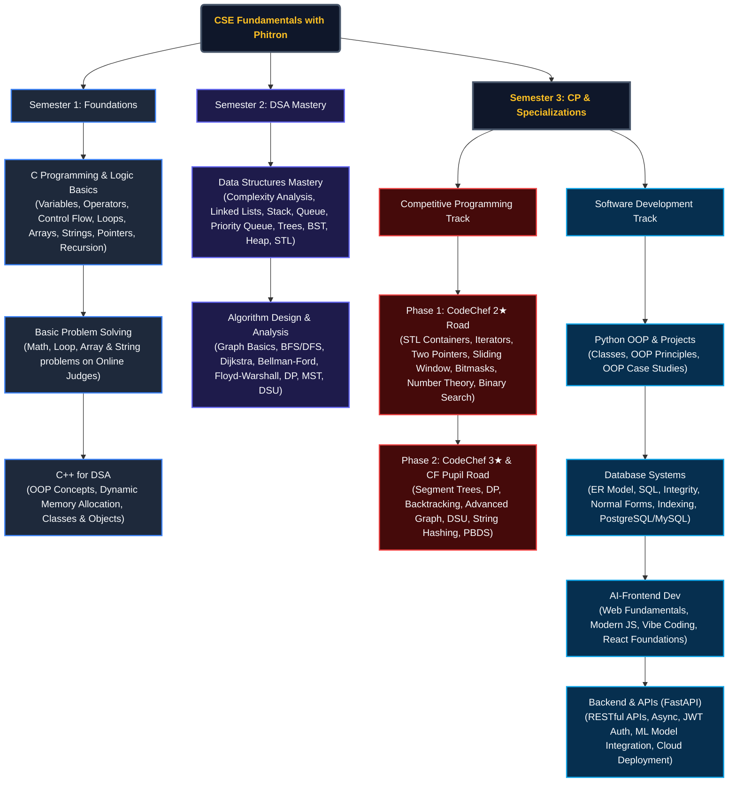

##  Overview

**CSE Fundamentals with Phitron** is a complete, structured archive of my coursework, assignments, exams, and projects spanning **Semester-1 to Semester-3**. It tracks my progressive journey from writing basic "Hello World" programs in C to mastering complex Data Structures, Algorithms, Competitive Programming, and advanced Software Development fields.

##  Learning Roadmap & Curriculum Flow

To visualize the scope of this repository, here is the structured roadmap of all topics covered across three semesters:



###  Curriculum Highlights at a Glance

| Phase / Semester | Focus Area | Key Concepts Covered |
| :--- | :--- | :--- |
| **Semester 1: Core Foundations** | **C & C++ Programming** | Syntax, Loops, Arrays, Strings, Pointers, Recursion, Object-Oriented Programming (OOP) in C++ |
| **Semester 2: Data Structures & Algorithms** | **DSA Mastery** | Time & Space Complexity, Stack, Queue, Singly/Doubly Linked Lists, Trees (BST, Heap), Graphs (BFS, DFS, Dijkstra, Bellman-Ford, Floyd-Warshall), Dynamic Programming (Knapsack, LCS, LIS) |
| **Semester 3: CP Specialization** | **Competitive Programming** | C++ STL, Bit Manipulation, Math & Number Theory (Sieve, Factorization), Binary Search on Answer, PBDS, Segment Trees, String Hashing |
| **Semester 3: Software Dev** | **Full-Stack Development** | **Python OOP** (Encapsulation, Inheritance), **Databases** (SQL, ER, Indexing, PostgreSQL/MySQL), **AI-Powered Frontend** (React, JS, Vibe Coding), **Backend Dev** (FastAPI, JWT, Async, ML Model Integration, Cloud Deployment) |


##  Repository Goals & Objectives

The primary goal of this repository is to build a highly organized, comprehensive showcase of my computer science and software engineering capability.

* **Problem Solving Instincts**: Develop deep capabilities in analyzing time and space complexity, utilizing advanced data structures, and applying standard algorithms to solve complex tasks.
* **Competitive Progression**: Actively advance through structured CP phases, solving real-world and mathematical challenges to rank up on CodeChef and Codeforces.
* **Full-Stack Competency**: Merge software development practices with backend scalability (FastAPI), database design (PostgreSQL/MySQL), and front-end responsiveness (React) to build complete, cloud-deployable systems.
* **Standardized Code Quality**: Maintain a clean, consistent, and professional archive of problem solutions, assignments, and projects serving as a learning roadmap.


<!-- # 📂 Course Structure -->
#  Semester-1 

##  Introduction To Programming in C Language

###  Weeks: [Week-1](#week-1) | [Week-2](#week-2) | [Week-3](#week-3) | [Catch Up Week](#catchupweek) | [Week-4](#week-4) | [Week-5](#week-5)  

###  Assignments & Exams: [Assignment-1](#assignment-1) | [Assignment-2](#assignment-2) | [Mid Exam](#mid-exam) | [Assignment-3](#assignment-3) | [Final Exam](#final-exam) 

##  Introduction to C++ for DSA

###  Weeks: [Week-1](#cpp-week-1) | [Week-2](#cpp-week-2)    

###  Assignments & Exams: [Mid Exam](#cpp-mid-exam) | [CodeFest-1](#cpp-CodeFest-1) | [Final Exam](#cpp-final-exam)  


## 📂 All Week & Module

<!-- 1st Week -->
##  <a id="week-1"></a>Week-1: [Orientation](https://github.com/Islamul-Hoque/CSE-Fundamentals-with-Phitron/tree/main/Semester-1/Introduction%20To%20Programming%20in%20C%20Language/Week-1)

###  Module-1: [Basic Syntax, Variables and Data Types](https://github.com/Islamul-Hoque/CSE-Fundamentals-with-Phitron/tree/main/Semester-1/Introduction%20To%20Programming%20in%20C%20Language/Week-1/Module-1(Variables%20and%20Data%20Types))  
1. `Data Type`: [initialize and print basic data types such as integer, float, string, and boolean in C](https://github.com/Islamul-Hoque/CSE-Fundamentals-with-Phitron/blob/main/Semester-1/Introduction%20To%20Programming%20in%20C%20Language/Week-1/Module-1(Variables%20and%20Data%20Types)/data_type.c)  
2. `Input`: [read and process inputs of various data types using scanf()](https://github.com/Islamul-Hoque/CSE-Fundamentals-with-Phitron/blob/main/Semester-1/Introduction%20To%20Programming%20in%20C%20Language/Week-1/Module-1(Variables%20and%20Data%20Types)/input.c)  
3. `Data Type Limitations`: [analyze memory limitations and use long long int and double for large/precise values](https://github.com/Islamul-Hoque/CSE-Fundamentals-with-Phitron/blob/main/Semester-1/Introduction%20To%20Programming%20in%20C%20Language/Week-1/Module-1(Variables%20and%20Data%20Types)/data_type_limitations.c)  
4. `Extra Practice`: [conceptual question on standard data type sizes and need for long long int](https://github.com/Islamul-Hoque/CSE-Fundamentals-with-Phitron/blob/main/Semester-1/Introduction%20To%20Programming%20in%20C%20Language/Week-1/Module-1(Variables%20and%20Data%20Types)/extra_practice.c)


###  Module-2: [Operators & Conditional Statements](https://github.com/Islamul-Hoque/CSE-Fundamentals-with-Phitron/tree/main/Semester-1/Introduction%20To%20Programming%20in%20C%20Language/Week-1/Module-2(Operators%20Conditional%20Statement))  
1. `Arithmetic`: [perform basic math operations and analyze integer vs float division behavior](https://github.com/Islamul-Hoque/CSE-Fundamentals-with-Phitron/blob/main/Semester-1/Introduction%20To%20Programming%20in%20C%20Language/Week-1/Module-2(Operators%20Conditional%20Statement)/arithmetic.c)  
2. `Remainder`: [calculate the modulo/remainder of division between two integers](https://github.com/Islamul-Hoque/CSE-Fundamentals-with-Phitron/blob/main/Semester-1/Introduction%20To%20Programming%20in%20C%20Language/Week-1/Module-2(Operators%20Conditional%20Statement)/remainder.c)  
3. `If Else`: [apply single-condition decision making and observe branch execution logic](https://github.com/Islamul-Hoque/CSE-Fundamentals-with-Phitron/blob/main/Semester-1/Introduction%20To%20Programming%20in%20C%20Language/Week-1/Module-2(Operators%20Conditional%20Statement)/if_else.c)  
4. `If Else Ladder`: [evaluate multiple conditions sequentially using an if-else-if ladder](https://github.com/Islamul-Hoque/CSE-Fundamentals-with-Phitron/blob/main/Semester-1/Introduction%20To%20Programming%20in%20C%20Language/Week-1/Module-2(Operators%20Conditional%20Statement)/If_else_ladder.c)  
5. `Nested If Else`: [utilize nested if-else structures to handle hierarchical decision paths](https://github.com/Islamul-Hoque/CSE-Fundamentals-with-Phitron/blob/main/Semester-1/Introduction%20To%20Programming%20in%20C%20Language/Week-1/Module-2(Operators%20Conditional%20Statement)/Nested_if_else.c)  
6. `Extra Practice`: [conceptual definitions, syntax reference and examples of conditions (even/odd, positive/negative)](https://github.com/Islamul-Hoque/CSE-Fundamentals-with-Phitron/blob/main/Semester-1/Introduction%20To%20Programming%20in%20C%20Language/Week-1/Module-2(Operators%20Conditional%20Statement)/extra-practice.c)  


<!--   -->


##  Module-2.5: [Practice Day 01](https://github.com/Islamul-Hoque/CSE-Fundamentals-with-Phitron/tree/main/Semester-1/Introduction%20To%20Programming%20in%20C%20Language/Week-1/Practice%20Day-1(Module-2.5)) 
1. `Zero Or Non Zero`: [check if an integer is zero or non-zero and print the result](https://github.com/Islamul-Hoque/CSE-Fundamentals-with-Phitron/blob/main/Semester-1/Introduction%20To%20Programming%20in%20C%20Language/Week-1/Practice%20Day-1(Module-2.5)/zero_or_non_zero.c)  
2. `Add 5 Mark`: [calculate the sum of an input value and 5 (or add 5 marks to a score)](https://github.com/Islamul-Hoque/CSE-Fundamentals-with-Phitron/blob/main/Semester-1/Introduction%20To%20Programming%20in%20C%20Language/Week-1/Practice%20Day-1(Module-2.5)/add_5_mark.c)  
3. `Multiple Or Not`: [check whether two numbers are multiples of each other and output Yes or No](https://github.com/Islamul-Hoque/CSE-Fundamentals-with-Phitron/blob/main/Semester-1/Introduction%20To%20Programming%20in%20C%20Language/Week-1/Practice%20Day-1(Module-2.5)/multiple_or_not.c)  
4. `Floating Point Number`: [read a floating-point number and print it with 3 decimal places of precision](https://github.com/Islamul-Hoque/CSE-Fundamentals-with-Phitron/blob/main/Semester-1/Introduction%20To%20Programming%20in%20C%20Language/Week-1/Practice%20Day-1(Module-2.5)/floating_point_number.c)  

##  Module-3: [Loop: for, while, do-while](https://github.com/Islamul-Hoque/CSE-Fundamentals-with-Phitron/tree/main/Semester-1/Introduction%20To%20Programming%20in%20C%20Language/Week-1/Module-3(Loop))  
1. `For Loop`: [print messages and increment counters using basic for loop syntax](https://github.com/Islamul-Hoque/CSE-Fundamentals-with-Phitron/blob/main/Semester-1/Introduction%20To%20Programming%20in%20C%20Language/Week-1/Module-3(Loop)/for_loop.c)  
2. `More For Loop`: [configure different increments, decrements, and geometric progressions in a for loop](https://github.com/Islamul-Hoque/CSE-Fundamentals-with-Phitron/blob/main/Semester-1/Introduction%20To%20Programming%20in%20C%20Language/Week-1/Module-3(Loop)/more_for_loop.c)  
3. `While`: [use the while loop syntax for conditional iteration control flow](https://github.com/Islamul-Hoque/CSE-Fundamentals-with-Phitron/blob/main/Semester-1/Introduction%20To%20Programming%20in%20C%20Language/Week-1/Module-3(Loop)/while.c)  
4. `Do While`: [implement a do-while loop to guarantee at least one execution iteration](https://github.com/Islamul-Hoque/CSE-Fundamentals-with-Phitron/blob/main/Semester-1/Introduction%20To%20Programming%20in%20C%20Language/Week-1/Module-3(Loop)/do_while.c)  
5. `Loop With Condition`: [identify even and odd numbers within a loop range using conditional checks](https://github.com/Islamul-Hoque/CSE-Fundamentals-with-Phitron/blob/main/Semester-1/Introduction%20To%20Programming%20in%20C%20Language/Week-1/Module-3(Loop)/loop_with_condition.c)  
6. `Sum 1 to N`: [calculate cumulative sum of first N natural numbers using a loop](https://github.com/Islamul-Hoque/CSE-Fundamentals-with-Phitron/blob/main/Semester-1/Introduction%20To%20Programming%20in%20C%20Language/Week-1/Module-3(Loop)/sum_1_to_N.c)  
7. `Break`: [terminate loop execution early using the break statement](https://github.com/Islamul-Hoque/CSE-Fundamentals-with-Phitron/blob/main/Semester-1/Introduction%20To%20Programming%20in%20C%20Language/Week-1/Module-3(Loop)/break.c)  
8. `Continue`: [skip the remaining instructions of current loop iteration using the continue statement](https://github.com/Islamul-Hoque/CSE-Fundamentals-with-Phitron/blob/main/Semester-1/Introduction%20To%20Programming%20in%20C%20Language/Week-1/Module-3(Loop)/Continue.c)  
9. `Infinity Loop`: [analyze do-while loop structures, scopes, variable shadowing, and infinite loops](https://github.com/Islamul-Hoque/CSE-Fundamentals-with-Phitron/blob/main/Semester-1/Introduction%20To%20Programming%20in%20C%20Language/Week-1/Module-3(Loop)/infinity_loop.c)  
10. `Quiz`: [solve loop tracing, scope variables, and iteration quiz questions](https://github.com/Islamul-Hoque/CSE-Fundamentals-with-Phitron/blob/main/Semester-1/Introduction%20To%20Programming%20in%20C%20Language/Week-1/Module-3(Loop)/quiz.c)  


##  Module-3.5: [Practice Day 02](https://github.com/Islamul-Hoque/CSE-Fundamentals-with-Phitron/tree/main/Semester-1/Introduction%20To%20Programming%20in%20C%20Language/Week-1/Practice%20Day-2(Module-3.5))  
1. `I Love Practice`: [print a simple text statement to console](https://github.com/Islamul-Hoque/CSE-Fundamentals-with-Phitron/blob/main/Semester-1/Introduction%20To%20Programming%20in%20C%20Language/Week-1/Practice%20Day-2(Module-3.5)/I_Love_Practice.c)  
2. `Sum of Two Numbers`: [read two integers and calculate their summation](https://github.com/Islamul-Hoque/CSE-Fundamentals-with-Phitron/blob/main/Semester-1/Introduction%20To%20Programming%20in%20C%20Language/Week-1/Practice%20Day-2(Module-3.5)/Sum_of_Two_Numbers.c)  
3. `Variables`: [read and print variables of different types like integer, long long int, float, and char](https://github.com/Islamul-Hoque/CSE-Fundamentals-with-Phitron/blob/main/Semester-1/Introduction%20To%20Programming%20in%20C%20Language/Week-1/Practice%20Day-2(Module-3.5)/Variables.c)  
4. `Divisible By 5 or Not`: [print numbers from 1 to N and check divisibility by 5 for each](https://github.com/Islamul-Hoque/CSE-Fundamentals-with-Phitron/blob/main/Semester-1/Introduction%20To%20Programming%20in%20C%20Language/Week-1/Practice%20Day-2(Module-3.5)/Divisible_By_5_or_Not.c)

<!--   -->

##  <a id="assignment-1"></a>Module-4: [Assignment-1](https://github.com/Islamul-Hoque/CSE-Fundamentals-with-Phitron/tree/main/All%20Assignment/C%20Programs/Assignment-1)  
1. `Print It`: [print multiple formatted text strings using C escape sequences](https://github.com/Islamul-Hoque/CSE-Fundamentals-with-Phitron/blob/main/All%20Assignment/C%20Programs/Assignment-1/print_it.c)  
2. `Multiply`: [calculate the product of two large integers using long long type](https://github.com/Islamul-Hoque/CSE-Fundamentals-with-Phitron/blob/main/All%20Assignment/C%20Programs/Assignment-1/multiply.c)  
3. `Divisible`: [check if a number is divisible by 3 and print YES or NO](https://github.com/Islamul-Hoque/CSE-Fundamentals-with-Phitron/blob/main/All%20Assignment/C%20Programs/Assignment-1/divisible.c)  
4. `Divisible 2`: [find and print all numbers from 1 to N that are divisible by both 3 and 7](https://github.com/Islamul-Hoque/CSE-Fundamentals-with-Phitron/blob/main/All%20Assignment/C%20Programs/Assignment-1/divisible2.c)  
5. `Shopping`: [implement budget-based shopping decision logic with nested conditional checks](https://github.com/Islamul-Hoque/CSE-Fundamentals-with-Phitron/blob/main/All%20Assignment/C%20Programs/Assignment-1/shopping.c)  

<!-- 2nd Week -->

##  <a id="week-2"></a>Week-2: [Recap and Array](https://github.com/Islamul-Hoque/CSE-Fundamentals-with-Phitron/tree/main/Semester-1/Introduction%20To%20Programming%20in%20C%20Language/Week-2)

##  Module-5 : [Problem Solving with Conditional Statements](https://github.com/Islamul-Hoque/CSE-Fundamentals-with-Phitron/tree/main/Semester-1/Introduction%20To%20Programming%20in%20C%20Language/Week-2/Module-5)
1. `Relational Operators`: [validate relational operator >= between two integers and output Yes or No](https://github.com/Islamul-Hoque/CSE-Fundamentals-with-Phitron/blob/main/Semester-1/Introduction%20To%20Programming%20in%20C%20Language/Week-2/Module-5/relational_operators.c)  
2. `Multiples`: [check whether two numbers are multiples of each other and output Multiples or No Multiples](https://github.com/Islamul-Hoque/CSE-Fundamentals-with-Phitron/blob/main/Semester-1/Introduction%20To%20Programming%20in%20C%20Language/Week-2/Module-5/multiples.c)  
3. `First Digit`: [extract and check if the first digit of a 4-digit number is even or odd](https://github.com/Islamul-Hoque/CSE-Fundamentals-with-Phitron/blob/main/Semester-1/Introduction%20To%20Programming%20in%20C%20Language/Week-2/Module-5/first_digit.c)  
4. `Char`: [convert lowercase letters to uppercase and vice versa using ASCII operations](https://github.com/Islamul-Hoque/CSE-Fundamentals-with-Phitron/blob/main/Semester-1/Introduction%20To%20Programming%20in%20C%20Language/Week-2/Module-5/char.c)  
5. `Capital Small Digit`: [determine if a character is a digit or alphabet, and check for lowercase or uppercase](https://github.com/Islamul-Hoque/CSE-Fundamentals-with-Phitron/blob/main/Semester-1/Introduction%20To%20Programming%20in%20C%20Language/Week-2/Module-5/capital_small_digit.c)  
6. `Max Min`: [find and print the maximum and minimum among three input integers](https://github.com/Islamul-Hoque/CSE-Fundamentals-with-Phitron/blob/main/Semester-1/Introduction%20To%20Programming%20in%20C%20Language/Week-2/Module-5/max_min.c)  

##  Module-6   : [Problem Solving with Loop](https://github.com/Islamul-Hoque/CSE-Fundamentals-with-Phitron/tree/main/Semester-1/Introduction%20To%20Programming%20in%20C%20Language/Week-2/Module-6)
1. `Even Numbers`: [find and print all even numbers from 1 to N, or print -1 if none exist](https://github.com/Islamul-Hoque/CSE-Fundamentals-with-Phitron/blob/main/Semester-1/Introduction%20To%20Programming%20in%20C%20Language/Week-2/Module-6/B_Even_Numbers.c)  
2. `Even Odd Positive and Negative`: [count and print even, odd, positive, and negative numbers from a given list](https://github.com/Islamul-Hoque/CSE-Fundamentals-with-Phitron/blob/main/Semester-1/Introduction%20To%20Programming%20in%20C%20Language/Week-2/Module-6/C_Even_Odd_Positive_and_Negative.c)  
3. `Fixed Password`: [check if input password matches fixed value 1999 and print Correct or Wrong](https://github.com/Islamul-Hoque/CSE-Fundamentals-with-Phitron/blob/main/Semester-1/Introduction%20To%20Programming%20in%20C%20Language/Week-2/Module-6/D_Fixed_Password.c)  
4. `Max`: [find maximum value among N input numbers](https://github.com/Islamul-Hoque/CSE-Fundamentals-with-Phitron/blob/main/Semester-1/Introduction%20To%20Programming%20in%20C%20Language/Week-2/Module-6/E_Max.c)  
5. `Multiplication Table`: [generate multiplication table for a given integer N](https://github.com/Islamul-Hoque/CSE-Fundamentals-with-Phitron/blob/main/Semester-1/Introduction%20To%20Programming%20in%20C%20Language/Week-2/Module-6/F_Multiplication_table.c)  
6. `Digits`: [print digits of a number from right to left with space separation](https://github.com/Islamul-Hoque/CSE-Fundamentals-with-Phitron/blob/main/Semester-1/Introduction%20To%20Programming%20in%20C%20Language/Week-2/Module-6/Q_Digits.c)  
7. `Pre and Post`: [demonstrate difference between prefix and postfix increment operators](https://github.com/Islamul-Hoque/CSE-Fundamentals-with-Phitron/blob/main/Semester-1/Introduction%20To%20Programming%20in%20C%20Language/Week-2/Module-6/pre_and_post.c)  

8. `Quiz`: [solve loop tracing, control statements, break, and continue quiz questions](https://github.com/Islamul-Hoque/CSE-Fundamentals-with-Phitron/blob/main/Semester-1/Introduction%20To%20Programming%20in%20C%20Language/Week-2/Module-6/quiz.c)  


##   Module-6.5 : [Practice Day 01](https://github.com/Islamul-Hoque/CSE-Fundamentals-with-Phitron/tree/main/Semester-1/Introduction%20To%20Programming%20in%20C%20Language/Week-2/Practice%20Day-1(Module-6.5))

##  Module-7 : [Loop, break, continue](https://github.com/Islamul-Hoque/CSE-Fundamentals-with-Phitron/tree/main/Semester-1/Introduction%20To%20Programming%20in%20C%20Language/Week-2/Practice%20Day-1(Module-7))

##  Module-7.5 : [Practice Day 02](https://github.com/Islamul-Hoque/CSE-Fundamentals-with-Phitron/tree/main/Semester-1/Introduction%20To%20Programming%20in%20C%20Language/Week-2/Practice%20Day-1(Module-7.5))

###  <a id="assignment-2"></a>Module-8: [Assignment 02](https://github.com/Islamul-Hoque/CSE-Fundamentals-with-Phitron/tree/main/All%20Assignment/C%20Programs/Assignment-2)
1. `Say It`: [print a specific message "I Want More Assignments" N times with numbering](https://github.com/Islamul-Hoque/CSE-Fundamentals-with-Phitron/blob/main/All%20Assignment/C%20Programs/Assignment-2/Say_It.c)  
2. `Update and Print`: [update the value at index X in an array of size N and print the array in reverse order](https://github.com/Islamul-Hoque/CSE-Fundamentals-with-Phitron/blob/main/All%20Assignment/C%20Programs/Assignment-2/Update_and_Print.c)  
3. `Reverse and Odd`: [take N array elements and print the values located at odd indices in reverse order](https://github.com/Islamul-Hoque/CSE-Fundamentals-with-Phitron/blob/main/All%20Assignment/C%20Programs/Assignment-2/Reverse_and_Odd.c)  
4. `Sum Sum`: [calculate and print the sum of positive numbers and negative numbers separately from N inputs](https://github.com/Islamul-Hoque/CSE-Fundamentals-with-Phitron/blob/main/All%20Assignment/C%20Programs/Assignment-2/Sum_Sum.c)  
5. `Is It a Challenge`: [print numbers from 1 to N if N > 0, or from N to 0 if N is negative/zero](https://github.com/Islamul-Hoque/CSE-Fundamentals-with-Phitron/blob/main/All%20Assignment/C%20Programs/Assignment-2/Is_It_a_Challenge.c)  

<!-- 3rd Week -->
##  <a id="week-3"></a>Week-3: [Array and String Operations](https://github.com/Islamul-Hoque/CSE-Fundamentals-with-Phitron/tree/main/Semester-1/Introduction%20To%20Programming%20in%20C%20Language/Week-3)

##  Module-9: [Array Operations](https://github.com/Islamul-Hoque/CSE-Fundamentals-with-Phitron/tree/main/Semester-1/Introduction%20To%20Programming%20in%20C%20Language/Week-3/Module-9)  
1. `Insert`: [insert a value at a specific index in an array and shift subsequent elements](https://github.com/Islamul-Hoque/CSE-Fundamentals-with-Phitron/blob/main/Semester-1/Introduction%20To%20Programming%20in%20C%20Language/Week-3/Module-9/Insert.c)  
2. `Reverse Array`: [reverse the elements of an array in-place using two pointers](https://github.com/Islamul-Hoque/CSE-Fundamentals-with-Phitron/blob/main/Semester-1/Introduction%20To%20Programming%20in%20C%20Language/Week-3/Module-9/Reverse_Array.c)  
3. `Swapping`: [swap the values of two variables using a temporary variable](https://github.com/Islamul-Hoque/CSE-Fundamentals-with-Phitron/blob/main/Semester-1/Introduction%20To%20Programming%20in%20C%20Language/Week-3/Module-9/Swapping.c)  
4. `Delete`: [delete an element at a specific index in an array and shift remaining elements](https://github.com/Islamul-Hoque/CSE-Fundamentals-with-Phitron/blob/main/Semester-1/Introduction%20To%20Programming%20in%20C%20Language/Week-3/Module-9/delete.c)

##  Module-10: [String](https://github.com/Islamul-Hoque/CSE-Fundamentals-with-Phitron/tree/main/Semester-1/Introduction%20To%20Programming%20in%20C%20Language/Week-3/Module-10)  
1. `Let's Use Getline`: [read a line using fgets and print it up to a backslash character](https://github.com/Islamul-Hoque/CSE-Fundamentals-with-Phitron/blob/main/Semester-1/Introduction%20To%20Programming%20in%20C%20Language/Week-3/Module-10/B_Let_s_use_Getline.c)  
2. `Count`: [calculate the sum of the digits in a given string](https://github.com/Islamul-Hoque/CSE-Fundamentals-with-Phitron/blob/main/Semester-1/Introduction%20To%20Programming%20in%20C%20Language/Week-3/Module-10/E_Count.c)  
3. `Length of a String`: [calculate the length of a string using a loop and the built-in strlen function](https://github.com/Islamul-Hoque/CSE-Fundamentals-with-Phitron/blob/main/Semester-1/Introduction%20To%20Programming%20in%20C%20Language/Week-3/Module-10/Length_of_a_string.c)  
4. `String Initialization`: [demonstrate string initialization and printing in C](https://github.com/Islamul-Hoque/CSE-Fundamentals-with-Phitron/blob/main/Semester-1/Introduction%20To%20Programming%20in%20C%20Language/Week-3/Module-10/String_initialization.c)  
5. `String Input with Space`: [read a string containing spaces using fgets and analyze input methods](https://github.com/Islamul-Hoque/CSE-Fundamentals-with-Phitron/blob/main/Semester-1/Introduction%20To%20Programming%20in%20C%20Language/Week-3/Module-10/String_input_with_space.c)  
6. `String`: [demonstrate char array vs string types, input mechanisms, and the null terminator](https://github.com/Islamul-Hoque/CSE-Fundamentals-with-Phitron/blob/main/Semester-1/Introduction%20To%20Programming%20in%20C%20Language/Week-3/Module-10/string.c)

##  Module-10.5: [Practice Day 01](https://github.com/Islamul-Hoque/CSE-Fundamentals-with-Phitron/tree/main/Semester-1/Introduction%20To%20Programming%20in%20C%20Language/Week-3/Practice%20Day-1(Module-10.5))  
1. `Array Copy`: [concatenate two arrays into a single new array and print it](https://github.com/Islamul-Hoque/CSE-Fundamentals-with-Phitron/blob/main/Semester-1/Introduction%20To%20Programming%20in%20C%20Language/Week-3/Practice%20Day-1(Module-10.5)/array_copy.c)  
2. `Reversing`: [read an array and print its elements in reverse order](https://github.com/Islamul-Hoque/CSE-Fundamentals-with-Phitron/blob/main/Semester-1/Introduction%20To%20Programming%20in%20C%20Language/Week-3/Practice%20Day-1(Module-10.5)/F_Reversing.c)  
3. `Palindrome Array`: [check whether a given array of integers is a palindrome](https://github.com/Islamul-Hoque/CSE-Fundamentals-with-Phitron/blob/main/Semester-1/Introduction%20To%20Programming%20in%20C%20Language/Week-3/Practice%20Day-1(Module-10.5)/G_Palindrome_Array.c)  
4. `Palindrome`: [check whether a given string is a palindrome](https://github.com/Islamul-Hoque/CSE-Fundamentals-with-Phitron/blob/main/Semester-1/Introduction%20To%20Programming%20in%20C%20Language/Week-3/Practice%20Day-1(Module-10.5)/I_Palindrome.c)  
5. `Strings`: [print lengths of two strings, concatenate them, and swap their first characters](https://github.com/Islamul-Hoque/CSE-Fundamentals-with-Phitron/blob/main/Semester-1/Introduction%20To%20Programming%20in%20C%20Language/Week-3/Practice%20Day-1(Module-10.5)/D_Strings.c)

##  Module-11: [String Operations](https://github.com/Islamul-Hoque/CSE-Fundamentals-with-Phitron/tree/main/Semester-1/Introduction%20To%20Programming%20in%20C%20Language/Week-3/Module-11)  
1. `Lexicographical Comparison`🌟: [perform lexicographical comparison of two strings manually and using strcmp()](https://github.com/Islamul-Hoque/CSE-Fundamentals-with-Phitron/blob/main/Semester-1/Introduction%20To%20Programming%20in%20C%20Language/Week-3/Module-11/lexicographical_comparison.c)  
2. `String Concat`🌟: [concatenate two strings using a manual loop and the built-in strcat() function](https://github.com/Islamul-Hoque/CSE-Fundamentals-with-Phitron/blob/main/Semester-1/Introduction%20To%20Programming%20in%20C%20Language/Week-3/Module-11/String_concat.c)  
3. `String Copy`🌟: [copy the contents of one string to another manually and using strcpy()](https://github.com/Islamul-Hoque/CSE-Fundamentals-with-Phitron/blob/main/Semester-1/Introduction%20To%20Programming%20in%20C%20Language/Week-3/Module-11/String_copy.c)

##  Module-11.5: [Practice Day 02](https://github.com/Islamul-Hoque/CSE-Fundamentals-with-Phitron/tree/main/Semester-1/Introduction%20To%20Programming%20in%20C%20Language/Week-3/Practice%20Day-2(Module-11.5))  
1. `Frequency Array`: [count and print the frequency of elements in an array using a frequency array](https://github.com/Islamul-Hoque/CSE-Fundamentals-with-Phitron/blob/main/Semester-1/Introduction%20To%20Programming%20in%20C%20Language/Week-3/Practice%20Day-2(Module-11.5)/Frequency_Array.c)

### <a id="mid-exam"></a>  Module-12: [C Program Mid Exam](https://github.com/Islamul-Hoque/CSE-Fundamentals-with-Phitron/tree/main/All%20Assignment/C%20Programs/Mid%20Exam)  
1. `Count Me 1`: [count the numbers divisible by 2 and remaining numbers divisible by 3 in an array](https://github.com/Islamul-Hoque/CSE-Fundamentals-with-Phitron/blob/main/All%20Assignment/C%20Programs/Mid%20Exam/Count_Me_1.c)  
2. `Count Me 2`: [count the number of consonants in a given string](https://github.com/Islamul-Hoque/CSE-Fundamentals-with-Phitron/blob/main/All%20Assignment/C%20Programs/Mid%20Exam/Count_Me_2.c)  
3. `Count Me 3`: [count uppercase letters, lowercase letters, and digits in a string across multiple test cases](https://github.com/Islamul-Hoque/CSE-Fundamentals-with-Phitron/blob/main/All%20Assignment/C%20Programs/Mid%20Exam/Count_Me_3.c)  
4. `Count Me 4`: [count and print the frequency of each character in a string](https://github.com/Islamul-Hoque/CSE-Fundamentals-with-Phitron/blob/main/All%20Assignment/C%20Programs/Mid%20Exam/Count_Me_4.c)  
5. `Farmers`🌟: [calculate the number of fewer days needed to complete a task when additional farmers are hired](https://github.com/Islamul-Hoque/CSE-Fundamentals-with-Phitron/blob/main/All%20Assignment/C%20Programs/Mid%20Exam/Farmers.c)

<!-- Catch Up Week -->
##  <a id="catchupweek"></a> Bonus Week: [C Program Catch Up Week](https://github.com/Islamul-Hoque/CSE-Fundamentals-with-Phitron/tree/main/Semester-1/Introduction%20To%20Programming%20in%20C%20Language/Catch-Up-Week)

##  Category-1: [Data Type & Conditions](https://github.com/Islamul-Hoque/CSE-Fundamentals-with-Phitron/tree/main/Semester-1/Introduction%20To%20Programming%20in%20C%20Language/Catch-Up-Week/Data-Type-Conditions)  
1. `Say Hello With C`: [print a hello greeting message in C](https://github.com/Islamul-Hoque/CSE-Fundamentals-with-Phitron/blob/main/Semester-1/Introduction%20To%20Programming%20in%20C%20Language/Catch-Up-Week/Data-Type-Conditions/A_Say_Hello_With_C.c)  
2. `Basic Data Types`: [read and print basic data types including integer, float, and double](https://github.com/Islamul-Hoque/CSE-Fundamentals-with-Phitron/blob/main/Semester-1/Introduction%20To%20Programming%20in%20C%20Language/Catch-Up-Week/Data-Type-Conditions/B_Basic_Data_Types.c)  
3. `Simple Calculator`: [perform basic arithmetic operations like addition, subtraction, multiplication, and division](https://github.com/Islamul-Hoque/CSE-Fundamentals-with-Phitron/blob/main/Semester-1/Introduction%20To%20Programming%20in%20C%20Language/Catch-Up-Week/Data-Type-Conditions/C_Simple_Calculator.c)  
4. `Difference`: [calculate the difference between two multiplication products (A*B) - (C*D)](https://github.com/Islamul-Hoque/CSE-Fundamentals-with-Phitron/blob/main/Semester-1/Introduction%20To%20Programming%20in%20C%20Language/Catch-Up-Week/Data-Type-Conditions/D_Difference.c)  
5. `Area of a Circle`: [compute the area of a circle with high-precision pi](https://github.com/Islamul-Hoque/CSE-Fundamentals-with-Phitron/blob/main/Semester-1/Introduction%20To%20Programming%20in%20C%20Language/Catch-Up-Week/Data-Type-Conditions/E_Area_of_a_Circle.c)  
6. `Digits Summation`: [sum the last digits of two given integers](https://github.com/Islamul-Hoque/CSE-Fundamentals-with-Phitron/blob/main/Semester-1/Introduction%20To%20Programming%20in%20C%20Language/Catch-Up-Week/Data-Type-Conditions/F_Digits_Summation.c)  
7. `Summation from 1 to N`: [calculate the cumulative sum of numbers from 1 to N](https://github.com/Islamul-Hoque/CSE-Fundamentals-with-Phitron/blob/main/Semester-1/Introduction%20To%20Programming%20in%20C%20Language/Catch-Up-Week/Data-Type-Conditions/G_Summation_from_1_to_N.c)  
8. `Two Numbers`: [calculate floor, ceil, and round division results for two numbers](https://github.com/Islamul-Hoque/CSE-Fundamentals-with-Phitron/blob/main/Semester-1/Introduction%20To%20Programming%20in%20C%20Language/Catch-Up-Week/Data-Type-Conditions/H_Two_numbers.c)  
9. `Welcome for You with Conditions`: [check if A is greater than or equal to B and print welcome messages](https://github.com/Islamul-Hoque/CSE-Fundamentals-with-Phitron/blob/main/Semester-1/Introduction%20To%20Programming%20in%20C%20Language/Catch-Up-Week/Data-Type-Conditions/I_Welcome_for_you_with_Conditions.c)  
10. `Multiples`: [check if one number is a multiple of another](https://github.com/Islamul-Hoque/CSE-Fundamentals-with-Phitron/blob/main/Semester-1/Introduction%20To%20Programming%20in%20C%20Language/Catch-Up-Week/Data-Type-Conditions/J_Multiples.c)  
11. `Max and Min`: [find the maximum and minimum values among three numbers](https://github.com/Islamul-Hoque/CSE-Fundamentals-with-Phitron/blob/main/Semester-1/Introduction%20To%20Programming%20in%20C%20Language/Catch-Up-Week/Data-Type-Conditions/K_Max_and_Min.c)  
12. `The Brothers`: [determine if two people are brothers by comparing their last names](https://github.com/Islamul-Hoque/CSE-Fundamentals-with-Phitron/blob/main/Semester-1/Introduction%20To%20Programming%20in%20C%20Language/Catch-Up-Week/Data-Type-Conditions/L_The_Brothers.c)  
13. `Capital or Small or Digit`: [identify if a character is a digit, uppercase, or lowercase letter](https://github.com/Islamul-Hoque/CSE-Fundamentals-with-Phitron/blob/main/Semester-1/Introduction%20To%20Programming%20in%20C%20Language/Catch-Up-Week/Data-Type-Conditions/M_Capital_or_Small_or_Digit.c)  
14. `Char`: [print the next character in ASCII sequence](https://github.com/Islamul-Hoque/CSE-Fundamentals-with-Phitron/blob/main/Semester-1/Introduction%20To%20Programming%20in%20C%20Language/Catch-Up-Week/Data-Type-Conditions/N_Char.c)  
15. `Calculator`: [perform basic arithmetic based on the input operator](https://github.com/Islamul-Hoque/CSE-Fundamentals-with-Phitron/blob/main/Semester-1/Introduction%20To%20Programming%20in%20C%20Language/Catch-Up-Week/Data-Type-Conditions/O_Calculator.c)  
16. `First Digit`: [determine if the first digit of a number is even or odd](https://github.com/Islamul-Hoque/CSE-Fundamentals-with-Phitron/blob/main/Semester-1/Introduction%20To%20Programming%20in%20C%20Language/Catch-Up-Week/Data-Type-Conditions/P_First_digit.c)  
17. `Coordinates of a Point`: [determine the quadrant or axis location of a coordinate point](https://github.com/Islamul-Hoque/CSE-Fundamentals-with-Phitron/blob/main/Semester-1/Introduction%20To%20Programming%20in%20C%20Language/Catch-Up-Week/Data-Type-Conditions/Q_Coordinates_of_a_Point.c)  
18. `Age in Days`: [convert a person's age from days into years, months, and days](https://github.com/Islamul-Hoque/CSE-Fundamentals-with-Phitron/blob/main/Semester-1/Introduction%20To%20Programming%20in%20C%20Language/Catch-Up-Week/Data-Type-Conditions/R_Age_in_Days.c)  
19. `Sort Numbers`: [sort three numbers in ascending order and print them](https://github.com/Islamul-Hoque/CSE-Fundamentals-with-Phitron/blob/main/Semester-1/Introduction%20To%20Programming%20in%20C%20Language/Catch-Up-Week/Data-Type-Conditions/T_Sort_Numbers.c)  
20. `Float or Int`: [check if a number is an integer or a float and print its decimal part](https://github.com/Islamul-Hoque/CSE-Fundamentals-with-Phitron/blob/main/Semester-1/Introduction%20To%20Programming%20in%20C%20Language/Catch-Up-Week/Data-Type-Conditions/U_Float_or_int.c)  
21. `Comparison`: [evaluate comparison statements between two numbers](https://github.com/Islamul-Hoque/CSE-Fundamentals-with-Phitron/blob/main/Semester-1/Introduction%20To%20Programming%20in%20C%20Language/Catch-Up-Week/Data-Type-Conditions/V_Comparison.c)  
22. `Mathematical Expression`: [evaluate mathematical expressions and verify their correctness](https://github.com/Islamul-Hoque/CSE-Fundamentals-with-Phitron/blob/main/Semester-1/Introduction%20To%20Programming%20in%20C%20Language/Catch-Up-Week/Data-Type-Conditions/W_Mathematical_Expression.c)  
23. `Two Intervals` 🌟: [check if there is an intersection/overlap between two intervals](https://github.com/Islamul-Hoque/CSE-Fundamentals-with-Phitron/blob/main/Semester-1/Introduction%20To%20Programming%20in%20C%20Language/Catch-Up-Week/Data-Type-Conditions/X_Two_intervals.c)  
24. `The Last 2 Digits`: [calculate and print the last two digits of a product of four numbers](https://github.com/Islamul-Hoque/CSE-Fundamentals-with-Phitron/blob/main/Semester-1/Introduction%20To%20Programming%20in%20C%20Language/Catch-Up-Week/Data-Type-Conditions/Y_The_last_2_digits.c)  
25. `Hard Compare` 🌟: [compare two exponent numbers using logarithms to avoid overflow](https://github.com/Islamul-Hoque/CSE-Fundamentals-with-Phitron/blob/main/Semester-1/Introduction%20To%20Programming%20in%20C%20Language/Catch-Up-Week/Data-Type-Conditions/Z_Hard_Compare.c)

##  Category-2: [Loops](https://github.com/Islamul-Hoque/CSE-Fundamentals-with-Phitron/tree/main/Semester-1/Introduction%20To%20Programming%20in%20C%20Language/Catch-Up-Week/Loops)  
1. `1 to N`: [print numbers from 1 to N using a loop](https://github.com/Islamul-Hoque/CSE-Fundamentals-with-Phitron/blob/main/Semester-1/Introduction%20To%20Programming%20in%20C%20Language/Catch-Up-Week/Loops/A_1_to_N.c)  
2. `Fixed Password`: [prompt for password inputs until the correct one is entered](https://github.com/Islamul-Hoque/CSE-Fundamentals-with-Phitron/blob/main/Semester-1/Introduction%20To%20Programming%20in%20C%20Language/Catch-Up-Week/Loops/D_Fixed_Password.c)  
3. `Multiplication Table`: [generate a multiplication table for a given number N](https://github.com/Islamul-Hoque/CSE-Fundamentals-with-Phitron/blob/main/Semester-1/Introduction%20To%20Programming%20in%20C%20Language/Catch-Up-Week/Loops/F_Multiplication_table.c)  
4. `One Prime`: [check if a given number is prime or not](https://github.com/Islamul-Hoque/CSE-Fundamentals-with-Phitron/blob/main/Semester-1/Introduction%20To%20Programming%20in%20C%20Language/Catch-Up-Week/Loops/H_One_Prime.c)  
5. `Primes from 1 to N`: [find and print all prime numbers in the range from 1 to N](https://github.com/Islamul-Hoque/CSE-Fundamentals-with-Phitron/blob/main/Semester-1/Introduction%20To%20Programming%20in%20C%20Language/Catch-Up-Week/Loops/J_Primes_from_1_to_n.c)  
6. `Divisors`: [find and print all divisors of a given number](https://github.com/Islamul-Hoque/CSE-Fundamentals-with-Phitron/blob/main/Semester-1/Introduction%20To%20Programming%20in%20C%20Language/Catch-Up-Week/Loops/K_Divisors.c)  
7. `Lucky Numbers` 🌟: [find and print all lucky numbers containing only digits 4 and 7 in a range](https://github.com/Islamul-Hoque/CSE-Fundamentals-with-Phitron/blob/main/Semester-1/Introduction%20To%20Programming%20in%20C%20Language/Catch-Up-Week/Loops/M_Lucky_Numbers.c)  


<!-- 4th Week -->
##  <a id="week-4"></a>Week-4: [Nested Loop Recap, Function & Pointer](https://github.com/Islamul-Hoque/CSE-Fundamentals-with-Phitron/tree/main/Semester-1/Introduction%20To%20Programming%20in%20C%20Language/Week-4)

<!--Week-4 || Module-13 -->
##  Module-13: [Nested Loop and Pattern](https://github.com/Islamul-Hoque/CSE-Fundamentals-with-Phitron/tree/main/Semester-1/Introduction%20To%20Programming%20in%20C%20Language/Week-4/Module-13)  
1. `Star Pattern`: [print a standard star pattern using nested loops](https://github.com/Islamul-Hoque/CSE-Fundamentals-with-Phitron/blob/main/Semester-1/Introduction%20To%20Programming%20in%20C%20Language/Week-4/Module-13/Star_Pattern.c)  
2. `Pyramid Pattern`🌟: [print pyramid and inverted pyramid patterns](https://github.com/Islamul-Hoque/CSE-Fundamentals-with-Phitron/blob/main/Semester-1/Introduction%20To%20Programming%20in%20C%20Language/Week-4/Module-13/Pyramid_Pattern.c)  
3. `More Pattern`: [print inverted star and pyramid number patterns](https://github.com/Islamul-Hoque/CSE-Fundamentals-with-Phitron/blob/main/Semester-1/Introduction%20To%20Programming%20in%20C%20Language/Week-4/Module-13/More_Pattern.c)  
4. `Diamond Pattern`🌟: [print a diamond shape pattern using spaces and stars](https://github.com/Islamul-Hoque/CSE-Fundamentals-with-Phitron/blob/main/Semester-1/Introduction%20To%20Programming%20in%20C%20Language/Week-4/Module-13/Diamond_Pattern.c)  
5. `Sum of 2 Values Equal X`🌟: [check if the sum of any two elements in an array equals X](https://github.com/Islamul-Hoque/CSE-Fundamentals-with-Phitron/blob/main/Semester-1/Introduction%20To%20Programming%20in%20C%20Language/Week-4/Module-13/Sum_of_2_values_equal_X.c)  
6. `Selection Sort`🌟: [sort an array of integers in ascending order using selection sort](https://github.com/Islamul-Hoque/CSE-Fundamentals-with-Phitron/blob/main/Semester-1/Introduction%20To%20Programming%20in%20C%20Language/Week-4/Module-13/Selection_Sort.c)  
7. `Quiz`: [solve nested loop tracing, array comparisons, and pattern quiz questions](https://github.com/Islamul-Hoque/CSE-Fundamentals-with-Phitron/blob/main/Semester-1/Introduction%20To%20Programming%20in%20C%20Language/Week-4/Module-13/quiz.c)


<!-- Week-4 || Module-14 -->
##  Module-14: [Function](https://github.com/Islamul-Hoque/CSE-Fundamentals-with-Phitron/tree/main/Semester-1/Introduction%20To%20Programming%20in%20C%20Language/Week-4/Module-14)  
1. `Return + Parameter`: [demonstrate a function with both a return type and parameters](https://github.com/Islamul-Hoque/CSE-Fundamentals-with-Phitron/blob/main/Semester-1/Introduction%20To%20Programming%20in%20C%20Language/Week-4/Module-14/return_parameter.c)  
2. `Return + No Parameter`: [demonstrate a function with a return type but no parameters](https://github.com/Islamul-Hoque/CSE-Fundamentals-with-Phitron/blob/main/Semester-1/Introduction%20To%20Programming%20in%20C%20Language/Week-4/Module-14/return_NoParameter.c)  
3. `No Return + Parameter`: [demonstrate a function with no return type but having parameters](https://github.com/Islamul-Hoque/CSE-Fundamentals-with-Phitron/blob/main/Semester-1/Introduction%20To%20Programming%20in%20C%20Language/Week-4/Module-14/noReturn_parameter.c)  
4. `No Return + No Parameter`: [demonstrate a function with no return type and no parameters](https://github.com/Islamul-Hoque/CSE-Fundamentals-with-Phitron/blob/main/Semester-1/Introduction%20To%20Programming%20in%20C%20Language/Week-4/Module-14/NoReturn_NoParameter.c)  
5. `Scope`: [demonstrate local vs global variable scope and lifetime in C](https://github.com/Islamul-Hoque/CSE-Fundamentals-with-Phitron/blob/main/Semester-1/Introduction%20To%20Programming%20in%20C%20Language/Week-4/Module-14/scope.c)  
6. `Useful Math Functions`🌟: [demonstrate useful math library functions like ceil(), floor(), round(), sqrt(), pow(), and abs()](https://github.com/Islamul-Hoque/CSE-Fundamentals-with-Phitron/blob/main/Semester-1/Introduction%20To%20Programming%20in%20C%20Language/Week-4/Module-14/Useful_Math_Functions.c)  
7. `Quiz`: [solve C function syntax, parameters, return types, and math library quiz questions](https://github.com/Islamul-Hoque/CSE-Fundamentals-with-Phitron/blob/main/Semester-1/Introduction%20To%20Programming%20in%20C%20Language/Week-4/Module-14/quiz.c)

##  Module-14.5: [Practice Day 01](https://github.com/Islamul-Hoque/CSE-Fundamentals-with-Phitron/tree/main/Semester-1/Introduction%20To%20Programming%20in%20C%20Language/Week-4/Practice%20Day-1(Module-14.5))

##  Module-15: [Pointer](https://github.com/Islamul-Hoque/CSE-Fundamentals-with-Phitron/tree/main/Semester-1/Introduction%20To%20Programming%20in%20C%20Language/Week-4/Module-15)  
1. `Pointer`: [demonstrate pointer basics, address operator, and value operator](https://github.com/Islamul-Hoque/CSE-Fundamentals-with-Phitron/blob/main/Semester-1/Introduction%20To%20Programming%20in%20C%20Language/Week-4/Module-15/Pointer.c)  
2. `Dereferencing a Pointer`: [access and modify the value of a variable using its memory address](https://github.com/Islamul-Hoque/CSE-Fundamentals-with-Phitron/blob/main/Semester-1/Introduction%20To%20Programming%20in%20C%20Language/Week-4/Module-15/Dereferencing_A_Pointer.c)  
3. `Pass By Value`🌟: [pass arguments to a function by value where modifications do not affect original variables](https://github.com/Islamul-Hoque/CSE-Fundamentals-with-Phitron/blob/main/Semester-1/Introduction%20To%20Programming%20in%20C%20Language/Week-4/Module-15/Pass_By_Value.c)  
4. `Pass By Reference`🌟: [pass arguments to a function by reference using pointers to change original values](https://github.com/Islamul-Hoque/CSE-Fundamentals-with-Phitron/blob/main/Semester-1/Introduction%20To%20Programming%20in%20C%20Language/Week-4/Module-15/Pass_By_Reference.c)  
5. `Pointer in Array`: [demonstrate how array name behaves as a pointer to the first element](https://github.com/Islamul-Hoque/CSE-Fundamentals-with-Phitron/blob/main/Semester-1/Introduction%20To%20Programming%20in%20C%20Language/Week-4/Module-15/Pointer_In_Array.c)  
6. `Function with Array`: [pass arrays to functions as pointers and modify elements](https://github.com/Islamul-Hoque/CSE-Fundamentals-with-Phitron/blob/main/Semester-1/Introduction%20To%20Programming%20in%20C%20Language/Week-4/Module-15/Function_with_array.c)  
7. `Function with String`: [pass strings to functions and calculate string length](https://github.com/Islamul-Hoque/CSE-Fundamentals-with-Phitron/blob/main/Semester-1/Introduction%20To%20Programming%20in%20C%20Language/Week-4/Module-15/Function_with_string.c)  
8. `Quiz`: [solve pointer declarations, dereferencing, pass-by-reference, and pointer arithmetic quiz questions](https://github.com/Islamul-Hoque/CSE-Fundamentals-with-Phitron/blob/main/Semester-1/Introduction%20To%20Programming%20in%20C%20Language/Week-4/Module-15/Quix.c)

##  Module-15.5: [Practice Day 02](https://github.com/Islamul-Hoque/CSE-Fundamentals-with-Phitron/tree/main/Semester-1/Introduction%20To%20Programming%20in%20C%20Language/Week-4/Practice%20Day-1(Module-15.5))

<!-- Week-4 || Module-16 || Assignment-3 -->
### <a id="assignment-3"></a>  Module-16: [Assignment-3](https://github.com/Islamul-Hoque/CSE-Fundamentals-with-Phitron/tree/main/All%20Assignment/C%20Programs/Assignment-3)  
1. `Pattern`🌟: [print a diamond pattern with alternating character lines](https://github.com/Islamul-Hoque/CSE-Fundamentals-with-Phitron/blob/main/All%20Assignment/C%20Programs/Assignment-3/Pattern.c)  
2. `Pattern 2`🌟: [print a numeric pattern of numbers in reverse order with custom spacing](https://github.com/Islamul-Hoque/CSE-Fundamentals-with-Phitron/blob/main/All%20Assignment/C%20Programs/Assignment-3/Pattern_2.c)  
3. `Count Before One`: [count how many numbers appear in an array before the number 1 is encountered](https://github.com/Islamul-Hoque/CSE-Fundamentals-with-Phitron/blob/main/All%20Assignment/C%20Programs/Assignment-3/Count_Before_One.c)  
4. `Is Palindrome`: [check whether a given number is a palindrome using parameter-passing function](https://github.com/Islamul-Hoque/CSE-Fundamentals-with-Phitron/blob/main/All%20Assignment/C%20Programs/Assignment-3/Is_Palindrome.c)  
5. `Even and Odd`: [print even and odd numbers separately using a function with no return type](https://github.com/Islamul-Hoque/CSE-Fundamentals-with-Phitron/blob/main/All%20Assignment/C%20Programs/Assignment-3/Even_and_Odd.c)


<!-- 5th Week -->
##  <a id="week-5"></a>Week-5: [2D Array and Recursion](https://github.com/Islamul-Hoque/CSE-Fundamentals-with-Phitron/tree/main/Semester-1/Introduction%20To%20Programming%20in%20C%20Language/Week-5(2D_Array_and_Recursion))

##  Module-17: [Recursion](https://github.com/Islamul-Hoque/CSE-Fundamentals-with-Phitron/tree/main/Semester-1/Introduction%20To%20Programming%20in%20C%20Language/Week-5(2D_Array_and_Recursion)/Module-17(Recursion))  
1. `Call Stack Demonstration`: [demonstrate function call stack execution order and function nesting](https://github.com/Islamul-Hoque/CSE-Fundamentals-with-Phitron/blob/main/Semester-1/Introduction%20To%20Programming%20in%20C%20Language/Week-5(2D_Array_and_Recursion)/Module-17(Recursion)/Call_Stack.c)  
2. `Infinite Recursion`: [demonstrate infinite recursion causing stack overflow](https://github.com/Islamul-Hoque/CSE-Fundamentals-with-Phitron/blob/main/Semester-1/Introduction%20To%20Programming%20in%20C%20Language/Week-5(2D_Array_and_Recursion)/Module-17(Recursion)/recursion.c)  
3. `Print Numbers from 1 to N`: [print numbers from 1 to N using recursion](https://github.com/Islamul-Hoque/CSE-Fundamentals-with-Phitron/blob/main/Semester-1/Introduction%20To%20Programming%20in%20C%20Language/Week-5(2D_Array_and_Recursion)/Module-17(Recursion)/Print_from_1_to_N.c)  
4. `Print Numbers from N to 1`: [print numbers from N to 1 using recursion](https://github.com/Islamul-Hoque/CSE-Fundamentals-with-Phitron/blob/main/Semester-1/Introduction%20To%20Programming%20in%20C%20Language/Week-5(2D_Array_and_Recursion)/Module-17(Recursion)/Print_from_N_to_1.c)  
5. `Print Reverse Numbers`: [print numbers from N to 1 in reverse order using backtracking recursion](https://github.com/Islamul-Hoque/CSE-Fundamentals-with-Phitron/blob/main/Semester-1/Introduction%20To%20Programming%20in%20C%20Language/Week-5(2D_Array_and_Recursion)/Module-17(Recursion)/Print_from_N_to_1_using_recursion.c)  
6. `Print Even Numbers`: [print even numbers from 1 to N using recursion](https://github.com/Islamul-Hoque/CSE-Fundamentals-with-Phitron/blob/main/Semester-1/Introduction%20To%20Programming%20in%20C%20Language/Week-5(2D_Array_and_Recursion)/Module-17(Recursion)/Print_Even_1_to_N_Recursion.c)  
7. `Print Array Elements`: [print array elements sequentially using recursion](https://github.com/Islamul-Hoque/CSE-Fundamentals-with-Phitron/blob/main/Semester-1/Introduction%20To%20Programming%20in%20C%20Language/Week-5(2D_Array_and_Recursion)/Module-17(Recursion)/Printing_an_array.c)  
8. `Quiz`: [solve function call stack and infinite recursion quiz questions](https://github.com/Islamul-Hoque/CSE-Fundamentals-with-Phitron/blob/main/Semester-1/Introduction%20To%20Programming%20in%20C%20Language/Week-5(2D_Array_and_Recursion)/Module-17(Recursion)/quiz.c)  
9. `Extra Practice → Print Recursion`: [print a simple recursion message N times recursively](https://github.com/Islamul-Hoque/CSE-Fundamentals-with-Phitron/blob/main/Semester-1/Introduction%20To%20Programming%20in%20C%20Language/Week-5(2D_Array_and_Recursion)/Module-17(Recursion)/Extra_Practice_Problem/A_Print_Recursion.c)  
10. `Extra Practice → Print 1 to N`: [print numbers from 1 to N using a simple recursive function](https://github.com/Islamul-Hoque/CSE-Fundamentals-with-Phitron/blob/main/Semester-1/Introduction%20To%20Programming%20in%20C%20Language/Week-5(2D_Array_and_Recursion)/Module-17(Recursion)/Extra_Practice_Problem/B_Print_from_1_to_N.c)  
11. `Extra Practice → Print N to 1`: [print numbers from N to 1 in reverse order using recursion](https://github.com/Islamul-Hoque/CSE-Fundamentals-with-Phitron/blob/main/Semester-1/Introduction%20To%20Programming%20in%20C%20Language/Week-5(2D_Array_and_Recursion)/Module-17(Recursion)/Extra_Practice_Problem/C_Print_from_N_to_1.c)  
12. `Extra Practice → Print Even Indices in Reverse`: [print array values at even indices in reverse order using recursion](https://github.com/Islamul-Hoque/CSE-Fundamentals-with-Phitron/blob/main/Semester-1/Introduction%20To%20Programming%20in%20C%20Language/Week-5(2D_Array_and_Recursion)/Module-17(Recursion)/Extra_Practice_Problem/F_Print_Even_Indices.c)  

##  Module-18: [2D Array](https://github.com/Islamul-Hoque/CSE-Fundamentals-with-Phitron/tree/main/Semester-1/Introduction%20To%20Programming%20in%20C%20Language/Week-5(2D_Array_and_Recursion)/Module-18(2D_Array))  
1. `2D Array Input and Output`: [read and print a 2D array representing a matrix](https://github.com/Islamul-Hoque/CSE-Fundamentals-with-Phitron/blob/main/Semester-1/Introduction%20To%20Programming%20in%20C%20Language/Week-5(2D_Array_and_Recursion)/Module-18(2D_Array)/2D_array_input_output.c)  
2. `Printing Specific Row Column`: [print a specific row and column from a given 2D array](https://github.com/Islamul-Hoque/CSE-Fundamentals-with-Phitron/blob/main/Semester-1/Introduction%20To%20Programming%20in%20C%20Language/Week-5(2D_Array_and_Recursion)/Module-18(2D_Array)/Printing_Specific_row_column.c)  
3. `Check Zero Matrix`: [check if a 2D matrix is a zero matrix](https://github.com/Islamul-Hoque/CSE-Fundamentals-with-Phitron/blob/main/Semester-1/Introduction%20To%20Programming%20in%20C%20Language/Week-5(2D_Array_and_Recursion)/Module-18(2D_Array)/Checking_Zero_Matrix.c)  
4. `Check Primary Diagonal Matrix`: [check if a 2D matrix is a primary diagonal matrix](https://github.com/Islamul-Hoque/CSE-Fundamentals-with-Phitron/blob/main/Semester-1/Introduction%20To%20Programming%20in%20C%20Language/Week-5(2D_Array_and_Recursion)/Module-18(2D_Array)/Checking_Primary_Diagonal_Matrix.c)  
5. `Check Secondary Diagonal Matrix`: [check if a 2D matrix is a secondary diagonal matrix](https://github.com/Islamul-Hoque/CSE-Fundamentals-with-Phitron/blob/main/Semester-1/Introduction%20To%20Programming%20in%20C%20Language/Week-5(2D_Array_and_Recursion)/Module-18(2D_Array)/Checking_Secondary_Diagonal_Matrix.c)  
6. `Checking Matrix`: [check if a 2D matrix is a row matrix, column matrix, or square matrix](https://github.com/Islamul-Hoque/CSE-Fundamentals-with-Phitron/blob/main/Semester-1/Introduction%20To%20Programming%20in%20C%20Language/Week-5(2D_Array_and_Recursion)/Module-18(2D_Array)/Checking_Matrix.c)  
7. `Extra Practice → Diagonal Absolute Difference`: [calculate the absolute difference between the sums of primary and secondary diagonals of a square matrix](https://github.com/Islamul-Hoque/CSE-Fundamentals-with-Phitron/blob/main/Semester-1/Introduction%20To%20Programming%20in%20C%20Language/Week-5(2D_Array_and_Recursion)/Module-18(2D_Array)/Extra_Practice_Problem/T_Matrix.c)  
8. `Extra Practice → Search in Matrix`: [search for an element X in a 2D matrix and print a decision message](https://github.com/Islamul-Hoque/CSE-Fundamentals-with-Phitron/blob/main/Semester-1/Introduction%20To%20Programming%20in%20C%20Language/Week-5(2D_Array_and_Recursion)/Module-18(2D_Array)/Extra_Practice_Problem/S_Search_In_Matrix.c)  

##  Module-18.5: [Practice Day 01](https://github.com/Islamul-Hoque/CSE-Fundamentals-with-Phitron/tree/main/Semester-1/Introduction%20To%20Programming%20in%20C%20Language/Week-5(2D_Array_and_Recursion)/Practice%20Day-1(Module-18.5))

##  Module-19: [Problem Solving with 2D Array and Recursion](https://github.com/Islamul-Hoque/CSE-Fundamentals-with-Phitron/tree/main/Semester-1/Introduction%20To%20Programming%20in%20C%20Language/Week-5(2D_Array_and_Recursion)/Module-19(Problem_Solving_With_2D_Array_and_Recursion))  
1. `Mirror Array`: [print the mirror image of a 2D matrix by reversing its columns](https://github.com/Islamul-Hoque/CSE-Fundamentals-with-Phitron/blob/main/Semester-1/Introduction%20To%20Programming%20in%20C%20Language/Week-5(2D_Array_and_Recursion)/Module-19(Problem_Solving_With_2D_Array_and_Recursion)/W_Mirror_Array.c)  
2. `Print Digits using Recursion`: [print the digits of a number in original order separated by spaces using recursion](https://github.com/Islamul-Hoque/CSE-Fundamentals-with-Phitron/blob/main/Semester-1/Introduction%20To%20Programming%20in%20C%20Language/Week-5(2D_Array_and_Recursion)/Module-19(Problem_Solving_With_2D_Array_and_Recursion)/D_Print_Digits_using_Recursion.c)  
3. `Count Vowels`: [count both lowercase and uppercase vowels in a string recursively](https://github.com/Islamul-Hoque/CSE-Fundamentals-with-Phitron/blob/main/Semester-1/Introduction%20To%20Programming%20in%20C%20Language/Week-5(2D_Array_and_Recursion)/Module-19(Problem_Solving_With_2D_Array_and_Recursion)/I_Count_Vowels.c)  
4. `Factorial`: [calculate the factorial of a number using recursion](https://github.com/Islamul-Hoque/CSE-Fundamentals-with-Phitron/blob/main/Semester-1/Introduction%20To%20Programming%20in%20C%20Language/Week-5(2D_Array_and_Recursion)/Module-19(Problem_Solving_With_2D_Array_and_Recursion)/J_Factorial.c)  

##  Module-19.5: [Practice Day 02](https://github.com/Islamul-Hoque/CSE-Fundamentals-with-Phitron/tree/main/Semester-1/Introduction%20To%20Programming%20in%20C%20Language/Week-5(2D_Array_and_Recursion)/Practice%20Day-1(Module-19.5))

## <a id="final-exam"></a>  Module-20: [Final Exam](https://github.com/Islamul-Hoque/CSE-Fundamentals-with-Phitron/tree/main/All%20Assignment/C%20Programs/Final-Exam)  
1. `Find the Missing Number`: [find the missing fourth number given the product and three other numbers](https://github.com/Islamul-Hoque/CSE-Fundamentals-with-Phitron/blob/main/All%20Assignment/C%20Programs/Final-Exam/Find_the_Missing_Number.c)  
2. `Jadu Matrix`🌟: [check if a matrix is a Jadu matrix where diagonals are 1s and other elements are 0s](https://github.com/Islamul-Hoque/CSE-Fundamentals-with-Phitron/blob/main/All%20Assignment/C%20Programs/Final-Exam/Jadu_Matrix.c)  
3. `Matrix Again`: [print the last row and last column of a given 2D matrix](https://github.com/Islamul-Hoque/CSE-Fundamentals-with-Phitron/blob/main/All%20Assignment/C%20Programs/Final-Exam/Matrix_Again.c)  
4. `Magical Tree`🌟: [print a tree pattern with a trunk of fixed height and dynamic branch size](https://github.com/Islamul-Hoque/CSE-Fundamentals-with-Phitron/blob/main/All%20Assignment/C%20Programs/Final-Exam/Magical_Tree.c)  
5. `Difference Array`🌟: [calculate and print the absolute difference between an array and its sorted copy](https://github.com/Islamul-Hoque/CSE-Fundamentals-with-Phitron/blob/main/All%20Assignment/C%20Programs/Final-Exam/Difference_Array.c)  


##  Structure-1 || Introduction to C++ for DSA 

<!-- 1st Week -->
## <a id="cpp-week-1"></a>    Week-1 : [Introduction to C++](https://github.com/Islamul-Hoque/CSE-Fundamentals-with-Phitron/tree/main/Semester-1/Introduction%20to%20C%2B%2B%20for%20DSA/Week-1(Introduction%20to%20C%2B%2B))

##  Module-1: [Basic c++](https://github.com/Islamul-Hoque/CSE-Fundamentals-with-Phitron/tree/main/Semester-1/Introduction%20to%20C%2B%2B%20for%20DSA/Week-1(Introduction%20to%20C%2B%2B)/Module-1(Basic%20c%2B%2B))

1. `Print`: [basic output of text and variables in C++](https://github.com/Islamul-Hoque/CSE-Fundamentals-with-Phitron/tree/main/Semester-1/Introduction%20to%20C%2B%2B%20for%20DSA/Week-1(Introduction%20to%20C%2B%2B)/Module-1(Basic%20c%2B%2B)/Print.cpp)  
2. `Take input in C++, Typecasting`: [demonstrate integer, string input and typecasting](https://github.com/Islamul-Hoque/CSE-Fundamentals-with-Phitron/tree/main/Semester-1/Introduction%20to%20C%2B%2B%20for%20DSA/Week-1(Introduction%20to%20C%2B%2B)/Module-1(Basic%20c%2B%2B)/input.cpp)  
3. `EOF`: [handle end-of-file input stream in C++](https://github.com/Islamul-Hoque/CSE-Fundamentals-with-Phitron/tree/main/Semester-1/Introduction%20to%20C%2B%2B%20for%20DSA/Week-1(Introduction%20to%20C%2B%2B)/Module-1(Basic%20c%2B%2B)/EOF.cpp)  
4. `Setprecision`: [format floating-point output with fixed precision](https://github.com/Islamul-Hoque/CSE-Fundamentals-with-Phitron/tree/main/Semester-1/Introduction%20to%20C%2B%2B%20for%20DSA/Week-1(Introduction%20to%20C%2B%2B)/Module-1(Basic%20c%2B%2B)/Setprecision.cpp)  
5. `If-Else`: [conditional branching using if-else statements](https://github.com/Islamul-Hoque/CSE-Fundamentals-with-Phitron/tree/main/Semester-1/Introduction%20to%20C%2B%2B%20for%20DSA/Week-1(Introduction%20to%20C%2B%2B)/Module-1(Basic%20c%2B%2B)/If_else.cpp)  
6. `Ternary Operator`: [short conditional evaluation using ternary operator](https://github.com/Islamul-Hoque/CSE-Fundamentals-with-Phitron/tree/main/Semester-1/Introduction%20to%20C%2B%2B%20for%20DSA/Week-1(Introduction%20to%20C%2B%2B)/Module-1(Basic%20c%2B%2B)/Ternary_Operator.cpp)  
7. `Switch → Week`: [map integer input to weekday using switch-case](https://github.com/Islamul-Hoque/CSE-Fundamentals-with-Phitron/tree/main/Semester-1/Introduction%20to%20C%2B%2B%20for%20DSA/Week-1(Introduction%20to%20C%2B%2B)/Module-1(Basic%20c%2B%2B)/Switch.cpp)  
8. `Switch → Even Odd`: [determine even or odd number using switch-case](https://github.com/Islamul-Hoque/CSE-Fundamentals-with-Phitron/tree/main/Semester-1/Introduction%20to%20C%2B%2B%20for%20DSA/Week-1(Introduction%20to%20C%2B%2B)/Module-1(Basic%20c%2B%2B)/Even_Odd_With_Switch.cpp)  
9. `Switch → Vowels Consonants`: [check if character is vowel or consonant using switch-case](https://github.com/Islamul-Hoque/CSE-Fundamentals-with-Phitron/tree/main/Semester-1/Introduction%20to%20C%2B%2B%20for%20DSA/Week-1(Introduction%20to%20C%2B%2B)/Module-1(Basic%20c%2B%2B)/Vowels_Consonants.cpp)  
10. `Min, Max, Swap`: [demonstrate std::min, std::max and swap functions](https://github.com/Islamul-Hoque/CSE-Fundamentals-with-Phitron/tree/main/Semester-1/Introduction%20to%20C%2B%2B%20for%20DSA/Week-1(Introduction%20to%20C%2B%2B)/Module-1(Basic%20c%2B%2B)/Min_Max_Swap.cpp)  
11. `String`: [string input, getline usage and output handling](https://github.com/Islamul-Hoque/CSE-Fundamentals-with-Phitron/tree/main/Semester-1/Introduction%20to%20C%2B%2B%20for%20DSA/Week-1(Introduction%20to%20C%2B%2B)/Module-1(Basic%20c%2B%2B)/String.cpp)  


##  Module-2: [Dynamic Memory Allocation](https://github.com/Islamul-Hoque/CSE-Fundamentals-with-Phitron/tree/main/Semester-1/Introduction%20to%20C%2B%2B%20for%20DSA/Week-1(Introduction%20to%20C%2B%2B)/Module-2(Dynamic_Memory_Allocation))

1. `Dynamic Variable` : [demonstrate static vs dynamic variable allocation using pointers](https://github.com/Islamul-Hoque/CSE-Fundamentals-with-Phitron/tree/main/Semester-1/Introduction%20to%20C%2B%2B%20for%20DSA/Week-1(Introduction%20to%20C%2B%2B)/Module-2(Dynamic_Memory_Allocation)/Dynamic_Variable.cpp)
2. `Dynamic Array` : [create integer array dynamically using new keyword and perform input/output operations](https://github.com/Islamul-Hoque/CSE-Fundamentals-with-Phitron/tree/main/Semester-1/Introduction%20to%20C%2B%2B%20for%20DSA/Week-1(Introduction%20to%20C%2B%2B)/Module-2(Dynamic_Memory_Allocation)/Dynamic_Array.cpp)
3. `Dynamic Array Return From Function` : [allocate dynamic array inside function and return pointer to main for output](https://github.com/Islamul-Hoque/CSE-Fundamentals-with-Phitron/tree/main/Semester-1/Introduction%20to%20C%2B%2B%20for%20DSA/Week-1(Introduction%20to%20C%2B%2B)/Module-2(Dynamic_Memory_Allocation)/Dynamic-Array-Return-From-Function.cpp)
4. `Increase Size of Dynamic Array` : [resize dynamic array by allocating new memory and copying elements](https://github.com/Islamul-Hoque/CSE-Fundamentals-with-Phitron/tree/main/Semester-1/Introduction%20to%20C%2B%2B%20for%20DSA/Week-1(Introduction%20to%20C%2B%2B)/Module-2(Dynamic_Memory_Allocation)/Increase_Size_of_Dynamic_Array.cpp)

##  Module-2.5: [Practice Day 01](https://github.com/Islamul-Hoque/CSE-Fundamentals-with-Phitron/tree/main/Semester-1/Introduction%20to%20C%2B%2B%20for%20DSA/Week-1(Introduction%20to%20C%2B%2B)/Practice%20Day-1(Module-2.5))
1. `C. Simple Calculator` : [perform addition, multiplication, and subtraction of two integers with proper formatting](https://github.com/Islamul-Hoque/CSE-Fundamentals-with-Phitron/tree/main/Semester-1/Introduction%20to%20C%2B%2B%20for%20DSA/Week-1(Introduction%20to%20C%2B%2B)/Practice%20Day-1(Module-2.5)/C_Simple_Calculator.cpp)
2. `E. Max` : [find maximum element in an integer array using loop and std::max](https://github.com/Islamul-Hoque/CSE-Fundamentals-with-Phitron/tree/main/Semester-1/Introduction%20to%20C%2B%2B%20for%20DSA/Week-1(Introduction%20to%20C%2B%2B)/Practice%20Day-1(Module-2.5)/E_Max.cpp)
3. `F. Reversing` : [reverse an integer array using two-pointer swapping technique](https://github.com/Islamul-Hoque/CSE-Fundamentals-with-Phitron/tree/main/Semester-1/Introduction%20to%20C%2B%2B%20for%20DSA/Week-1(Introduction%20to%20C%2B%2B)/Practice%20Day-1(Module-2.5)/F_Reversing.cpp)
4. `K. Max and Min` : [print minimum and maximum among three integers using std::min and std::max](https://github.com/Islamul-Hoque/CSE-Fundamentals-with-Phitron/tree/main/Semester-1/Introduction%20to%20C%2B%2B%20for%20DSA/Week-1(Introduction%20to%20C%2B%2B)/Practice%20Day-1(Module-2.5)/K_Max_and_Min.cpp)
5. `M. Capital or Small or Digit` : [classify input character as digit, capital letter, or small letter](https://github.com/Islamul-Hoque/CSE-Fundamentals-with-Phitron/tree/main/Semester-1/Introduction%20to%20C%2B%2B%20for%20DSA/Week-1(Introduction%20to%20C%2B%2B)/Practice%20Day-1(Module-2.5)/M_Capital_or_Small_or_Digit.cpp)

##  Module-3:  [Class and Object in C++](https://github.com/Islamul-Hoque/CSE-Fundamentals-with-Phitron/tree/main/Semester-1/Introduction%20to%20C%2B%2B%20for%20DSA/Week-1(Introduction%20to%20C%2B%2B)/Module-3(Class%20and%20Object%20in%20C%2B%2B))

1. `Working with class and object` : [basic class declaration, object creation, hardcoded data and user input handling](https://github.com/Islamul-Hoque/CSE-Fundamentals-with-Phitron/tree/main/Semester-1/Introduction%20to%20C%2B%2B%20for%20DSA/Week-1(Introduction%20to%20C%2B%2B)/Module-3(Class%20and%20Object%20in%20C%2B%2B)/Class_and_Object.cpp)
2. `Constructor and its Simulation` : [demonstrate default and parameterized constructors with manual data assignment and input handling](https://github.com/Islamul-Hoque/CSE-Fundamentals-with-Phitron/tree/main/Semester-1/Introduction%20to%20C%2B%2B%20for%20DSA/Week-1(Introduction%20to%20C%2B%2B)/Module-3(Class%20and%20Object%20in%20C%2B%2B)/Constructor.cpp)
3. `This keyword and Arrow sign` : [use of 'this' pointer in constructor and arrow operator for object initialization](https://github.com/Islamul-Hoque/CSE-Fundamentals-with-Phitron/tree/main/Semester-1/Introduction%20to%20C%2B%2B%20for%20DSA/Week-1(Introduction%20to%20C%2B%2B)/Module-3(Class%20and%20Object%20in%20C%2B%2B)/This_and_Arrow.cpp)
4. `Return object from function` : [return a class object from function and print object data in main](https://github.com/Islamul-Hoque/CSE-Fundamentals-with-Phitron/tree/main/Semester-1/Introduction%20to%20C%2B%2B%20for%20DSA/Week-1(Introduction%20to%20C%2B%2B)/Module-3(Class%20and%20Object%20in%20C%2B%2B)/Return_object_from_function.cpp)
5. `Why we need dynamic object` : [return object pointer from function using constructor and access data via pointer](https://github.com/Islamul-Hoque/CSE-Fundamentals-with-Phitron/tree/main/Semester-1/Introduction%20to%20C%2B%2B%20for%20DSA/Week-1(Introduction%20to%20C%2B%2B)/Module-3(Class%20and%20Object%20in%20C%2B%2B)/Why_We_Need_Dynamic_Object.cpp)
6. `Dynamic Object` : [create dynamic object using 'new' keyword and access data via pointer](https://github.com/Islamul-Hoque/CSE-Fundamentals-with-Phitron/tree/main/Semester-1/Introduction%20to%20C%2B%2B%20for%20DSA/Week-1(Introduction%20to%20C%2B%2B)/Module-3(Class%20and%20Object%20in%20C%2B%2B)/Dynamic_Object.cpp)
7. `Dynamic object Return from function` : [return dynamically created object from function and access data via pointer](https://github.com/Islamul-Hoque/CSE-Fundamentals-with-Phitron/tree/main/Semester-1/Introduction%20to%20C%2B%2B%20for%20DSA/Week-1(Introduction%20to%20C%2B%2B)/Module-3(Class%20and%20Object%20in%20C%2B%2B)/Dynamic_Object_Return_From_Function.cpp)
8. `Sort function in C++` : [sort an integer array using STL sort() function](https://github.com/Islamul-Hoque/CSE-Fundamentals-with-Phitron/tree/main/Semester-1/Introduction%20to%20C%2B%2B%20for%20DSA/Week-1(Introduction%20to%20C%2B%2B)/Module-3(Class%20and%20Object%20in%20C%2B%2B)/Sorting.cpp)


##  Module-3.5: [Practice Day 02](https://github.com/Islamul-Hoque/CSE-Fundamentals-with-Phitron/tree/main/Semester-1/Introduction%20to%20C%2B%2B%20for%20DSA/Week-1(Introduction%20to%20C%2B%2B)/Practice%20Day-2(Module-3.5))
1. `G. Palindrome Array` : [check if an array is palindrome using two-pointer approach](https://github.com/Islamul-Hoque/CSE-Fundamentals-with-Phitron/tree/main/Semester-1/Introduction%20to%20C%2B%2B%20for%20DSA/Week-1(Introduction%20to%20C%2B%2B)/Practice%20Day-2(Module-3.5)/G_Palindrome_Array.cpp)
2. `H. Sorting` : [sort an array using manual bubble/selection sort without built-in functions](https://github.com/Islamul-Hoque/CSE-Fundamentals-with-Phitron/tree/main/Semester-1/Introduction%20to%20C%2B%2B%20for%20DSA/Week-1(Introduction%20to%20C%2B%2B)/Practice%20Day-2(Module-3.5)/H_Sorting.cpp)
3. `I. Smallest Pair` : [find minimum value of Ai + Aj + (j - i) using brute-force nested loops](https://github.com/Islamul-Hoque/CSE-Fundamentals-with-Phitron/tree/main/Semester-1/Introduction%20to%20C%2B%2B%20for%20DSA/Week-1(Introduction%20to%20C%2B%2B)/Practice%20Day-2(Module-3.5)/I_Smallest_Pair.cpp)
4. `V. Comparison` : [validate relational operator between two integers using nested if-else and ternary operator](https://github.com/Islamul-Hoque/CSE-Fundamentals-with-Phitron/tree/main/Semester-1/Introduction%20to%20C%2B%2B%20for%20DSA/Week-1(Introduction%20to%20C%2B%2B)/Practice%20Day-2(Module-3.5)/V_Comparison.cpp)
5. `W. Mathematical Expression` : [check correctness of A S B = C expression and print 'Yes' or correct result](https://github.com/Islamul-Hoque/CSE-Fundamentals-with-Phitron/tree/main/Semester-1/Introduction%20to%20C%2B%2B%20for%20DSA/Week-1(Introduction%20to%20C%2B%2B)/Practice%20Day-2(Module-3.5)/W_Mathematical_Expression.cpp)

<!-- C++ Mid Exam -->

## <a id="cpp-mid-exam"></a> Module-12: [C++ Mid Exam](https://github.com/Islamul-Hoque/CSE-Fundamentals-with-Phitron/tree/main/All%20Assignment/C%2B%2B/Mid%20Exam)
1. `Sort It` : [sort array in ascending and descending order using STL sort()](https://github.com/Islamul-Hoque/CSE-Fundamentals-with-Phitron/blob/main/All%20Assignment/C%2B%2B/Mid%20Exam/Sort_It.cpp)  
2. `Sort It 2` : [implement sort_it() function with dynamic array return and descending sort](https://github.com/Islamul-Hoque/CSE-Fundamentals-with-Phitron/blob/main/All%20Assignment/C%2B%2B/Mid%20Exam/Sort_It_2.cpp)  
3. `Monkey` : [remove spaces and sort characters alphabetically](https://github.com/Islamul-Hoque/CSE-Fundamentals-with-Phitron/blob/main/All%20Assignment/C%2B%2B/Mid%20Exam/Monkey.cpp)  
4. `Who Is It` : [find student with highest marks, resolving ties by smallest ID](https://github.com/Islamul-Hoque/CSE-Fundamentals-with-Phitron/blob/main/All%20Assignment/C%2B%2B/Mid%20Exam/Who_Is_It.cpp)  
5. `Choose Three` : [check if any three distinct elements sum to S](https://github.com/Islamul-Hoque/CSE-Fundamentals-with-Phitron/blob/main/All%20Assignment/C%2B%2B/Mid%20Exam/Choose_Three.cpp)  


<!-- CodeFest-1 -->
## <a id="cpp-CodeFest-1"></a>   CodeFest-1 Problem Solutions
1. `Mirror Sum` : [mirror sum of two arrays by adding elements with their mirrored counterparts](https://github.com/Islamul-Hoque/CSE-Fundamentals-with-Phitron/blob/main/CodeFest/CodeFest-1/Mirror_Sum.c)
2. `Good Pair Detector` : [count good pairs by multiplying even and odd counts in an array](https://github.com/Islamul-Hoque/CSE-Fundamentals-with-Phitron/blob/main/CodeFest/CodeFest-1/Good_Pair_Detector.c)
3. `Divisibility by 3` : [check divisibility of a number by 3 using digit sum](https://github.com/Islamul-Hoque/CSE-Fundamentals-with-Phitron/blob/main/CodeFest/CodeFest-1/Divisibility_by_3.c)
4. `Merge by Index` : [merge substring of second string into first string based on given start and end indices](https://github.com/Islamul-Hoque/CSE-Fundamentals-with-Phitron/blob/main/CodeFest/CodeFest-1/Merge_by_Index.c)
5. `Let's Play With Candy` : [find smallest missing non-negative integer from sorted candy labels](https://github.com/Islamul-Hoque/CSE-Fundamentals-with-Phitron/blob/main/CodeFest/CodeFest-1/Let_s_Play_With_Candy.c)


## <a id="cpp-week-2"></a>     Week-2: [String, Class, Objects)](https://github.com/Islamul-Hoque/CSE-Fundamentals-with-Phitron/tree/main/Semester-1/Introduction%20to%20C%2B%2B%20for%20DSA/Week-2(String%2C%20Class%2C%20Objects))

##  Module-5: [String Class In C++](https://github.com/Islamul-Hoque/CSE-Fundamentals-with-Phitron/tree/main/Semester-1/Introduction%20to%20C%2B%2B%20for%20DSA/Week-2(String%2C%20Class%2C%20Objects)/Module-5(String%20Class%20In%20C%2B%2B))

1. `String`: [demonstrate built-in string class declaration, assignments, and comparison in C++ vs C-style strings](https://github.com/Islamul-Hoque/CSE-Fundamentals-with-Phitron/blob/main/Semester-1/Introduction%20to%20C%2B%2B%20for%20DSA/Week-2(String%2C%20Class%2C%20Objects)/Module-5(String%20Class%20In%20C%2B%2B)/String.cpp)  
2. `String Capacity`: [explore string capacity functions like size(), max_size(), capacity(), resize(), clear(), and empty()](https://github.com/Islamul-Hoque/CSE-Fundamentals-with-Phitron/blob/main/Semester-1/Introduction%20to%20C%2B%2B%20for%20DSA/Week-2(String%2C%20Class%2C%20Objects)/Module-5(String%20Class%20In%20C%2B%2B)/String_Capacity.cpp)  
3. `String Element Access`: [access individual characters of a string using operator[], at(), front(), and back()](https://github.com/Islamul-Hoque/CSE-Fundamentals-with-Phitron/blob/main/Semester-1/Introduction%20to%20C%2B%2B%20for%20DSA/Week-2(String%2C%20Class%2C%20Objects)/Module-5(String%20Class%20In%20C%2B%2B)/String_Element_Access.cpp)  
4. `String Iterators`: [traverse a string using iterators (begin() and end()) and range-based loops](https://github.com/Islamul-Hoque/CSE-Fundamentals-with-Phitron/blob/main/Semester-1/Introduction%20to%20C%2B%2B%20for%20DSA/Week-2(String%2C%20Class%2C%20Objects)/Module-5(String%20Class%20In%20C%2B%2B)/String_Iterators.cpp)  
5. `String Modifiers`: [modify strings using append (+=), append(), push_back(), and pop_back()](https://github.com/Islamul-Hoque/CSE-Fundamentals-with-Phitron/blob/main/Semester-1/Introduction%20to%20C%2B%2B%20for%20DSA/Week-2(String%2C%20Class%2C%20Objects)/Module-5(String%20Class%20In%20C%2B%2B)/String_Modifiers.cpp)  
6. `String Modifiers 2`: [further explore modifier methods such as assign(), erase(), replace(), and insert()](https://github.com/Islamul-Hoque/CSE-Fundamentals-with-Phitron/blob/main/Semester-1/Introduction%20to%20C%2B%2B%20for%20DSA/Week-2(String%2C%20Class%2C%20Objects)/Module-5(String%20Class%20In%20C%2B%2B)/String_Modifiers2.cpp)  
7. `String input with spaces`: [read strings containing spaces using cin.getline() and getline(cin, s) along with cin.ignore()](https://github.com/Islamul-Hoque/CSE-Fundamentals-with-Phitron/blob/main/Semester-1/Introduction%20to%20C%2B%2B%20for%20DSA/Week-2(String%2C%20Class%2C%20Objects)/Module-5(String%20Class%20In%20C%2B%2B)/String_input_with_spaces.cpp)  
8. `Stringstream`: [tokenize a sentence into individual words and count them using std::stringstream](https://github.com/Islamul-Hoque/CSE-Fundamentals-with-Phitron/blob/main/Semester-1/Introduction%20to%20C%2B%2B%20for%20DSA/Week-2(String%2C%20Class%2C%20Objects)/Module-5(String%20Class%20In%20C%2B%2B)/Stringstream.cpp)  
9. `Quiz`: [quiz questions solving and demonstrations of string operations, getline, and stringstream](https://github.com/Islamul-Hoque/CSE-Fundamentals-with-Phitron/blob/main/Semester-1/Introduction%20to%20C%2B%2B%20for%20DSA/Week-2(String%2C%20Class%2C%20Objects)/Module-5(String%20Class%20In%20C%2B%2B)/quiz.cpp)  

##  Module-6: [More about class and string](https://github.com/Islamul-Hoque/CSE-Fundamentals-with-Phitron/tree/main/Semester-1/Introduction%20to%20C%2B%2B%20for%20DSA/Week-2(String%2C%20Class%2C%20Objects)/Module-6(More%20about%20class%20and%20string))

1. `String Constructor`: [demonstrate various overloaded string constructors in C++](https://github.com/Islamul-Hoque/CSE-Fundamentals-with-Phitron/blob/main/Semester-1/Introduction%20to%20C%2B%2B%20for%20DSA/Week-2(String%2C%20Class%2C%20Objects)/Module-6(More%20about%20class%20and%20string)/String_Constructor.cpp)  
2. `Sort String`: [sort characters of a string alphabetically using std::sort()](https://github.com/Islamul-Hoque/CSE-Fundamentals-with-Phitron/blob/main/Semester-1/Introduction%20to%20C%2B%2B%20for%20DSA/Week-2(String%2C%20Class%2C%20Objects)/Module-6(More%20about%20class%20and%20string)/Sort_String.cpp)  
3. `Range based for loop`: [use range-based for loop to iterate over characters of a string directly](https://github.com/Islamul-Hoque/CSE-Fundamentals-with-Phitron/blob/main/Semester-1/Introduction%20to%20C%2B%2B%20for%20DSA/Week-2(String%2C%20Class%2C%20Objects)/Module-6(More%20about%20class%20and%20string)/Range_based_for_loop.cpp)  
4. `Reverse function`: [reverse both integer arrays and strings using std::reverse()](https://github.com/Islamul-Hoque/CSE-Fundamentals-with-Phitron/blob/main/Semester-1/Introduction%20to%20C%2B%2B%20for%20DSA/Week-2(String%2C%20Class%2C%20Objects)/Module-6(More%20about%20class%20and%20string)/Reverse_function.cpp)  
5. `Reverse word codeforces`: [solve a Codeforces problem by reversing each word in a sentence using stringstream and std::reverse()](https://github.com/Islamul-Hoque/CSE-Fundamentals-with-Phitron/blob/main/Semester-1/Introduction%20to%20C%2B%2B%20for%20DSA/Week-2(String%2C%20Class%2C%20Objects)/Module-6(More%20about%20class%20and%20string)/Reverse_word_codeforces.cpp)  
6. `Function inside class`: [declare and call member functions inside a class in C++](https://github.com/Islamul-Hoque/CSE-Fundamentals-with-Phitron/blob/main/Semester-1/Introduction%20to%20C%2B%2B%20for%20DSA/Week-2(String%2C%20Class%2C%20Objects)/Module-6(More%20about%20class%20and%20string)/Function_inside_class.cpp)  
7. `Copy dynamic object`: [demonstrate correct ways to copy values from one dynamic object to another to avoid shallow copy/pointer issues](https://github.com/Islamul-Hoque/CSE-Fundamentals-with-Phitron/blob/main/Semester-1/Introduction%20to%20C%2B%2B%20for%20DSA/Week-2(String%2C%20Class%2C%20Objects)/Module-6(More%20about%20class%20and%20string)/Copy_dynamic_object.cpp)  
8. `Quiz`: [quiz questions solving and demonstrations of object copying, string constructor, and reverse function](https://github.com/Islamul-Hoque/CSE-Fundamentals-with-Phitron/blob/main/Semester-1/Introduction%20to%20C%2B%2B%20for%20DSA/Week-2(String%2C%20Class%2C%20Objects)/Module-6(More%20about%20class%20and%20string)/quiz.cpp)  

### <a id="cpp-final-exam"></a>  Module-8: [Final Exam](https://github.com/Islamul-Hoque/CSE-Fundamentals-with-Phitron/tree/main/All%20Assignment/C%2B%2B/Final%20Exam)
1. `Replace Word` : [replace all occurrences of a target word/substring in a string with hash character (#)](https://github.com/Islamul-Hoque/CSE-Fundamentals-with-Phitron/blob/main/All%20Assignment/C%2B%2B/Final%20Exam/Replace_Word.cpp)  
2. `Find Jessica` : [find if the name "Jessica" is present in a given string/sentence](https://github.com/Islamul-Hoque/CSE-Fundamentals-with-Phitron/blob/main/All%20Assignment/C%2B%2B/Final%20Exam/Find_Jessica.cpp)  
3. `Reverse It` : [reverse the sections of students while keeping other properties intact](https://github.com/Islamul-Hoque/CSE-Fundamentals-with-Phitron/blob/main/All%20Assignment/C%2B%2B/Final%20Exam/Reverse_It.cpp)  
4. `Sort It` : [sort students by total marks in descending order, resolving ties by ID in ascending order](https://github.com/Islamul-Hoque/CSE-Fundamentals-with-Phitron/blob/main/All%20Assignment/C%2B%2B/Final%20Exam/Sort_It.cpp)  
5. `Sort It Again` : [sort students by English marks, then math marks in descending order, resolving ties by ID in ascending order](https://github.com/Islamul-Hoque/CSE-Fundamentals-with-Phitron/blob/main/All%20Assignment/C%2B%2B/Final%20Exam/Sort_It_Again.cpp)  

##  Road to Problem Solvers Club (XPSC) 
### XPSC-1 Problem Solutions

1. `Rahim's Shopping` : [find most expensive affordable item or -1 if none](https://github.com/Islamul-Hoque/CSE-Fundamentals-with-Phitron/blob/main/Semester-1/Introduction%20to%20C%2B%2B%20for%20DSA/Road%20to%20Problem%20Solvers%20Club%20(XPSC)/XPSC-1/Rahim_s_Shopping.cpp)
2. `ZigZag Permutation` : [construct permutation with smallest numbers at odd positions and largest at even positions](https://github.com/Islamul-Hoque/CSE-Fundamentals-with-Phitron/blob/main/Semester-1/Introduction%20to%20C%2B%2B%20for%20DSA/Road%20to%20Problem%20Solvers%20Club%20(XPSC)/XPSC-1/ZigZag_Permutation.cpp)

<!-- semester-2 -->
#  Semester-2 

##  Basic Data Structures

###  Weeks: [Week-1](#ds-week-1)  

###  Assignments & Exams: [Assignment-1](#ds-assignment-1)  

## 📂 All Week & Module

<!-- week-1 -->
##  <a id="ds-week-1"></a>Week-1: [Introduction to Data Structure](https://github.com/Islamul-Hoque/CSE-Fundamentals-with-Phitron/tree/main/Semester-2/Basic%20Data%20Structures/Week-1(Introduction%20to%20Data%20Structure))  

<!-- Module-1 -->
 ###  Module-1: [Time and Space Complexity](https://github.com/Islamul-Hoque/CSE-Fundamentals-with-Phitron/tree/main/Semester-2/Basic%20Data%20Structures/Week-1(Introduction%20to%20Data%20Structure)/Module-1(Time%20and%20Space%20Complexity))  
1. `Best to Worst Complexity`: [analyze time complexity hierarchies and comparison scale for N = 1000](https://github.com/Islamul-Hoque/CSE-Fundamentals-with-Phitron/blob/main/Semester-2/Basic%20Data%20Structures/Week-1(Introduction%20to%20Data%20Structure)/Module-1(Time%20and%20Space%20Complexity)/Best_to_Worst_Complexity.txt)  
2. `Linear Complexity O of N`: [demonstrate linear time complexity O(N) with loops](https://github.com/Islamul-Hoque/CSE-Fundamentals-with-Phitron/blob/main/Semester-2/Basic%20Data%20Structures/Week-1(Introduction%20to%20Data%20Structure)/Module-1(Time%20and%20Space%20Complexity)/Linear_Complexity_O_of_N.cpp)  
4. `Logarithmic Complexity O logN`: [demonstrate logarithmic time complexity O(log N) using multiplication and division loops](https://github.com/Islamul-Hoque/CSE-Fundamentals-with-Phitron/blob/main/Semester-2/Basic%20Data%20Structures/Week-1(Introduction%20to%20Data%20Structure)/Module-1(Time%20and%20Space%20Complexity)/Logarithmic_Complexity_O_logN.cpp)  
7. `Sqrt Complexity O sqrtN`: [calculate divisors of N using square root time complexity O(sqrt(N))](https://github.com/Islamul-Hoque/CSE-Fundamentals-with-Phitron/blob/main/Semester-2/Basic%20Data%20Structures/Week-1(Introduction%20to%20Data%20Structure)/Module-1(Time%20and%20Space%20Complexity)/Sqrt_complexity_O_sqrtN.cpp)  
3. `Linearithmic Complexity O NlogN`: [demonstrate linearithmic time complexity O(N log N) using nested loops](https://github.com/Islamul-Hoque/CSE-Fundamentals-with-Phitron/blob/main/Semester-2/Basic%20Data%20Structures/Week-1(Introduction%20to%20Data%20Structure)/Module-1(Time%20and%20Space%20Complexity)/Linearithmic_Complexity_O_NlogN.cpp)  
5. `Quadratic Complexity O NN`: [demonstrate quadratic time complexity O(N^2) using nested loops](https://github.com/Islamul-Hoque/CSE-Fundamentals-with-Phitron/blob/main/Semester-2/Basic%20Data%20Structures/Week-1(Introduction%20to%20Data%20Structure)/Module-1(Time%20and%20Space%20Complexity)/Quadratic_complexity_O_NN.cpp)  
6. `Space Complexity`: [analyze space complexity examples including constant, linear, and quadratic space allocation](https://github.com/Islamul-Hoque/CSE-Fundamentals-with-Phitron/blob/main/Semester-2/Basic%20Data%20Structures/Week-1(Introduction%20to%20Data%20Structure)/Module-1(Time%20and%20Space%20Complexity)/Space_Complexity.cpp)  
8. `Z Binary Search`: [solve a search query problem using linear search resulting in Time Limit Exceeded (TLE)](https://github.com/Islamul-Hoque/CSE-Fundamentals-with-Phitron/blob/main/Semester-2/Basic%20Data%20Structures/Week-1(Introduction%20to%20Data%20Structure)/Module-1(Time%20and%20Space%20Complexity)/Z_Binary_Search.cpp)  
9. `Quiz`: [solutions to quiz questions tracking time and space complexity analysis](https://github.com/Islamul-Hoque/CSE-Fundamentals-with-Phitron/blob/main/Semester-2/Basic%20Data%20Structures/Week-1(Introduction%20to%20Data%20Structure)/Module-1(Time%20and%20Space%20Complexity)/quix.cpp)  
10. `Sum`: [calculate summation of numbers from 1 to N using both O(N) loop and O(1) mathematical formula](https://github.com/Islamul-Hoque/CSE-Fundamentals-with-Phitron/blob/main/Semester-2/Basic%20Data%20Structures/Week-1(Introduction%20to%20Data%20Structure)/Module-1(Time%20and%20Space%20Complexity)/sum.cpp)  


<!-- Module-2 -->
###  Module-2: [STL Vector](https://github.com/Islamul-Hoque/CSE-Fundamentals-with-Phitron/tree/main/Semester-2/Basic%20Data%20Structures/Week-1(Introduction%20to%20Data%20Structure)/Module-2(STL%20Vector))  
1. `Vector Initialization`: [demonstrate various ways to initialize vectors, copy vectors, and copy arrays to vectors](https://github.com/Islamul-Hoque/CSE-Fundamentals-with-Phitron/blob/main/Semester-2/Basic%20Data%20Structures/Week-1(Introduction%20to%20Data%20Structure)/Module-2(STL%20Vector)/Vector_Initialization.cpp)  
2. `Vector Capacity Functions`: [explore vector capacity functions like size(), capacity(), clear(), empty(), and resize()](https://github.com/Islamul-Hoque/CSE-Fundamentals-with-Phitron/blob/main/Semester-2/Basic%20Data%20Structures/Week-1(Introduction%20to%20Data%20Structure)/Module-2(STL%20Vector)/Vector_Capacity_functions.cpp)  
3. `Vector Modifiers 1`: [modify vectors using assign(), push_back(), pop_back(), insert(), and erase()](https://github.com/Islamul-Hoque/CSE-Fundamentals-with-Phitron/blob/main/Semester-2/Basic%20Data%20Structures/Week-1(Introduction%20to%20Data%20Structure)/Module-2(STL%20Vector)/Vector_Modifiers_1.cpp)  
4. `Vector Modifiers 2`: [modify vector content using replace() and find() search algorithms](https://github.com/Islamul-Hoque/CSE-Fundamentals-with-Phitron/blob/main/Semester-2/Basic%20Data%20Structures/Week-1(Introduction%20to%20Data%20Structure)/Module-2(STL%20Vector)/Vector_Modifiers_2.cpp)  
5. `Vector Element Access`: [access vector elements using operator[], at(), back(), and front()](https://github.com/Islamul-Hoque/CSE-Fundamentals-with-Phitron/blob/main/Semester-2/Basic%20Data%20Structures/Week-1(Introduction%20to%20Data%20Structure)/Module-2(STL%20Vector)/Vector_Element_Access.cpp)  
6. `Vector Iterators`: [traverse vectors using iterator bounds begin() and end()](https://github.com/Islamul-Hoque/CSE-Fundamentals-with-Phitron/blob/main/Semester-2/Basic%20Data%20Structures/Week-1(Introduction%20to%20Data%20Structure)/Module-2(STL%20Vector)/Vector_Iterators.cpp)  
7. `Vector Input And Output`: [read values into vectors and print them using range-based loops](https://github.com/Islamul-Hoque/CSE-Fundamentals-with-Phitron/blob/main/Semester-2/Basic%20Data%20Structures/Week-1(Introduction%20to%20Data%20Structure)/Module-2(STL%20Vector)/Vector_Input_And_Output.cpp)  
8. `Vector of String`: [initialize, read, and print vectors of strings using getline()](https://github.com/Islamul-Hoque/CSE-Fundamentals-with-Phitron/blob/main/Semester-2/Basic%20Data%20Structures/Week-1(Introduction%20to%20Data%20Structure)/Module-2(STL%20Vector)/Vector_of_String.cpp)  
9. `Quiz`: [solutions to quiz tracing questions on STL vector operations](https://github.com/Islamul-Hoque/CSE-Fundamentals-with-Phitron/blob/main/Semester-2/Basic%20Data%20Structures/Week-1(Introduction%20to%20Data%20Structure)/Module-2(STL%20Vector)/quiz.cpp)  


<!-- Module-3 -->
###  Module-3: [Prefix Sum and Binary Search](https://github.com/Islamul-Hoque/CSE-Fundamentals-with-Phitron/tree/main/Semester-2/Basic%20Data%20Structures/Week-1(Introduction%20to%20Data%20Structure)/Module-3(Prefix%20Sum%20and%20Binary%20Search))  
1. `Y Range Sum Query`: [solve the range sum query problem using brute force O(N*Q) and optimized prefix sum O(Q) approaches](https://github.com/Islamul-Hoque/CSE-Fundamentals-with-Phitron/blob/main/Semester-2/Basic%20Data%20Structures/Week-1(Introduction%20to%20Data%20Structure)/Module-3(Prefix%20Sum%20and%20Binary%20Search)/Y_Range_sum_query.cpp)  
2. `Binary Search Example`: [implement standard binary search algorithm on a sorted array](https://github.com/Islamul-Hoque/CSE-Fundamentals-with-Phitron/blob/main/Semester-2/Basic%20Data%20Structures/Week-1(Introduction%20to%20Data%20Structure)/Module-3(Prefix%20Sum%20and%20Binary%20Search)/Binary_Search_Example.cpp)  
3. `Z Binary Search`: [solve search queries using linear search brute force vs binary search O(Q log N) optimized method](https://github.com/Islamul-Hoque/CSE-Fundamentals-with-Phitron/blob/main/Semester-2/Basic%20Data%20Structures/Week-1(Introduction%20to%20Data%20Structure)/Module-3(Prefix%20Sum%20and%20Binary%20Search)/Z_Binary_Search.cpp)  
4. `Quiz`: [solutions to quiz tracing questions on prefix sum and binary search complexities](https://github.com/Islamul-Hoque/CSE-Fundamentals-with-Phitron/blob/main/Semester-2/Basic%20Data%20Structures/Week-1(Introduction%20to%20Data%20Structure)/Module-3(Prefix%20Sum%20and%20Binary%20Search)/quiz.cpp)  


 ##  <a id="ds-assignment-1"></a>Module-4: [Assignment-1](https://github.com/Islamul-Hoque/CSE-Fundamentals-with-Phitron/tree/main/All%20Assignment/Data%20Structures/Assignment-1)  
1. `Duplicate`: [check if a sorted array contains any duplicate values and print YES or NO](https://github.com/Islamul-Hoque/CSE-Fundamentals-with-Phitron/blob/main/All%20Assignment/Data%20Structures/Assignment-1/Duplicate.cpp)  
2. `Get Prefix Sum`: [calculate the prefix sum of an array and print the elements in reverse order](https://github.com/Islamul-Hoque/CSE-Fundamentals-with-Phitron/blob/main/All%20Assignment/Data%20Structures/Assignment-1/Get_Prefix_Sum.cpp)  
3. `Insert It`: [insert the elements of a second vector into a first vector at a specified index](https://github.com/Islamul-Hoque/CSE-Fundamentals-with-Phitron/blob/main/All%20Assignment/Data%20Structures/Assignment-1/Insert_it.cpp)  
4. `Printing X`: [print a symmetric X pattern using backslashes, slashes, and spaces for a given odd integer N](https://github.com/Islamul-Hoque/CSE-Fundamentals-with-Phitron/blob/main/All%20Assignment/Data%20Structures/Assignment-1/Printing_X.cpp)  
5. `Sorted`: [verify whether a given array of elements is sorted in non-decreasing order across multiple test cases](https://github.com/Islamul-Hoque/CSE-Fundamentals-with-Phitron/blob/main/All%20Assignment/Data%20Structures/Assignment-1/Sorted.cpp)  


<!-- Data Structure || Week-2 -->
<!-- week-2 -->
##  <a id="ds-week-2"></a>Week-2: [Linked List](https://github.com/Islamul-Hoque/CSE-Fundamentals-with-Phitron/tree/main/Semester-2/Basic%20Data%20Structures/Week-2(Linked%20List))  

<!-- Week-2 || Module-5 -->
###  Module-5: [Singly Linked List](https://github.com/Islamul-Hoque/CSE-Fundamentals-with-Phitron/tree/main/Semester-2/Basic%20Data%20Structures/Week-2(Linked%20List)/Module-5(Singly%20Linked%20List)) 
1. `limitation of Array`: [demonstrate address continuity differences between static arrays and dynamic vectors](https://github.com/Islamul-Hoque/CSE-Fundamentals-with-Phitron/blob/main/Semester-2/Basic%20Data%20Structures/Week-2(Linked%20List)/Module-5(Singly%20Linked%20List)/limitation_of_array.cpp)  
2. `Creating A Node`: [create and link basic nodes manually in a custom class structure](https://github.com/Islamul-Hoque/CSE-Fundamentals-with-Phitron/blob/main/Semester-2/Basic%20Data%20Structures/Week-2(Linked%20List)/Module-5(Singly%20Linked%20List)/Creating_A_Node.cpp)  
3. `Dynamic Node`: [instantiate and link nodes dynamically using pointer references and dynamic memory allocation](https://github.com/Islamul-Hoque/CSE-Fundamentals-with-Phitron/blob/main/Semester-2/Basic%20Data%20Structures/Week-2(Linked%20List)/Module-5(Singly%20Linked%20List)/Dynamic_Node.cpp)  
4. `Node with Constructor`: [initialize nodes with values directly using constructor-defined properties](https://github.com/Islamul-Hoque/CSE-Fundamentals-with-Phitron/blob/main/Semester-2/Basic%20Data%20Structures/Week-2(Linked%20List)/Module-5(Singly%20Linked%20List)/Node_with_Constructor.cpp)  
5. `Printing Linked List`: [traverse and print all node values in a singly linked list sequentially](https://github.com/Islamul-Hoque/CSE-Fundamentals-with-Phitron/blob/main/Semester-2/Basic%20Data%20Structures/Week-2(Linked%20List)/Module-5(Singly%20Linked%20List)/Printing_Linked_List.cpp)  
6. `Quiz`: [solve quiz questions covering node creation, dynamic allocation, list properties, and traversal basics](https://github.com/Islamul-Hoque/CSE-Fundamentals-with-Phitron/blob/main/Semester-2/Basic%20Data%20Structures/Week-2(Linked%20List)/Module-5(Singly%20Linked%20List)/quiz.cpp)  


<!-- Week-2 || Module-6 -->
###  Module-6: [Singly Linked List Operations](https://github.com/Islamul-Hoque/CSE-Fundamentals-with-Phitron/tree/main/Semester-2/Basic%20Data%20Structures/Week-2(Linked%20List)/Module-6(Singly%20Linked%20List%20Operations)) 

1. `Reference of a pointer`: [demonstrate how pointer by reference allows modifying the original pointer variable within functions](https://github.com/Islamul-Hoque/CSE-Fundamentals-with-Phitron/blob/main/Semester-2/Basic%20Data%20Structures/Week-2(Linked%20List)/Module-6(Singly%20Linked%20List%20Operations)/Reference_of_a_pointer.cpp)  
2. `Insert at head`: [insert a new node at the beginning (head) of a singly linked list in O(1) time](https://github.com/Islamul-Hoque/CSE-Fundamentals-with-Phitron/blob/main/Semester-2/Basic%20Data%20Structures/Week-2(Linked%20List)/Module-6(Singly%20Linked%20List%20Operations)/Insert_at_head.cpp)  
3. `Insert at tail`: [traverse to the end of a singly linked list to insert a new node at the tail position](https://github.com/Islamul-Hoque/CSE-Fundamentals-with-Phitron/blob/main/Semester-2/Basic%20Data%20Structures/Week-2(Linked%20List)/Module-6(Singly%20Linked%20List%20Operations)/Insert_at_tail.cpp)  
4. `Insert At Any Position`: [insert a new node at a given index position (0-indexed) inside a singly linked list](https://github.com/Islamul-Hoque/CSE-Fundamentals-with-Phitron/blob/main/Semester-2/Basic%20Data%20Structures/Week-2(Linked%20List)/Module-6(Singly%20Linked%20List%20Operations)/Insert_At_Any_Position.cpp)  
5. `Insert at tail Optimized`: [insert a new node at the tail of a linked list in O(1) time using a tail pointer reference](https://github.com/Islamul-Hoque/CSE-Fundamentals-with-Phitron/blob/main/Semester-2/Basic%20Data%20Structures/Week-2(Linked%20List)/Module-6(Singly%20Linked%20List%20Operations)/Insert_at_tail_Optimized.cpp)  
6. `Quiz`: [solve quiz tracing questions on pointer references, insertion algorithms, and operations' time complexities](https://github.com/Islamul-Hoque/CSE-Fundamentals-with-Phitron/blob/main/Semester-2/Basic%20Data%20Structures/Week-2(Linked%20List)/Module-6(Singly%20Linked%20List%20Operations)/quiz.cpp)  


<!-- Week-2 || Module-7 -->
###  Module-7: [More operation on Singly Linked List](https://github.com/Islamul-Hoque/CSE-Fundamentals-with-Phitron/tree/main/Semester-2/Basic%20Data%20Structures/Week-2(Linked%20List)/Module-7(More%20operation%20on%20Singly%20Linked%20List)) 

1. `Insert at tail input`: [take inputs continuously until -1 to construct a singly linked list in O(N)](https://github.com/Islamul-Hoque/CSE-Fundamentals-with-Phitron/blob/main/Semester-2/Basic%20Data%20Structures/Week-2(Linked%20List)/Module-7(More%20operation%20on%20Singly%20Linked%20List)/Insert_at_tail_input.cpp)  
2. `Delete at head`: [delete the head (first) node of a singly linked list and update the head pointer](https://github.com/Islamul-Hoque/CSE-Fundamentals-with-Phitron/blob/main/Semester-2/Basic%20Data%20Structures/Week-2(Linked%20List)/Module-7(More%20operation%20on%20Singly%20Linked%20List)/Delete_at_head.cpp)  
3. `Delete at any position`: [delete a node from a specified index position in a singly linked list](https://github.com/Islamul-Hoque/CSE-Fundamentals-with-Phitron/blob/main/Semester-2/Basic%20Data%20Structures/Week-2(Linked%20List)/Module-7(More%20operation%20on%20Singly%20Linked%20List)/Delete_at_any_position.cpp)  
4. `Delete at tail`: [delete the tail node of a singly linked list and update the tail pointer](https://github.com/Islamul-Hoque/CSE-Fundamentals-with-Phitron/blob/main/Semester-2/Basic%20Data%20Structures/Week-2(Linked%20List)/Module-7(More%20operation%20on%20Singly%20Linked%20List)/Delete_at_tail.cpp)  
5. `Linked list reverse printing`: [print the elements of a singly linked list in reverse order using recursion](https://github.com/Islamul-Hoque/CSE-Fundamentals-with-Phitron/blob/main/Semester-2/Basic%20Data%20Structures/Week-2(Linked%20List)/Module-7(More%20operation%20on%20Singly%20Linked%20List)/Linked_list_reverse_printing.cpp)  
6. `Sort linked list`: [sort elements of a singly linked list in ascending order using selection sort](https://github.com/Islamul-Hoque/CSE-Fundamentals-with-Phitron/blob/main/Semester-2/Basic%20Data%20Structures/Week-2(Linked%20List)/Module-7(More%20operation%20on%20Singly%20Linked%20List)/Sort_linked_list.cpp)  
7. `Quiz`: [solve quiz questions on singly linked list deletion complexities and algorithms](https://github.com/Islamul-Hoque/CSE-Fundamentals-with-Phitron/blob/main/Semester-2/Basic%20Data%20Structures/Week-2(Linked%20List)/Module-7(More%20operation%20on%20Singly%20Linked%20List)/quiz.cpp)  


<!-- Week-2 || Module-8 || Assignment-2-->
##  <a id="ds-assignment-2"></a>Module-4: [Assignment-2](https://github.com/Islamul-Hoque/CSE-Fundamentals-with-Phitron/tree/main/All%20Assignment/Data%20Structures/Assignment-2)  
1. `Get Difference`: [calculate the absolute difference between the maximum and minimum elements in a singly linked list](https://github.com/Islamul-Hoque/CSE-Fundamentals-with-Phitron/blob/main/All%20Assignment/Data%20Structures/Assignment-2/Get_Difference.cpp)  
2. `Search`: [search for a specific value in a singly linked list and return its index, or -1 if not found](https://github.com/Islamul-Hoque/CSE-Fundamentals-with-Phitron/blob/main/All%20Assignment/Data%20Structures/Assignment-2/Search.cpp)  
3. `Same to Same`: [verify if two singly linked lists are identical in terms of size and value sequence](https://github.com/Islamul-Hoque/CSE-Fundamentals-with-Phitron/blob/main/All%20Assignment/Data%20Structures/Assignment-2/Same_to_Same.cpp)  
4. `Queries`: [perform dynamic operations including head insertion, tail insertion, and element deletion on multiple queries](https://github.com/Islamul-Hoque/CSE-Fundamentals-with-Phitron/blob/main/All%20Assignment/Data%20Structures/Assignment-2/Queries.cpp)  
5. `Remove Duplicate`: [remove duplicate values from an unsorted singly linked list using an inner-outer pointer technique](https://github.com/Islamul-Hoque/CSE-Fundamentals-with-Phitron/blob/main/All%20Assignment/Data%20Structures/Assignment-2/Remove_Duplicate.cpp)  


## 🚀 How to Run
1. Clone the repository:
   ```bash
   https://github.com/Islamul-Hoque/CSE-Fundamentals-with-Phitron.git

2. Navigate to the folder:
   ```bash
   cd CSE-Fundamentals-with-Phitron

3. Compile and run any C file manually:
   ```bash
   gcc filename.c -o output
   ./output

## ⚡ Run with Input/Output Text Files
1. C Program
   ```bash
   gcc filename.c -o filename.exe
   timeout 15s ./filename.exe < input.txt > output.txt || (echo -n > output.txt && echo 'Time Limit Gone')


2. C++ Program
   ```bash
   g++ filename.cpp -o filename.exe
   timeout 15s ./filename.exe < input.txt > output.txt || (echo -n > output.txt && echo 'Time Limit Gone')
