<!-- # 📘 CSE-Fundamentals-with-Phitron -->

## 📚 Overview
This repository contains **all assignments, practice codes, and module‑wise examples** from **Semester‑1 to Semester‑3** of the Phitron C Programming course.  
It is organized week‑by‑week and module‑wise, including:
- 📂 Structured modules with quizzes, practice problems, and explanations  
- 📝 Assignments with HackerRank contest links  
- 💻 Practice codes for loops, arrays, strings, and more  

👉 The goal is to maintain a clean, consistent, and professional learning archive for C programming fundamentals.

---

<!-- # 📂 Course Structure -->
## 📂 Structure-1 || Introduction To Programming in C Language || All Assignments 
## 🧭 Quick Navigation  

### 📘 Assignments & Exams  [Assignment-1](https://github.com/Islamul-Hoque/CSE-Fundamentals-with-Phitron/tree/main/All%20Assignment/Assignment-1) | [Assignment-2](https://github.com/Islamul-Hoque/CSE-Fundamentals-with-Phitron/tree/main/All%20Assignment/Assignment-2) | [Mid Exam](https://github.com/Islamul-Hoque/CSE-Fundamentals-with-Phitron/tree/main/All%20Assignment/Mid_Exam) | [Assignment-3](https://github.com/Islamul-Hoque/CSE-Fundamentals-with-Phitron/tree/main/All%20Assignment/Assignment-3) | [Final Exam](https://github.com/Islamul-Hoque/CSE-Fundamentals-with-Phitron/tree/main/All%20Assignment/Final-Exam)  

### 📚 Weeks  [Week-1](https://github.com/Islamul-Hoque/CSE-Fundamentals-with-Phitron/tree/main/Semester-1/Introduction%20To%20Programming%20in%20C%20Language/Week-1) | [Week-2](https://github.com/Islamul-Hoque/CSE-Fundamentals-with-Phitron/tree/main/Semester-1/Introduction%20To%20Programming%20in%20C%20Language/Week-2) | [Week-3](https://github.com/Islamul-Hoque/CSE-Fundamentals-with-Phitron/tree/main/Semester-1/Introduction%20To%20Programming%20in%20C%20Language/Week-3) | [Week-4](https://github.com/Islamul-Hoque/CSE-Fundamentals-with-Phitron/tree/main/Semester-1/Introduction%20To%20Programming%20in%20C%20Language/Week-4) | [Week-5](https://github.com/Islamul-Hoque/CSE-Fundamentals-with-Phitron/tree/main/Semester-1/Introduction%20To%20Programming%20in%20C%20Language/Week-5(2D_Array_and_Recursion))

## 🚀 CodeFest-1 Problem Solutions
- Mirror Sum: [mirror sum of two arrays by adding elements with their mirrored counterparts](https://github.com/Islamul-Hoque/CSE-Fundamentals-with-Phitron/blob/main/CodeFest/CodeFest-1/Mirror_Sum.c)
- Good Pair Detector: [count good pairs by multiplying even and odd counts in an array](https://github.com/Islamul-Hoque/CSE-Fundamentals-with-Phitron/blob/main/CodeFest/CodeFest-1/Good_Pair_Detector.c)
- Divisibility by 3: [check divisibility of a number by 3 using digit sum](https://github.com/Islamul-Hoque/CSE-Fundamentals-with-Phitron/blob/main/CodeFest/CodeFest-1/Divisibility_by_3.c)
- Merge by Index: [merge substring of second string into first string based on given start and end indices](https://github.com/Islamul-Hoque/CSE-Fundamentals-with-Phitron/blob/main/CodeFest/CodeFest-1/Merge_by_Index.c)
- Let's Play With Candy: [find smallest missing non-negative integer from sorted candy labels](https://github.com/Islamul-Hoque/CSE-Fundamentals-with-Phitron/blob/main/CodeFest/CodeFest-1/Let_s_Play_With_Candy.c)

## 📂 All Week & Module

<!-- 1st Week -->
  - [Week-1 (Orientation)](https://github.com/Islamul-Hoque/CSE-Fundamentals-with-Phitron/tree/main/Semester-1/Introduction%20To%20Programming%20in%20C%20Language/Week-1)
    - Module-1 : [Basic Syntax, Variables and Data Types](https://github.com/Islamul-Hoque/CSE-Fundamentals-with-Phitron/tree/main/Semester-1/Introduction%20To%20Programming%20in%20C%20Language/Week-1/Module-1(Variables%20and%20Data%20Types))
    - Module-2 : [Operators & Conditional Statements](https://github.com/Islamul-Hoque/CSE-Fundamentals-with-Phitron/tree/main/Semester-1/Introduction%20To%20Programming%20in%20C%20Language/Week-1/Module-2(Operators%20Conditional%20Statement))
    - Module-2.5 : [Practice Day 01](https://github.com/Islamul-Hoque/CSE-Fundamentals-with-Phitron/tree/main/Semester-1/Introduction%20To%20Programming%20in%20C%20Language/Week-1/Practice%20Day-1(Module-2.5))
    - Module-3 : [Loop: for, while, do-while](https://github.com/Islamul-Hoque/CSE-Fundamentals-with-Phitron/tree/main/Semester-1/Introduction%20To%20Programming%20in%20C%20Language/Week-1/Module-3(Loop))
    - Module-3.5 : [Practice Day 02](https://github.com/Islamul-Hoque/CSE-Fundamentals-with-Phitron/tree/main/Semester-1/Introduction%20To%20Programming%20in%20C%20Language/Week-1/Practice%20Day-2(Module-3.5))
    - Module-4   : [Assignment-1](https://github.com/Islamul-Hoque/CSE-Fundamentals-with-Phitron/tree/main/All%20Assignment/Assignment-1)

<!-- 2nd Week -->

  - [Week-2 (Recap and Array)](https://github.com/Islamul-Hoque/CSE-Fundamentals-with-Phitron/tree/main/Semester-1/Introduction%20To%20Programming%20in%20C%20Language/Week-2)

    - Module-5   : [Problem Solving with Conditional Statements](https://github.com/Islamul-Hoque/CSE-Fundamentals-with-Phitron/tree/main/Semester-1/Introduction%20To%20Programming%20in%20C%20Language/Week-2/Module-5)
    - Module-6   : [Problem Solving with Loop](https://github.com/Islamul-Hoque/CSE-Fundamentals-with-Phitron/tree/main/Semester-1/Introduction%20To%20Programming%20in%20C%20Language/Week-2/Module-6)
    - Module-6.5 : [Practice Day 01](https://github.com/Islamul-Hoque/CSE-Fundamentals-with-Phitron/tree/main/Semester-1/Introduction%20To%20Programming%20in%20C%20Language/Week-2/Practice%20Day-1(Module-6.5))
    - Module-7 : [Loop, break, continue](https://github.com/Islamul-Hoque/CSE-Fundamentals-with-Phitron/tree/main/Semester-1/Introduction%20To%20Programming%20in%20C%20Language/Week-2/Practice%20Day-1(Module-7))
    - Module-7.5 : [Practice Day 02](https://github.com/Islamul-Hoque/CSE-Fundamentals-with-Phitron/tree/main/Semester-1/Introduction%20To%20Programming%20in%20C%20Language/Week-2/Practice%20Day-1(Module-7.5))
    - Module-8   : [Assignment 02](https://github.com/Islamul-Hoque/CSE-Fundamentals-with-Phitron/tree/main/All%20Assignment/Assignment-2)

<!-- 3rd Week -->
- [Week-3 (Array and String Operations)](https://github.com/Islamul-Hoque/CSE-Fundamentals-with-Phitron/tree/main/Semester-1/Introduction%20To%20Programming%20in%20C%20Language/Week-3)

  - Module-9 : [Array Operations](https://github.com/Islamul-Hoque/CSE-Fundamentals-with-Phitron/tree/main/Semester-1/Introduction%20To%20Programming%20in%20C%20Language/Week-3/Module-9)

  - Module-10 : [String](https://github.com/Islamul-Hoque/CSE-Fundamentals-with-Phitron/tree/main/Semester-1/Introduction%20To%20Programming%20in%20C%20Language/Week-3/Module-10)  
    - [strlen() Function Example](https://github.com/Islamul-Hoque/CSE-Fundamentals-with-Phitron/blob/main/Semester-1/Introduction%20To%20Programming%20in%20C%20Language/Week-3/Module-10/Length_of_a_string.c)

  - Module-10.5 : [Practice Day 01](https://github.com/Islamul-Hoque/CSE-Fundamentals-with-Phitron/tree/main/Semester-1/Introduction%20To%20Programming%20in%20C%20Language/Week-3/Practice%20Day-1(Module-10.5))  
    - [Array Copy](https://github.com/Islamul-Hoque/CSE-Fundamentals-with-Phitron/blob/main/Semester-1/Introduction%20To%20Programming%20in%20C%20Language/Week-3/Practice%20Day-1(Module-10.5)/array_copy.c)  
    - [Reverse Integer Array](https://github.com/Islamul-Hoque/CSE-Fundamentals-with-Phitron/blob/main/Semester-1/Introduction%20To%20Programming%20in%20C%20Language/Week-3/Practice%20Day-1(Module-10.5)/F_Reversing.c)  
    - [Palindrome Check (Integer Array)](https://github.com/Islamul-Hoque/CSE-Fundamentals-with-Phitron/blob/main/Semester-1/Introduction%20To%20Programming%20in%20C%20Language/Week-3/Practice%20Day-1(Module-10.5)/G_Palindrome_Array.c)  
    - [Palindrome Check (String)](https://github.com/Islamul-Hoque/CSE-Fundamentals-with-Phitron/blob/main/Semester-1/Introduction%20To%20Programming%20in%20C%20Language/Week-3/Practice%20Day-1(Module-10.5)/I_Palindrome.c)  
    - [String Operations (Length, Concatenate, Swap)](https://github.com/Islamul-Hoque/CSE-Fundamentals-with-Phitron/blob/main/Semester-1/Introduction%20To%20Programming%20in%20C%20Language/Week-3/Practice%20Day-1(Module-10.5)/D_Strings.c)

  - Module-11 : [String Operations](https://github.com/Islamul-Hoque/CSE-Fundamentals-with-Phitron/tree/main/Semester-1/Introduction%20To%20Programming%20in%20C%20Language/Week-3/Module-11)  
     - String Comparison : [(strcmp() + Manual Loop)](https://github.com/Islamul-Hoque/CSE-Fundamentals-with-Phitron/blob/main/Semester-1/Introduction%20To%20Programming%20in%20C%20Language/Week-3/Module-11/lexicographical_comparison.c)  
     - String Concatenation : [(strcat() + Manual Loop)](https://github.com/Islamul-Hoque/CSE-Fundamentals-with-Phitron/blob/main/Semester-1/Introduction%20To%20Programming%20in%20C%20Language/Week-3/Module-11/String_concat.c)  
     - String Copy : [(strcpy() + Manual Loop)](https://github.com/Islamul-Hoque/CSE-Fundamentals-with-Phitron/blob/main/Semester-1/Introduction%20To%20Programming%20in%20C%20Language/Week-3/Module-11/String_copy.c)
  
  - Module-11.5 : [Practice Day 02](https://github.com/Islamul-Hoque/CSE-Fundamentals-with-Phitron/tree/main/Semester-1/Introduction%20To%20Programming%20in%20C%20Language/Week-3/Practice%20Day-2(Module-11.5))  
    - [Frequency Array](https://github.com/Islamul-Hoque/CSE-Fundamentals-with-Phitron/blob/main/Semester-1/Introduction%20To%20Programming%20in%20C%20Language/Week-3/Practice%20Day-2(Module-11.5)/Frequency_Array.c)

  - Module-12 : [Mid Exam](https://github.com/Islamul-Hoque/CSE-Fundamentals-with-Phitron/tree/main/All%20Assignment/Mid_Exam)

<!-- Catch Up Week -->
### Catch Up Week: [Catch-Up-Week](https://github.com/Islamul-Hoque/CSE-Fundamentals-with-Phitron/tree/main/Semester-1/Introduction%20To%20Programming%20in%20C%20Language/Catch-Up-Week)

  - [Data-Type-Conditions :  👇](https://github.com/Islamul-Hoque/CSE-Fundamentals-with-Phitron/tree/main/Semester-1/Introduction%20To%20Programming%20in%20C%20Language/Catch-Up-Week/Data-Type-Conditions)

    1. Say Hello With C → [Print "Hello" message using C](https://github.com/Islamul-Hoque/CSE-Fundamentals-with-Phitron/tree/main/Semester-1/Introduction%20To%20Programming%20in%20C%20Language/Catch-Up-Week/Data-Type-Conditions/A_Say_Hello_With_C.c)  
    2. Basic Data Types → [Read and print integer, long long, char, float, double](https://github.com/Islamul-Hoque/CSE-Fundamentals-with-Phitron/tree/main/Semester-1/Introduction%20To%20Programming%20in%20C%20Language/Catch-Up-Week/Data-Type-Conditions/B_Basic_Data_Types.c)  
    3. Simple Calculator → [Perform addition, subtraction, multiplication, division](https://github.com/Islamul-Hoque/CSE-Fundamentals-with-Phitron/tree/main/Semester-1/Introduction%20To%20Programming%20in%20C%20Language/Catch-Up-Week/Data-Type-Conditions/C_Simple_Calculator.c)  
    4. Difference → [Calculate difference between two products A×B − C×D](https://github.com/Islamul-Hoque/CSE-Fundamentals-with-Phitron/tree/main/Semester-1/Introduction%20To%20Programming%20in%20C%20Language/Catch-Up-Week/Data-Type-Conditions/D_Difference.c)  
    5. Area of a Circle → [Compute circle area using πr²](https://github.com/Islamul-Hoque/CSE-Fundamentals-with-Phitron/tree/main/Semester-1/Introduction%20To%20Programming%20in%20C%20Language/Catch-Up-Week/Data-Type-Conditions/E_Area_of_a_Circle.c)  
    6. Digits Summation → [Sum last digits of two numbers](https://github.com/Islamul-Hoque/CSE-Fundamentals-with-Phitron/tree/main/Semester-1/Introduction%20To%20Programming%20in%20C%20Language/Catch-Up-Week/Data-Type-Conditions/F_Digits_Summation.c)  
    7. Summation from 1 to N → [Find sum of first N natural numbers](https://github.com/Islamul-Hoque/CSE-Fundamentals-with-Phitron/tree/main/Semester-1/Introduction%20To%20Programming%20in%20C%20Language/Catch-Up-Week/Data-Type-Conditions/G_Summation_from_1_to_N.c)  
    8. Two Numbers → [Compare two numbers and print relation](https://github.com/Islamul-Hoque/CSE-Fundamentals-with-Phitron/tree/main/Semester-1/Introduction%20To%20Programming%20in%20C%20Language/Catch-Up-Week/Data-Type-Conditions/H_Two_numbers.c)  
    9. Welcome for You with Conditions → [Check if A ≤ B and print messages](https://github.com/Islamul-Hoque/CSE-Fundamentals-with-Phitron/tree/main/Semester-1/Introduction%20To%20Programming%20in%20C%20Language/Catch-Up-Week/Data-Type-Conditions/I_Welcome_for_you_with_Conditions.c)  
    10. Multiples → [Check if one number is multiple of another](https://github.com/Islamul-Hoque/CSE-Fundamentals-with-Phitron/tree/main/Semester-1/Introduction%20To%20Programming%20in%20C%20Language/Catch-Up-Week/Data-Type-Conditions/J_Multiples.c)  
    11. Max and Min → [Find maximum and minimum among three numbers](https://github.com/Islamul-Hoque/CSE-Fundamentals-with-Phitron/tree/main/Semester-1/Introduction%20To%20Programming%20in%20C%20Language/Catch-Up-Week/Data-Type-Conditions/K_Max_and_Min.c)  
    12. The Brothers → [Check if two strings are identical](https://github.com/Islamul-Hoque/CSE-Fundamentals-with-Phitron/tree/main/Semester-1/Introduction%20To%20Programming%20in%20C%20Language/Catch-Up-Week/Data-Type-Conditions/L_The_Brothers.c)  
    13. Capital or Small or Digit → [Identify character type: uppercase, lowercase, digit](https://github.com/Islamul-Hoque/CSE-Fundamentals-with-Phitron/tree/main/Semester-1/Introduction%20To%20Programming%20in%20C%20Language/Catch-Up-Week/Data-Type-Conditions/M_Capital_or_Small_or_Digit.c)  
    14. Char → [Print next character in ASCII sequence](https://github.com/Islamul-Hoque/CSE-Fundamentals-with-Phitron/tree/main/Semester-1/Introduction%20To%20Programming%20in%20C%20Language/Catch-Up-Week/Data-Type-Conditions/N_Char.c)  
    15. Calculator → [Perform arithmetic based on operator (+ − × ÷)](https://github.com/Islamul-Hoque/CSE-Fundamentals-with-Phitron/tree/main/Semester-1/Introduction%20To%20Programming%20in%20C%20Language/Catch-Up-Week/Data-Type-Conditions/O_Calculator.c)  
    16. First Digit → [Extract and print first digit of a number](https://github.com/Islamul-Hoque/CSE-Fundamentals-with-Phitron/tree/main/Semester-1/Introduction%20To%20Programming%20in%20C%20Language/Catch-Up-Week/Data-Type-Conditions/P_First_digit.c)  
    17. Coordinates of a Point → [Determine quadrant or axis of given point](https://github.com/Islamul-Hoque/CSE-Fundamentals-with-Phitron/tree/main/Semester-1/Introduction%20To%20Programming%20in%20C%20Language/Catch-Up-Week/Data-Type-Conditions/Q_Coordinates_of_a_Point.c)  
    18. Age in Days → [Convert years, months, days into total days](https://github.com/Islamul-Hoque/CSE-Fundamentals-with-Phitron/tree/main/Semester-1/Introduction%20To%20Programming%20in%20C%20Language/Catch-Up-Week/Data-Type-Conditions/R_Age_in_Days.c)  
    19. Sort Numbers → [Sort three numbers in ascending order](https://github.com/Islamul-Hoque/CSE-Fundamentals-with-Phitron/tree/main/Semester-1/Introduction%20To%20Programming%20in%20C%20Language/Catch-Up-Week/Data-Type-Conditions/T_Sort_Numbers.c)  
    20. Float or Int → [Check if number is integer or float](https://github.com/Islamul-Hoque/CSE-Fundamentals-with-Phitron/tree/main/Semester-1/Introduction%20To%20Programming%20in%20C%20Language/Catch-Up-Week/Data-Type-Conditions/U_Float_or_int.c)  
    21. Comparison → [Compare two integers with operator > < =](https://github.com/Islamul-Hoque/CSE-Fundamentals-with-Phitron/tree/main/Semester-1/Introduction%20To%20Programming%20in%20C%20Language/Catch-Up-Week/Data-Type-Conditions/V_Comparison.c)  
    22. Mathematical Expression → [Evaluate expression and check correctness](https://github.com/Islamul-Hoque/CSE-Fundamentals-with-Phitron/tree/main/Semester-1/Introduction%20To%20Programming%20in%20C%20Language/Catch-Up-Week/Data-Type-Conditions/W_Mathematical_Expression.c)  
    23. Two Intervals 🌟→ [Check overlap between two intervals](https://github.com/Islamul-Hoque/CSE-Fundamentals-with-Phitron/tree/main/Semester-1/Introduction%20To%20Programming%20in%20C%20Language/Catch-Up-Week/Data-Type-Conditions/X_Two_intervals.c)  
    24. The Last 2 Digits → [Print last two digits of product A×B](https://github.com/Islamul-Hoque/CSE-Fundamentals-with-Phitron/tree/main/Semester-1/Introduction%20To%20Programming%20in%20C%20Language/Catch-Up-Week/Data-Type-Conditions/Y_The_last_2_digits.c)  
    25. Hard Compare 🌟→ [Compare A^B and C^D using logarithms to avoid overflow](https://github.com/Islamul-Hoque/CSE-Fundamentals-with-Phitron/tree/main/Semester-1/Introduction%20To%20Programming%20in%20C%20Language/Catch-Up-Week/Data-Type-Conditions/Z_Hard_Compare.c)  


  - [Loops](https://github.com/Islamul-Hoque/CSE-Fundamentals-with-Phitron/tree/main/Semester-1/Introduction%20To%20Programming%20in%20C%20Language/Catch-Up-Week/Loops)
    1. 1 to N → [Print numbers from 1 to N using loop](https://github.com/Islamul-Hoque/CSE-Fundamentals-with-Phitron/blob/main/Semester-1/Introduction%20To%20Programming%20in%20C%20Language/Catch-Up-Week/Loops/A_1_to_N.c)  
    2. Fixed Password → [Check password input until correct one is entered](https://github.com/Islamul-Hoque/CSE-Fundamentals-with-Phitron/blob/main/Semester-1/Introduction%20To%20Programming%20in%20C%20Language/Catch-Up-Week/Loops/D_Fixed_Password.c)  
    3. Multiplication Table → [Generate multiplication table for given number](https://github.com/Islamul-Hoque/CSE-Fundamentals-with-Phitron/blob/main/Semester-1/Introduction%20To%20Programming%20in%20C%20Language/Catch-Up-Week/Loops/F_Multiplication_table.c)  
    4. One Prime → [Check if given number is prime or not](https://github.com/Islamul-Hoque/CSE-Fundamentals-with-Phitron/blob/main/Semester-1/Introduction%20To%20Programming%20in%20C%20Language/Catch-Up-Week/Loops/H_One_Prime.c)  
    5. Primes from 1 to N → [Print all prime numbers from 1 to N](https://github.com/Islamul-Hoque/CSE-Fundamentals-with-Phitron/blob/main/Semester-1/Introduction%20To%20Programming%20in%20C%20Language/Catch-Up-Week/Loops/J_Primes_from_1_to_n.c)  
    6. Divisors → [Print all divisors of a given number](https://github.com/Islamul-Hoque/CSE-Fundamentals-with-Phitron/blob/main/Semester-1/Introduction%20To%20Programming%20in%20C%20Language/Catch-Up-Week/Loops/K_Divisors.c)  
    7. Lucky Numbers 🌟→ [Check if number is divisible by 4 or 7](https://github.com/Islamul-Hoque/CSE-Fundamentals-with-Phitron/blob/main/Semester-1/Introduction%20To%20Programming%20in%20C%20Language/Catch-Up-Week/Loops/M_Lucky_Numbers.c)  

<!-- 4th Week -->
  - [Week-4 (Nested Loop Recap, Function & Pointer)](https://github.com/Islamul-Hoque/CSE-Fundamentals-with-Phitron/tree/main/Semester-1/Introduction%20To%20Programming%20in%20C%20Language/Week-4)

  - Module-13 : [Nested Loop and Pattern](https://github.com/Islamul-Hoque/CSE-Fundamentals-with-Phitron/tree/main/Semester-1/Introduction%20To%20Programming%20in%20C%20Language/Week-4/Module-13)  
    - [Star Pattern](https://github.com/Islamul-Hoque/CSE-Fundamentals-with-Phitron/blob/main/Semester-1/Introduction%20To%20Programming%20in%20C%20Language/Week-4/Module-13/Star_Pattern.c)  
    - [Pyramid & Inverted Pyramid](https://github.com/Islamul-Hoque/CSE-Fundamentals-with-Phitron/blob/main/Semester-1/Introduction%20To%20Programming%20in%20C%20Language/Week-4/Module-13/Pyramid_Pattern.c)  
    - [Diamond Pattern](https://github.com/Islamul-Hoque/CSE-Fundamentals-with-Phitron/blob/main/Semester-1/Introduction%20To%20Programming%20in%20C%20Language/Week-4/Module-13/Diamond_Pattern.c)  
    - [Sum of Two Values Equal X](https://github.com/Islamul-Hoque/CSE-Fundamentals-with-Phitron/blob/main/Semester-1/Introduction%20To%20Programming%20in%20C%20Language/Week-4/Module-13/Sum_of_2_values_equal_X.c)  
    - [Selection Sort](https://github.com/Islamul-Hoque/CSE-Fundamentals-with-Phitron/blob/main/Semester-1/Introduction%20To%20Programming%20in%20C%20Language/Week-4/Module-13/Selection_Sort.c)  
    - [Quiz](https://github.com/Islamul-Hoque/CSE-Fundamentals-with-Phitron/blob/main/Semester-1/Introduction%20To%20Programming%20in%20C%20Language/Week-4/Module-13/quiz.c)

  - Module-14 : [Function](https://github.com/Islamul-Hoque/CSE-Fundamentals-with-Phitron/tree/main/Semester-1/Introduction%20To%20Programming%20in%20C%20Language/Week-4/Module-14)  
    - [Return + Parameter](https://github.com/Islamul-Hoque/CSE-Fundamentals-with-Phitron/tree/main/Semester-1/Introduction%20To%20Programming%20in%20C%20Language/Week-4/Module-14/return_parameter.c)  
    - [Return + No Parameter](https://github.com/Islamul-Hoque/CSE-Fundamentals-with-Phitron/tree/main/Semester-1/Introduction%20To%20Programming%20in%20C%20Language/Week-4/Module-14/return_NoParameter.c)  
    - [No Return + Parameter](https://github.com/Islamul-Hoque/CSE-Fundamentals-with-Phitron/tree/main/Semester-1/Introduction%20To%20Programming%20in%20C%20Language/Week-4/Module-14/noReturn_parameter.c)  
    - [No Return + No Parameter](https://github.com/Islamul-Hoque/CSE-Fundamentals-with-Phitron/tree/main/Semester-1/Introduction%20To%20Programming%20in%20C%20Language/Week-4/Module-14/NoReturn_NoParameter.c)  
    - [Scope Demonstration](https://github.com/Islamul-Hoque/CSE-Fundamentals-with-Phitron/tree/main/Semester-1/Introduction%20To%20Programming%20in%20C%20Language/Week-4/Module-14/scope.c)  
    - [Math Functions (ceil, floor, round, sqrt, pow, abs)](https://github.com/Islamul-Hoque/CSE-Fundamentals-with-Phitron/tree/main/Semester-1/Introduction%20To%20Programming%20in%20C%20Language/Week-4/Module-14/Useful_Math_Functions.c)  
    - [Quiz](https://github.com/Islamul-Hoque/CSE-Fundamentals-with-Phitron/tree/main/Semester-1/Introduction%20To%20Programming%20in%20C%20Language/Week-4/Module-14/quiz.c)

  - Module-14.5 : [Practice Day 01]()

  - Module-15 : [Pointer](https://github.com/Islamul-Hoque/CSE-Fundamentals-with-Phitron/tree/main/Semester-1/Introduction%20To%20Programming%20in%20C%20Language/Week-4/Module-15)  
    - [Pointer Basics](https://github.com/Islamul-Hoque/CSE-Fundamentals-with-Phitron/tree/main/Semester-1/Introduction%20To%20Programming%20in%20C%20Language/Week-4/Module-15/Pointer.c)  
    - [Referencing & Dereferencing](https://github.com/Islamul-Hoque/CSE-Fundamentals-with-Phitron/tree/main/Semester-1/Introduction%20To%20Programming%20in%20C%20Language/Week-4/Module-15/Dereferencing_A_Pointer.c)  
    - [Pass By Value](https://github.com/Islamul-Hoque/CSE-Fundamentals-with-Phitron/tree/main/Semester-1/Introduction%20To%20Programming%20in%20C%20Language/Week-4/Module-15/Pass_By_Value.c)  
    - [Pass By Reference](https://github.com/Islamul-Hoque/CSE-Fundamentals-with-Phitron/tree/main/Semester-1/Introduction%20To%20Programming%20in%20C%20Language/Week-4/Module-15/Pass_By_Reference.c)  
    - [Pointer in Array](https://github.com/Islamul-Hoque/CSE-Fundamentals-with-Phitron/tree/main/Semester-1/Introduction%20To%20Programming%20in%20C%20Language/Week-4/Module-15/Pointer_In_Array.c)  
    - [Function with Array](https://github.com/Islamul-Hoque/CSE-Fundamentals-with-Phitron/tree/main/Semester-1/Introduction%20To%20Programming%20in%20C%20Language/Week-4/Module-15/Function_with_array.c)  
    - [Function with String](https://github.com/Islamul-Hoque/CSE-Fundamentals-with-Phitron/tree/main/Semester-1/Introduction%20To%20Programming%20in%20C%20Language/Week-4/Module-15/Function_with_string.c)

  - Module-15.5 : [Practice Day 02]()
  - Module-16 : [Assignment-3](https://github.com/Islamul-Hoque/CSE-Fundamentals-with-Phitron/tree/main/All%20Assignment/Assignment-3)  
     - [Diamond Pattern (Odd/Even Line Alternation)](https://github.com/Islamul-Hoque/CSE-Fundamentals-with-Phitron/blob/main/All%20Assignment/Assignment-3/Pattern.c)  
     - [Numeric Pattern (Reverse Order with Spacing)](https://github.com/Islamul-Hoque/CSE-Fundamentals-with-Phitron/blob/main/All%20Assignment/Assignment-3/Pattern_2.c)  
     - [Count Before One (Return Function)](https://github.com/Islamul-Hoque/CSE-Fundamentals-with-Phitron/blob/main/All%20Assignment/Assignment-3/Count_Before_One.c)  
     - [Palindrome Check (Return + Parameter)](https://github.com/Islamul-Hoque/CSE-Fundamentals-with-Phitron/blob/main/All%20Assignment/Assignment-3/Is_Palindrome.c)  
     - [Even and Odd (No Return, No Parameter)](https://github.com/Islamul-Hoque/CSE-Fundamentals-with-Phitron/blob/main/All%20Assignment/Assignment-3/Even_and_Odd.c)

<!-- 5th Week -->
  - [Week-5 (2D Array and Recursion)](https://github.com/Islamul-Hoque/CSE-Fundamentals-with-Phitron/tree/main/Semester-1/Introduction%20To%20Programming%20in%20C%20Language/Week-5(2D_Array_and_Recursion))

  - Module-17 : [Recursion](https://github.com/Islamul-Hoque/CSE-Fundamentals-with-Phitron/tree/main/Semester-1/Introduction%20To%20Programming%20in%20C%20Language/Week-5(2D_Array_and_Recursion)/Module-17(Recursion))  
    - [Call Stack Demonstration](https://github.com/Islamul-Hoque/CSE-Fundamentals-with-Phitron/blob/main/Semester-1/Introduction%20To%20Programming%20in%20C%20Language/Week-5(2D_Array_and_Recursion)/Module-17(Recursion)/Call_Stack.c)  
    - [Infinite Recursion (Stack Overflow)](https://github.com/Islamul-Hoque/CSE-Fundamentals-with-Phitron/blob/main/Semester-1/Introduction%20To%20Programming%20in%20C%20Language/Week-5(2D_Array_and_Recursion)/Module-17(Recursion)/recursion.c)  
    - [Print Numbers from 1 to N (Recursion)](https://github.com/Islamul-Hoque/CSE-Fundamentals-with-Phitron/blob/main/Semester-1/Introduction%20To%20Programming%20in%20C%20Language/Week-5(2D_Array_and_Recursion)/Module-17(Recursion)/Print_from_1_to_N.c)  
    - [Print Numbers from N to 1 (Recursion)](https://github.com/Islamul-Hoque/CSE-Fundamentals-with-Phitron/blob/main/Semester-1/Introduction%20To%20Programming%20in%20C%20Language/Week-5(2D_Array_and_Recursion)/Module-17(Recursion)/Print_from_N_to_1.c)  
    - [Print Reverse Numbers (Recursion)](https://github.com/Islamul-Hoque/CSE-Fundamentals-with-Phitron/blob/main/Semester-1/Introduction%20To%20Programming%20in%20C%20Language/Week-5(2D_Array_and_Recursion)/Module-17(Recursion)/Print_from_N_to_1_using_recursion.c)  
    - [Print Even Numbers from 1 to N (Recursion)](https://github.com/Islamul-Hoque/CSE-Fundamentals-with-Phitron/blob/main/Semester-1/Introduction%20To%20Programming%20in%20C%20Language/Week-5(2D_Array_and_Recursion)/Module-17(Recursion)/Print_Even_1_to_N_Recursion.c)  
    - [Print Array Elements using Recursion](https://github.com/Islamul-Hoque/CSE-Fundamentals-with-Phitron/blob/main/Semester-1/Introduction%20To%20Programming%20in%20C%20Language/Week-5(2D_Array_and_Recursion)/Module-17(Recursion)/Printing_an_array.c)  
    - [Recursion and Function Call Flow Quiz Problems (Q-1 to Q-4)](https://github.com/Islamul-Hoque/CSE-Fundamentals-with-Phitron/blob/main/Semester-1/Introduction%20To%20Programming%20in%20C%20Language/Week-5(2D_Array_and_Recursion)/Module-17(Recursion)/quiz.c)  

    - Extra Practice Problem : [All Problem](https://github.com/Islamul-Hoque/CSE-Fundamentals-with-Phitron/tree/main/Semester-1/Introduction%20To%20Programming%20in%20C%20Language/Week-5(2D_Array_and_Recursion)/Module-17(Recursion)/Extra_Practice_Problem)  
      - [Print Even Indices in Reverse Order (Recursion)](https://github.com/Islamul-Hoque/CSE-Fundamentals-with-Phitron/blob/main/Semester-1/Introduction%20To%20Programming%20in%20C%20Language/Week-5(2D_Array_and_Recursion)/Module-17(Recursion)/Extra_Practice_Problem/F_Print_Even_Indices.c)

  - Module-18 : [2D Array](https://github.com/Islamul-Hoque/CSE-Fundamentals-with-Phitron/tree/main/Semester-1/Introduction%20To%20Programming%20in%20C%20Language/Week-5(2D_Array_and_Recursion)/Module-18(2D_Array))  
    - [2D Array Input and Output (Matrix Form)](https://github.com/Islamul-Hoque/CSE-Fundamentals-with-Phitron/blob/main/Semester-1/Introduction%20To%20Programming%20in%20C%20Language/Week-5(2D_Array_and_Recursion)/Module-18(2D_Array)/2D_array_input_output.c)  
    - [Print Specific Row and Column from 2D Array](https://github.com/Islamul-Hoque/CSE-Fundamentals-with-Phitron/blob/main/Semester-1/Introduction%20To%20Programming%20in%20C%20Language/Week-5(2D_Array_and_Recursion)/Module-18(2D_Array)/Printing_Specific_row_column.c)  
    - [Check Zero Matrix](https://github.com/Islamul-Hoque/CSE-Fundamentals-with-Phitron/blob/main/Semester-1/Introduction%20To%20Programming%20in%20C%20Language/Week-5(2D_Array_and_Recursion)/Module-18(2D_Array)/Checking_Zero_Matrix.c)  
    - [Check Primary Diagonal Matrix](https://github.com/Islamul-Hoque/CSE-Fundamentals-with-Phitron/blob/main/Semester-1/Introduction%20To%20Programming%20in%20C%20Language/Week-5(2D_Array_and_Recursion)/Module-18(2D_Array)/Checking_Primary_Diagonal_Matrix.c)  
    - [Check Secondary Diagonal Matrix](https://github.com/Islamul-Hoque/CSE-Fundamentals-with-Phitron/blob/main/Semester-1/Introduction%20To%20Programming%20in%20C%20Language/Week-5(2D_Array_and_Recursion)/Module-18(2D_Array)/Checking_Secondary_Diagonal_Matrix.c)  

    - Extra Practice Problem : [All Problem](https://github.com/Islamul-Hoque/CSE-Fundamentals-with-Phitron/tree/main/Semester-1/Introduction%20To%20Programming%20in%20C%20Language/Week-5(2D_Array_and_Recursion)/Module-18(2D_Array)/Extra_Practice_Problem)  
      - [Diagonal Absolute Difference (Primary vs Secondary)](https://github.com/Islamul-Hoque/CSE-Fundamentals-with-Phitron/blob/main/Semester-1/Introduction%20To%20Programming%20in%20C%20Language/Week-5(2D_Array_and_Recursion)/Module-18(2D_Array)/Extra_Practice_Problem/T_Matrix.c)  
      - [Search in 2D Matrix with Conditional Output](https://github.com/Islamul-Hoque/CSE-Fundamentals-with-Phitron/blob/main/Semester-1/Introduction%20To%20Programming%20in%20C%20Language/Week-5(2D_Array_and_Recursion)/Module-18(2D_Array)/Extra_Practice_Problem/S_Search_In_Matrix.c)

  - Module-19 : [Problem Solving with 2D Array and Recursion](https://github.com/Islamul-Hoque/CSE-Fundamentals-with-Phitron/tree/main/Semester-1/Introduction%20To%20Programming%20in%20C%20Language/Week-5(2D_Array_and_Recursion)/Module-19(Problem_Solving_With_2D_Array_and_Recursion))  
     - [Mirror Array](https://github.com/Islamul-Hoque/CSE-Fundamentals-with-Phitron/blob/main/Semester-1/Introduction%20To%20Programming%20in%20C%20Language/Week-5(2D_Array_and_Recursion)/Module-19(Problem_Solving_With_2D_Array_and_Recursion)/W_Mirror_Array.c)  
     - [Print Digits Using Recursion](https://github.com/Islamul-Hoque/CSE-Fundamentals-with-Phitron/blob/main/Semester-1/Introduction%20To%20Programming%20in%20C%20Language/Week-5(2D_Array_and_Recursion)/Module-19(Problem_Solving_With_2D_Array_and_Recursion)/D_Print_Digits_using_Recursion.c)  
     - [Count Vowels Using Recursion (Capital & Small)](https://github.com/Islamul-Hoque/CSE-Fundamentals-with-Phitron/blob/main/Semester-1/Introduction%20To%20Programming%20in%20C%20Language/Week-5(2D_Array_and_Recursion)/Module-19(Problem_Solving_With_2D_Array_and_Recursion)/I_Count_Vowels.c)  
     - [Factorial Using Recursion](https://github.com/Islamul-Hoque/CSE-Fundamentals-with-Phitron/blob/main/Semester-1/Introduction%20To%20Programming%20in%20C%20Language/Week-5(2D_Array_and_Recursion)/Module-19(Problem_Solving_With_2D_Array_and_Recursion)/J_Factorial.c)

  - Module-20 : [Final Exam](https://github.com/Islamul-Hoque/CSE-Fundamentals-with-Phitron/tree/main/All%20Assignment/Final-Exam)  
     - [Find the Missing Number (Divisibility & Conditional Output)](https://github.com/Islamul-Hoque/CSE-Fundamentals-with-Phitron/blob/main/All%20Assignment/Final-Exam/Find_the_Missing_Number.c)  
     - [Check Jadu Matrix (Diagonal 1s, Others 0s)](https://github.com/Islamul-Hoque/CSE-Fundamentals-with-Phitron/blob/main/All%20Assignment/Final-Exam/Jadu_Matrix.c)  
     - [Print Last Row and Column of Matrix](https://github.com/Islamul-Hoque/CSE-Fundamentals-with-Phitron/blob/main/All%20Assignment/Final-Exam/Matrix_Again.c)  
     - [Print Christmas Tree Pattern (Magical Tree)](https://github.com/Islamul-Hoque/CSE-Fundamentals-with-Phitron/blob/main/All%20Assignment/Final-Exam/Magical_Tree.c)  
     - [Difference Array (Copy, Sort & Absolute Difference)](https://github.com/Islamul-Hoque/CSE-Fundamentals-with-Phitron/blob/main/All%20Assignment/Final-Exam/Difference_Array.c)


## 📂 Structure-1 || Introduction to C++ for DSA 

<!-- 1st Week -->
  - Week-1 : [Introduction to C++](https://github.com/Islamul-Hoque/CSE-Fundamentals-with-Phitron/tree/main/Semester-1/Introduction%20to%20C%2B%2B%20for%20DSA/Week-1)
    - Module-1 : [Basic c++](https://github.com/Islamul-Hoque/CSE-Fundamentals-with-Phitron/tree/main/Semester-1/Introduction%20to%20C%2B%2B%20for%20DSA/Week-1/Module-1(Basic%20c%2B%2B))
        - [Print](https://github.com/Islamul-Hoque/CSE-Fundamentals-with-Phitron/blob/main/Semester-1/Introduction%20to%20C%2B%2B%20for%20DSA/Week-1/Module-1(Basic%20c%2B%2B)/Print.cpp) 
        - [take input in C++, Typecasting](https://github.com/Islamul-Hoque/CSE-Fundamentals-with-Phitron/blob/main/Semester-1/Introduction%20to%20C%2B%2B%20for%20DSA/Week-1/Module-1(Basic%20c%2B%2B)/input.cpp) 
        - [EOF](https://github.com/Islamul-Hoque/CSE-Fundamentals-with-Phitron/blob/main/Semester-1/Introduction%20to%20C%2B%2B%20for%20DSA/Week-1/Module-1(Basic%20c%2B%2B)/EOF.cpp) 
        - [Setprecision](https://github.com/Islamul-Hoque/CSE-Fundamentals-with-Phitron/blob/main/Semester-1/Introduction%20to%20C%2B%2B%20for%20DSA/Week-1/Module-1(Basic%20c%2B%2B)/Setprecision.cpp) 
        - [If-Else](https://github.com/Islamul-Hoque/CSE-Fundamentals-with-Phitron/blob/main/Semester-1/Introduction%20to%20C%2B%2B%20for%20DSA/Week-1/Module-1(Basic%20c%2B%2B)/If_else.cpp) 
        - [Ternary Operator](https://github.com/Islamul-Hoque/CSE-Fundamentals-with-Phitron/blob/main/Semester-1/Introduction%20to%20C%2B%2B%20for%20DSA/Week-1/Module-1(Basic%20c%2B%2B)/Ternary_Operator.cpp) 
        - [Switch => Weak](https://github.com/Islamul-Hoque/CSE-Fundamentals-with-Phitron/blob/main/Semester-1/Introduction%20to%20C%2B%2B%20for%20DSA/Week-1/Module-1(Basic%20c%2B%2B)/Switch.cpp)
        - [Switch => Even Odd](https://github.com/Islamul-Hoque/CSE-Fundamentals-with-Phitron/blob/main/Semester-1/Introduction%20to%20C%2B%2B%20for%20DSA/Week-1/Module-1(Basic%20c%2B%2B)/Even_Odd_With_Switch.cpp)
        - [Switch => Vowels Consonants](https://github.com/Islamul-Hoque/CSE-Fundamentals-with-Phitron/blob/main/Semester-1/Introduction%20to%20C%2B%2B%20for%20DSA/Week-1/Module-1(Basic%20c%2B%2B)/Vowels_Consonants.cpp)
        - [Min, Max, Swap](https://github.com/Islamul-Hoque/CSE-Fundamentals-with-Phitron/blob/main/Semester-1/Introduction%20to%20C%2B%2B%20for%20DSA/Week-1/Module-1(Basic%20c%2B%2B)/Min_Max_Swap.cpp)
        - [String](https://github.com/Islamul-Hoque/CSE-Fundamentals-with-Phitron/blob/main/Semester-1/Introduction%20to%20C%2B%2B%20for%20DSA/Week-1/Module-1(Basic%20c%2B%2B)/String.cpp)

    - Module-2 : [Dynamic Memory Allocation](https://github.com/Islamul-Hoque/CSE-Fundamentals-with-Phitron/tree/main/Semester-1/Introduction%20to%20C%2B%2B%20for%20DSA/Week-1/Module-2(Dynamic_Memory_Allocation))
        - [Dynamic Variable](https://github.com/Islamul-Hoque/CSE-Fundamentals-with-Phitron/blob/main/Semester-1/Introduction%20to%20C%2B%2B%20for%20DSA/Week-1/Module-2(Dynamic_Memory_Allocation)/Dynamic_Variable.cpp) 

## 🚀 How to Run
1. Clone the repository:
   ```bash
   https://github.com/Islamul-Hoque/CSE-Fundamentals-with-Phitron.git

2. Navigate to the folder:
   ```bash
   cd CSE-Fundamentals-with-Phitron

3. Compile and run any C file manually:
   ```bash
   gcc filename.c -o output
   ./output

## ⚡ Run with Input/Output Text Files
1. C Program
   ```bash
   gcc filename.c -o filename.exe
   timeout 15s ./filename.exe < input.txt > output.txt || (echo -n > output.txt && echo 'Time Limit Gone')


2. C++ Program
   ```bash
   g++ filename.cpp -o filename.exe
   timeout 15s ./filename.exe < input.txt > output.txt || (echo -n > output.txt && echo 'Time Limit Gone')

