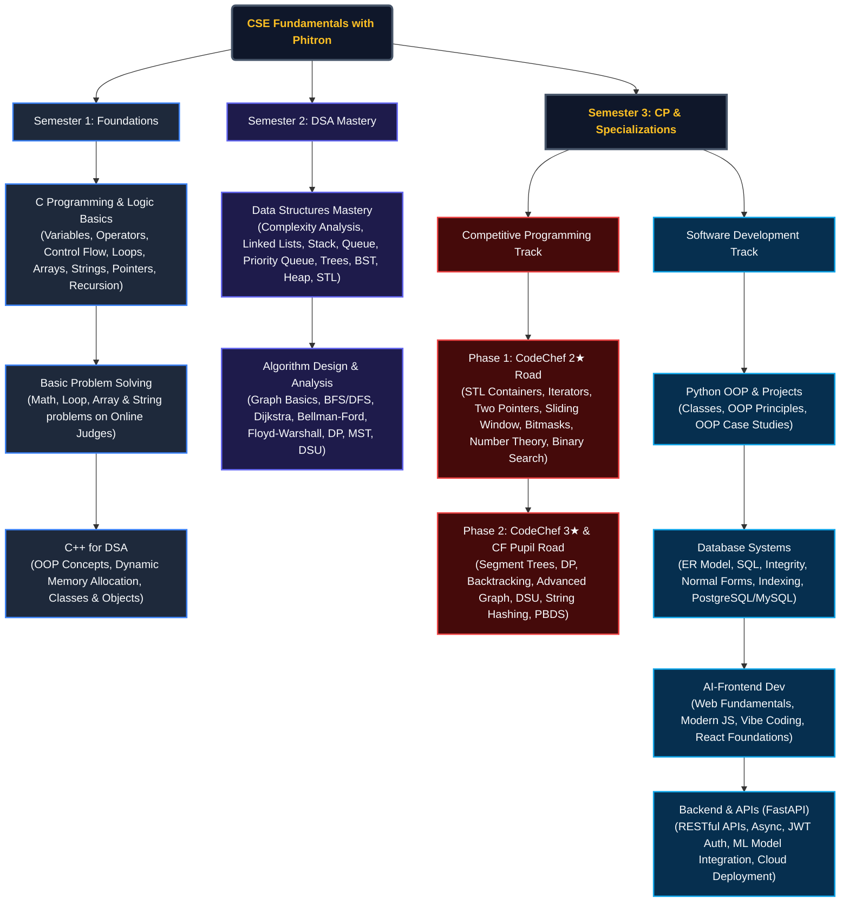

##  Overview

**CSE Fundamentals with Phitron** is a complete, structured archive of my coursework, assignments, exams, and projects spanning **Semester-1 to Semester-3**. It tracks my progressive journey from writing basic "Hello World" programs in C to mastering complex Data Structures, Algorithms, Competitive Programming, and advanced Software Development fields.

##  Learning Roadmap & Curriculum Flow

To visualize the scope of this repository, here is the structured roadmap of all topics covered across three semesters:



###  Curriculum Highlights at a Glance

| Phase / Semester | Focus Area | Key Concepts Covered |
| :--- | :--- | :--- |
| **Semester 1: Core Foundations** | **C & C++ Programming** | Syntax, Loops, Arrays, Strings, Pointers, Recursion, Object-Oriented Programming (OOP) in C++ |
| **Semester 2: Data Structures & Algorithms** | **DSA Mastery** | Time & Space Complexity, Stack, Queue, Singly/Doubly Linked Lists, Trees (BST, Heap), Graphs (BFS, DFS, Dijkstra, Bellman-Ford, Floyd-Warshall), Dynamic Programming (Knapsack, LCS, LIS) |
| **Semester 3: CP Specialization** | **Competitive Programming** | C++ STL, Bit Manipulation, Math & Number Theory (Sieve, Factorization), Binary Search on Answer, PBDS, Segment Trees, String Hashing |
| **Semester 3: Software Dev** | **Full-Stack Development** | **Python OOP** (Encapsulation, Inheritance), **Databases** (SQL, ER, Indexing, PostgreSQL/MySQL), **AI-Powered Frontend** (React, JS, Vibe Coding), **Backend Dev** (FastAPI, JWT, Async, ML Model Integration, Cloud Deployment) |


##  Repository Goals & Objectives

The primary goal of this repository is to build a highly organized, comprehensive showcase of my computer science and software engineering capability.

* **Problem Solving Instincts**: Develop deep capabilities in analyzing time and space complexity, utilizing advanced data structures, and applying standard algorithms to solve complex tasks.
* **Competitive Progression**: Actively advance through structured CP phases, solving real-world and mathematical challenges to rank up on CodeChef and Codeforces.
* **Full-Stack Competency**: Merge software development practices with backend scalability (FastAPI), database design (PostgreSQL/MySQL), and front-end responsiveness (React) to build complete, cloud-deployable systems.
* **Standardized Code Quality**: Maintain a clean, consistent, and professional archive of problem solutions, assignments, and projects serving as a learning roadmap.


<!-- # 📂 Course Structure -->
#  Semester-1 

##  Introduction To Programming in C Language

###  Weeks: [Week-1](#week-1) | [Week-2](#week-2) | [Week-3](#week-3) | [Catch Up Week](#catchupweek) | [Week-4](#week-4) | [Week-5](#week-5)  

###  Assignments & Exams: [Assignment-1](#assignment-1) | [Assignment-2](#assignment-2) | [Mid Exam](#mid-exam) | [Assignment-3](#assignment-3) | [Final Exam](#final-exam) 

##  Introduction to C++ for DSA

###  Weeks: [Week-1](#cpp-week-1) | [Week-2](#cpp-week-2)    

###  Assignments & Exams: [Mid Exam](#cpp-mid-exam) | [CodeFest-1](#cpp-CodeFest-1) | [Final Exam](#cpp-final-exam)  


## 📂 All Week & Module

<!-- 1st Week -->
## <a id="week-1"></a>Week-1: [Orientation](https://github.com/Islamul-Hoque/CSE-Fundamentals-with-Phitron/tree/main/Semester-1/Introduction%20To%20Programming%20in%20C%20Language/Week-1)

## 🚀 Module-1: [Basic Syntax, Variables and Data Types](https://github.com/Islamul-Hoque/CSE-Fundamentals-with-Phitron/tree/main/Semester-1/Introduction%20To%20Programming%20in%20C%20Language/Week-1/Module-1(Variables%20and%20Data%20Types))  
1. `Data Type`: [initialize and print basic data types such as integer, float, string, and boolean in C](https://github.com/Islamul-Hoque/CSE-Fundamentals-with-Phitron/blob/main/Semester-1/Introduction%20To%20Programming%20in%20C%20Language/Week-1/Module-1(Variables%20and%20Data%20Types)/data_type.c)  
2. `Input`: [read and process inputs of various data types using scanf()](https://github.com/Islamul-Hoque/CSE-Fundamentals-with-Phitron/blob/main/Semester-1/Introduction%20To%20Programming%20in%20C%20Language/Week-1/Module-1(Variables%20and%20Data%20Types)/input.c)  
3. `Data Type Limitations`: [analyze memory limitations and use long long int and double for large/precise values](https://github.com/Islamul-Hoque/CSE-Fundamentals-with-Phitron/blob/main/Semester-1/Introduction%20To%20Programming%20in%20C%20Language/Week-1/Module-1(Variables%20and%20Data%20Types)/data_type_limitations.c)  
4. `Extra Practice`: [conceptual question on standard data type sizes and need for long long int](https://github.com/Islamul-Hoque/CSE-Fundamentals-with-Phitron/blob/main/Semester-1/Introduction%20To%20Programming%20in%20C%20Language/Week-1/Module-1(Variables%20and%20Data%20Types)/extra_practice.c)

## 🚀 Module-2: [Operators & Conditional Statements](https://github.com/Islamul-Hoque/CSE-Fundamentals-with-Phitron/tree/main/Semester-1/Introduction%20To%20Programming%20in%20C%20Language/Week-1/Module-2(Operators%20Conditional%20Statement))  
1. `Arithmetic`: [perform basic math operations and analyze integer vs float division behavior](https://github.com/Islamul-Hoque/CSE-Fundamentals-with-Phitron/blob/main/Semester-1/Introduction%20To%20Programming%20in%20C%20Language/Week-1/Module-2(Operators%20Conditional%20Statement)/arithmetic.c)  
2. `Remainder`: [calculate the modulo/remainder of division between two integers](https://github.com/Islamul-Hoque/CSE-Fundamentals-with-Phitron/blob/main/Semester-1/Introduction%20To%20Programming%20in%20C%20Language/Week-1/Module-2(Operators%20Conditional%20Statement)/remainder.c)  
3. `If Else`: [apply single-condition decision making and observe branch execution logic](https://github.com/Islamul-Hoque/CSE-Fundamentals-with-Phitron/blob/main/Semester-1/Introduction%20To%20Programming%20in%20C%20Language/Week-1/Module-2(Operators%20Conditional%20Statement)/if_else.c)  
4. `If Else Ladder`: [evaluate multiple conditions sequentially using an if-else-if ladder](https://github.com/Islamul-Hoque/CSE-Fundamentals-with-Phitron/blob/main/Semester-1/Introduction%20To%20Programming%20in%20C%20Language/Week-1/Module-2(Operators%20Conditional%20Statement)/If_else_ladder.c)  
5. `Nested If Else`: [utilize nested if-else structures to handle hierarchical decision paths](https://github.com/Islamul-Hoque/CSE-Fundamentals-with-Phitron/blob/main/Semester-1/Introduction%20To%20Programming%20in%20C%20Language/Week-1/Module-2(Operators%20Conditional%20Statement)/Nested_if_else.c)  
6. `Extra Practice`: [conceptual definitions, syntax reference and examples of conditions (even/odd, positive/negative)](https://github.com/Islamul-Hoque/CSE-Fundamentals-with-Phitron/blob/main/Semester-1/Introduction%20To%20Programming%20in%20C%20Language/Week-1/Module-2(Operators%20Conditional%20Statement)/extra-practice.c)  

## 🚀 Module-2.5: [Practice Day 01](https://github.com/Islamul-Hoque/CSE-Fundamentals-with-Phitron/tree/main/Semester-1/Introduction%20To%20Programming%20in%20C%20Language/Week-1/Practice%20Day-1(Module-2.5)) 
1. `Zero Or Non Zero`: [check if an integer is zero or non-zero and print the result](https://github.com/Islamul-Hoque/CSE-Fundamentals-with-Phitron/blob/main/Semester-1/Introduction%20To%20Programming%20in%20C%20Language/Week-1/Practice%20Day-1(Module-2.5)/zero_or_non_zero.c)  
2. `Add 5 Mark`: [calculate the sum of an input value and 5 (or add 5 marks to a score)](https://github.com/Islamul-Hoque/CSE-Fundamentals-with-Phitron/blob/main/Semester-1/Introduction%20To%20Programming%20in%20C%20Language/Week-1/Practice%20Day-1(Module-2.5)/add_5_mark.c)  
3. `Multiple Or Not`: [check whether two numbers are multiples of each other and output Yes or No](https://github.com/Islamul-Hoque/CSE-Fundamentals-with-Phitron/blob/main/Semester-1/Introduction%20To%20Programming%20in%20C%20Language/Week-1/Practice%20Day-1(Module-2.5)/multiple_or_not.c)  
4. `Floating Point Number`: [read a floating-point number and print it with 3 decimal places of precision](https://github.com/Islamul-Hoque/CSE-Fundamentals-with-Phitron/blob/main/Semester-1/Introduction%20To%20Programming%20in%20C%20Language/Week-1/Practice%20Day-1(Module-2.5)/floating_point_number.c)  

## 🚀 Module-3: [Loop: for, while, do-while](https://github.com/Islamul-Hoque/CSE-Fundamentals-with-Phitron/tree/main/Semester-1/Introduction%20To%20Programming%20in%20C%20Language/Week-1/Module-3(Loop))  
1. `For Loop`: [print messages and increment counters using basic for loop syntax](https://github.com/Islamul-Hoque/CSE-Fundamentals-with-Phitron/blob/main/Semester-1/Introduction%20To%20Programming%20in%20C%20Language/Week-1/Module-3(Loop)/for_loop.c)  
2. `More For Loop`: [configure different increments, decrements, and geometric progressions in a for loop](https://github.com/Islamul-Hoque/CSE-Fundamentals-with-Phitron/blob/main/Semester-1/Introduction%20To%20Programming%20in%20C%20Language/Week-1/Module-3(Loop)/more_for_loop.c)  
3. `While`: [use the while loop syntax for conditional iteration control flow](https://github.com/Islamul-Hoque/CSE-Fundamentals-with-Phitron/blob/main/Semester-1/Introduction%20To%20Programming%20in%20C%20Language/Week-1/Module-3(Loop)/while.c)  
4. `Do While`: [implement a do-while loop to guarantee at least one execution iteration](https://github.com/Islamul-Hoque/CSE-Fundamentals-with-Phitron/blob/main/Semester-1/Introduction%20To%20Programming%20in%20C%20Language/Week-1/Module-3(Loop)/do_while.c)  
5. `Loop With Condition`: [identify even and odd numbers within a loop range using conditional checks](https://github.com/Islamul-Hoque/CSE-Fundamentals-with-Phitron/blob/main/Semester-1/Introduction%20To%20Programming%20in%20C%20Language/Week-1/Module-3(Loop)/loop_with_condition.c)  
6. `Sum 1 to N`: [calculate cumulative sum of first N natural numbers using a loop](https://github.com/Islamul-Hoque/CSE-Fundamentals-with-Phitron/blob/main/Semester-1/Introduction%20To%20Programming%20in%20C%20Language/Week-1/Module-3(Loop)/sum_1_to_N.c)  
7. `Break`: [terminate loop execution early using the break statement](https://github.com/Islamul-Hoque/CSE-Fundamentals-with-Phitron/blob/main/Semester-1/Introduction%20To%20Programming%20in%20C%20Language/Week-1/Module-3(Loop)/break.c)  
8. `Continue`: [skip the remaining instructions of current loop iteration using the continue statement](https://github.com/Islamul-Hoque/CSE-Fundamentals-with-Phitron/blob/main/Semester-1/Introduction%20To%20Programming%20in%20C%20Language/Week-1/Module-3(Loop)/Continue.c)  
9. `Infinity Loop`: [analyze do-while loop structures, scopes, variable shadowing, and infinite loops](https://github.com/Islamul-Hoque/CSE-Fundamentals-with-Phitron/blob/main/Semester-1/Introduction%20To%20Programming%20in%20C%20Language/Week-1/Module-3(Loop)/infinity_loop.c)  
10. `Quiz`: [solve loop tracing, scope variables, and iteration quiz questions](https://github.com/Islamul-Hoque/CSE-Fundamentals-with-Phitron/blob/main/Semester-1/Introduction%20To%20Programming%20in%20C%20Language/Week-1/Module-3(Loop)/quiz.c)  


## 🚀 Module-3.5: [Practice Day 02](https://github.com/Islamul-Hoque/CSE-Fundamentals-with-Phitron/tree/main/Semester-1/Introduction%20To%20Programming%20in%20C%20Language/Week-1/Practice%20Day-2(Module-3.5))  

### <a id="assignment-1"></a>Module-4: [Assignment-1](https://github.com/Islamul-Hoque/CSE-Fundamentals-with-Phitron/tree/main/All%20Assignment/Assignment-1)  

<!-- 2nd Week -->

## <a id="week-2"></a>Week-2: [Recap and Array](https://github.com/Islamul-Hoque/CSE-Fundamentals-with-Phitron/tree/main/Semester-1/Introduction%20To%20Programming%20in%20C%20Language/Week-2)

  - Module-5   : [Problem Solving with Conditional Statements](https://github.com/Islamul-Hoque/CSE-Fundamentals-with-Phitron/tree/main/Semester-1/Introduction%20To%20Programming%20in%20C%20Language/Week-2/Module-5)
    - Module-6   : [Problem Solving with Loop](https://github.com/Islamul-Hoque/CSE-Fundamentals-with-Phitron/tree/main/Semester-1/Introduction%20To%20Programming%20in%20C%20Language/Week-2/Module-6)
    - Module-6.5 : [Practice Day 01](https://github.com/Islamul-Hoque/CSE-Fundamentals-with-Phitron/tree/main/Semester-1/Introduction%20To%20Programming%20in%20C%20Language/Week-2/Practice%20Day-1(Module-6.5))
    - Module-7 : [Loop, break, continue](https://github.com/Islamul-Hoque/CSE-Fundamentals-with-Phitron/tree/main/Semester-1/Introduction%20To%20Programming%20in%20C%20Language/Week-2/Practice%20Day-1(Module-7))
    - Module-7.5 : [Practice Day 02](https://github.com/Islamul-Hoque/CSE-Fundamentals-with-Phitron/tree/main/Semester-1/Introduction%20To%20Programming%20in%20C%20Language/Week-2/Practice%20Day-1(Module-7.5))

### <a id="assignment-2"></a>Module-8: [Assignment 02](https://github.com/Islamul-Hoque/CSE-Fundamentals-with-Phitron/tree/main/All%20Assignment/C%20Programs/Assignment-2)

<!-- 3rd Week -->
## <a id="week-3"></a>Week-3 :[Array and String Operations](https://github.com/Islamul-Hoque/CSE-Fundamentals-with-Phitron/tree/main/Semester-1/Introduction%20To%20Programming%20in%20C%20Language/Week-3)

  - Module-9 : [Array Operations](https://github.com/Islamul-Hoque/CSE-Fundamentals-with-Phitron/tree/main/Semester-1/Introduction%20To%20Programming%20in%20C%20Language/Week-3/Module-9)

  - Module-10 : [String](https://github.com/Islamul-Hoque/CSE-Fundamentals-with-Phitron/tree/main/Semester-1/Introduction%20To%20Programming%20in%20C%20Language/Week-3/Module-10)  
    - [strlen() Function Example](https://github.com/Islamul-Hoque/CSE-Fundamentals-with-Phitron/blob/main/Semester-1/Introduction%20To%20Programming%20in%20C%20Language/Week-3/Module-10/Length_of_a_string.c)

  - Module-10.5 : [Practice Day 01](https://github.com/Islamul-Hoque/CSE-Fundamentals-with-Phitron/tree/main/Semester-1/Introduction%20To%20Programming%20in%20C%20Language/Week-3/Practice%20Day-1(Module-10.5))  
    - [Array Copy](https://github.com/Islamul-Hoque/CSE-Fundamentals-with-Phitron/blob/main/Semester-1/Introduction%20To%20Programming%20in%20C%20Language/Week-3/Practice%20Day-1(Module-10.5)/array_copy.c)  
    - [Reverse Integer Array](https://github.com/Islamul-Hoque/CSE-Fundamentals-with-Phitron/blob/main/Semester-1/Introduction%20To%20Programming%20in%20C%20Language/Week-3/Practice%20Day-1(Module-10.5)/F_Reversing.c)  
    - [Palindrome Check (Integer Array)](https://github.com/Islamul-Hoque/CSE-Fundamentals-with-Phitron/blob/main/Semester-1/Introduction%20To%20Programming%20in%20C%20Language/Week-3/Practice%20Day-1(Module-10.5)/G_Palindrome_Array.c)  
    - [Palindrome Check (String)](https://github.com/Islamul-Hoque/CSE-Fundamentals-with-Phitron/blob/main/Semester-1/Introduction%20To%20Programming%20in%20C%20Language/Week-3/Practice%20Day-1(Module-10.5)/I_Palindrome.c)  
    - [String Operations (Length, Concatenate, Swap)](https://github.com/Islamul-Hoque/CSE-Fundamentals-with-Phitron/blob/main/Semester-1/Introduction%20To%20Programming%20in%20C%20Language/Week-3/Practice%20Day-1(Module-10.5)/D_Strings.c)

  - Module-11 : [String Operations](https://github.com/Islamul-Hoque/CSE-Fundamentals-with-Phitron/tree/main/Semester-1/Introduction%20To%20Programming%20in%20C%20Language/Week-3/Module-11)  
     - String Comparison : [(strcmp() + Manual Loop)](https://github.com/Islamul-Hoque/CSE-Fundamentals-with-Phitron/blob/main/Semester-1/Introduction%20To%20Programming%20in%20C%20Language/Week-3/Module-11/lexicographical_comparison.c)  
     - String Concatenation : [(strcat() + Manual Loop)](https://github.com/Islamul-Hoque/CSE-Fundamentals-with-Phitron/blob/main/Semester-1/Introduction%20To%20Programming%20in%20C%20Language/Week-3/Module-11/String_concat.c)  
     - String Copy : [(strcpy() + Manual Loop)](https://github.com/Islamul-Hoque/CSE-Fundamentals-with-Phitron/blob/main/Semester-1/Introduction%20To%20Programming%20in%20C%20Language/Week-3/Module-11/String_copy.c)
  
  - Module-11.5 : [Practice Day 02](https://github.com/Islamul-Hoque/CSE-Fundamentals-with-Phitron/tree/main/Semester-1/Introduction%20To%20Programming%20in%20C%20Language/Week-3/Practice%20Day-2(Module-11.5))  
    - [Frequency Array](https://github.com/Islamul-Hoque/CSE-Fundamentals-with-Phitron/blob/main/Semester-1/Introduction%20To%20Programming%20in%20C%20Language/Week-3/Practice%20Day-2(Module-11.5)/Frequency_Array.c)


### <a id="mid-exam"></a>Module-12: [Mid Exam](https://github.com/Islamul-Hoque/CSE-Fundamentals-with-Phitron/tree/main/All%20Assignment/C%20Programs/Mid_Exam)

<!-- Catch Up Week -->
## <a id="catchupweek"></a>Catch Up Week: [Catch-Up-Week](https://github.com/Islamul-Hoque/CSE-Fundamentals-with-Phitron/tree/main/Semester-1/Introduction%20To%20Programming%20in%20C%20Language/Catch-Up-Week)

  - [Data-Type-Conditions :  👇](https://github.com/Islamul-Hoque/CSE-Fundamentals-with-Phitron/tree/main/Semester-1/Introduction%20To%20Programming%20in%20C%20Language/Catch-Up-Week/Data-Type-Conditions)

    1. Say Hello With C → [Print "Hello" message using C](https://github.com/Islamul-Hoque/CSE-Fundamentals-with-Phitron/tree/main/Semester-1/Introduction%20To%20Programming%20in%20C%20Language/Catch-Up-Week/Data-Type-Conditions/A_Say_Hello_With_C.c)  
    2. Basic Data Types → [Read and print integer, long long, char, float, double](https://github.com/Islamul-Hoque/CSE-Fundamentals-with-Phitron/tree/main/Semester-1/Introduction%20To%20Programming%20in%20C%20Language/Catch-Up-Week/Data-Type-Conditions/B_Basic_Data_Types.c)  
    3. Simple Calculator → [Perform addition, subtraction, multiplication, division](https://github.com/Islamul-Hoque/CSE-Fundamentals-with-Phitron/tree/main/Semester-1/Introduction%20To%20Programming%20in%20C%20Language/Catch-Up-Week/Data-Type-Conditions/C_Simple_Calculator.c)  
    4. Difference → [Calculate difference between two products A×B − C×D](https://github.com/Islamul-Hoque/CSE-Fundamentals-with-Phitron/tree/main/Semester-1/Introduction%20To%20Programming%20in%20C%20Language/Catch-Up-Week/Data-Type-Conditions/D_Difference.c)  
    5. Area of a Circle → [Compute circle area using πr²](https://github.com/Islamul-Hoque/CSE-Fundamentals-with-Phitron/tree/main/Semester-1/Introduction%20To%20Programming%20in%20C%20Language/Catch-Up-Week/Data-Type-Conditions/E_Area_of_a_Circle.c)  
    6. Digits Summation → [Sum last digits of two numbers](https://github.com/Islamul-Hoque/CSE-Fundamentals-with-Phitron/tree/main/Semester-1/Introduction%20To%20Programming%20in%20C%20Language/Catch-Up-Week/Data-Type-Conditions/F_Digits_Summation.c)  
    7. Summation from 1 to N → [Find sum of first N natural numbers](https://github.com/Islamul-Hoque/CSE-Fundamentals-with-Phitron/tree/main/Semester-1/Introduction%20To%20Programming%20in%20C%20Language/Catch-Up-Week/Data-Type-Conditions/G_Summation_from_1_to_N.c)  
    8. Two Numbers → [Compare two numbers and print relation](https://github.com/Islamul-Hoque/CSE-Fundamentals-with-Phitron/tree/main/Semester-1/Introduction%20To%20Programming%20in%20C%20Language/Catch-Up-Week/Data-Type-Conditions/H_Two_numbers.c)  
    9. Welcome for You with Conditions → [Check if A ≤ B and print messages](https://github.com/Islamul-Hoque/CSE-Fundamentals-with-Phitron/tree/main/Semester-1/Introduction%20To%20Programming%20in%20C%20Language/Catch-Up-Week/Data-Type-Conditions/I_Welcome_for_you_with_Conditions.c)  
    10. Multiples → [Check if one number is multiple of another](https://github.com/Islamul-Hoque/CSE-Fundamentals-with-Phitron/tree/main/Semester-1/Introduction%20To%20Programming%20in%20C%20Language/Catch-Up-Week/Data-Type-Conditions/J_Multiples.c)  
    11. Max and Min → [Find maximum and minimum among three numbers](https://github.com/Islamul-Hoque/CSE-Fundamentals-with-Phitron/tree/main/Semester-1/Introduction%20To%20Programming%20in%20C%20Language/Catch-Up-Week/Data-Type-Conditions/K_Max_and_Min.c)  
    12. The Brothers → [Check if two strings are identical](https://github.com/Islamul-Hoque/CSE-Fundamentals-with-Phitron/tree/main/Semester-1/Introduction%20To%20Programming%20in%20C%20Language/Catch-Up-Week/Data-Type-Conditions/L_The_Brothers.c)  
    13. Capital or Small or Digit → [Identify character type: uppercase, lowercase, digit](https://github.com/Islamul-Hoque/CSE-Fundamentals-with-Phitron/tree/main/Semester-1/Introduction%20To%20Programming%20in%20C%20Language/Catch-Up-Week/Data-Type-Conditions/M_Capital_or_Small_or_Digit.c)  
    14. Char → [Print next character in ASCII sequence](https://github.com/Islamul-Hoque/CSE-Fundamentals-with-Phitron/tree/main/Semester-1/Introduction%20To%20Programming%20in%20C%20Language/Catch-Up-Week/Data-Type-Conditions/N_Char.c)  
    15. Calculator → [Perform arithmetic based on operator (+ − × ÷)](https://github.com/Islamul-Hoque/CSE-Fundamentals-with-Phitron/tree/main/Semester-1/Introduction%20To%20Programming%20in%20C%20Language/Catch-Up-Week/Data-Type-Conditions/O_Calculator.c)  
    16. First Digit → [Extract and print first digit of a number](https://github.com/Islamul-Hoque/CSE-Fundamentals-with-Phitron/tree/main/Semester-1/Introduction%20To%20Programming%20in%20C%20Language/Catch-Up-Week/Data-Type-Conditions/P_First_digit.c)  
    17. Coordinates of a Point → [Determine quadrant or axis of given point](https://github.com/Islamul-Hoque/CSE-Fundamentals-with-Phitron/tree/main/Semester-1/Introduction%20To%20Programming%20in%20C%20Language/Catch-Up-Week/Data-Type-Conditions/Q_Coordinates_of_a_Point.c)  
    18. Age in Days → [Convert years, months, days into total days](https://github.com/Islamul-Hoque/CSE-Fundamentals-with-Phitron/tree/main/Semester-1/Introduction%20To%20Programming%20in%20C%20Language/Catch-Up-Week/Data-Type-Conditions/R_Age_in_Days.c)  
    19. Sort Numbers → [Sort three numbers in ascending order](https://github.com/Islamul-Hoque/CSE-Fundamentals-with-Phitron/tree/main/Semester-1/Introduction%20To%20Programming%20in%20C%20Language/Catch-Up-Week/Data-Type-Conditions/T_Sort_Numbers.c)  
    20. Float or Int → [Check if number is integer or float](https://github.com/Islamul-Hoque/CSE-Fundamentals-with-Phitron/tree/main/Semester-1/Introduction%20To%20Programming%20in%20C%20Language/Catch-Up-Week/Data-Type-Conditions/U_Float_or_int.c)  
    21. Comparison → [Compare two integers with operator > < =](https://github.com/Islamul-Hoque/CSE-Fundamentals-with-Phitron/tree/main/Semester-1/Introduction%20To%20Programming%20in%20C%20Language/Catch-Up-Week/Data-Type-Conditions/V_Comparison.c)  
    22. Mathematical Expression → [Evaluate expression and check correctness](https://github.com/Islamul-Hoque/CSE-Fundamentals-with-Phitron/tree/main/Semester-1/Introduction%20To%20Programming%20in%20C%20Language/Catch-Up-Week/Data-Type-Conditions/W_Mathematical_Expression.c)  
    23. Two Intervals 🌟→ [Check overlap between two intervals](https://github.com/Islamul-Hoque/CSE-Fundamentals-with-Phitron/tree/main/Semester-1/Introduction%20To%20Programming%20in%20C%20Language/Catch-Up-Week/Data-Type-Conditions/X_Two_intervals.c)  
    24. The Last 2 Digits → [Print last two digits of product A×B](https://github.com/Islamul-Hoque/CSE-Fundamentals-with-Phitron/tree/main/Semester-1/Introduction%20To%20Programming%20in%20C%20Language/Catch-Up-Week/Data-Type-Conditions/Y_The_last_2_digits.c)  
    25. Hard Compare 🌟→ [Compare A^B and C^D using logarithms to avoid overflow](https://github.com/Islamul-Hoque/CSE-Fundamentals-with-Phitron/tree/main/Semester-1/Introduction%20To%20Programming%20in%20C%20Language/Catch-Up-Week/Data-Type-Conditions/Z_Hard_Compare.c)  


  - [Loops](https://github.com/Islamul-Hoque/CSE-Fundamentals-with-Phitron/tree/main/Semester-1/Introduction%20To%20Programming%20in%20C%20Language/Catch-Up-Week/Loops)
    1. 1 to N → [Print numbers from 1 to N using loop](https://github.com/Islamul-Hoque/CSE-Fundamentals-with-Phitron/blob/main/Semester-1/Introduction%20To%20Programming%20in%20C%20Language/Catch-Up-Week/Loops/A_1_to_N.c)  
    2. Fixed Password → [Check password input until correct one is entered](https://github.com/Islamul-Hoque/CSE-Fundamentals-with-Phitron/blob/main/Semester-1/Introduction%20To%20Programming%20in%20C%20Language/Catch-Up-Week/Loops/D_Fixed_Password.c)  
    3. Multiplication Table → [Generate multiplication table for given number](https://github.com/Islamul-Hoque/CSE-Fundamentals-with-Phitron/blob/main/Semester-1/Introduction%20To%20Programming%20in%20C%20Language/Catch-Up-Week/Loops/F_Multiplication_table.c)  
    4. One Prime → [Check if given number is prime or not](https://github.com/Islamul-Hoque/CSE-Fundamentals-with-Phitron/blob/main/Semester-1/Introduction%20To%20Programming%20in%20C%20Language/Catch-Up-Week/Loops/H_One_Prime.c)  
    5. Primes from 1 to N → [Print all prime numbers from 1 to N](https://github.com/Islamul-Hoque/CSE-Fundamentals-with-Phitron/blob/main/Semester-1/Introduction%20To%20Programming%20in%20C%20Language/Catch-Up-Week/Loops/J_Primes_from_1_to_n.c)  
    6. Divisors → [Print all divisors of a given number](https://github.com/Islamul-Hoque/CSE-Fundamentals-with-Phitron/blob/main/Semester-1/Introduction%20To%20Programming%20in%20C%20Language/Catch-Up-Week/Loops/K_Divisors.c)  
    7. Lucky Numbers 🌟→ [Check if number is divisible by 4 or 7](https://github.com/Islamul-Hoque/CSE-Fundamentals-with-Phitron/blob/main/Semester-1/Introduction%20To%20Programming%20in%20C%20Language/Catch-Up-Week/Loops/M_Lucky_Numbers.c)  

<!-- 4th Week -->
## <a id="week-4"></a>Week-4 [Nested Loop Recap, Function & Pointer](https://github.com/Islamul-Hoque/CSE-Fundamentals-with-Phitron/tree/main/Semester-1/Introduction%20To%20Programming%20in%20C%20Language/Week-4)

  - Module-13 : [Nested Loop and Pattern](https://github.com/Islamul-Hoque/CSE-Fundamentals-with-Phitron/tree/main/Semester-1/Introduction%20To%20Programming%20in%20C%20Language/Week-4/Module-13)  
    - [Star Pattern](https://github.com/Islamul-Hoque/CSE-Fundamentals-with-Phitron/blob/main/Semester-1/Introduction%20To%20Programming%20in%20C%20Language/Week-4/Module-13/Star_Pattern.c)  
    - [Pyramid & Inverted Pyramid](https://github.com/Islamul-Hoque/CSE-Fundamentals-with-Phitron/blob/main/Semester-1/Introduction%20To%20Programming%20in%20C%20Language/Week-4/Module-13/Pyramid_Pattern.c)  
    - [Diamond Pattern](https://github.com/Islamul-Hoque/CSE-Fundamentals-with-Phitron/blob/main/Semester-1/Introduction%20To%20Programming%20in%20C%20Language/Week-4/Module-13/Diamond_Pattern.c)  
    - [Sum of Two Values Equal X](https://github.com/Islamul-Hoque/CSE-Fundamentals-with-Phitron/blob/main/Semester-1/Introduction%20To%20Programming%20in%20C%20Language/Week-4/Module-13/Sum_of_2_values_equal_X.c)  
    - [Selection Sort](https://github.com/Islamul-Hoque/CSE-Fundamentals-with-Phitron/blob/main/Semester-1/Introduction%20To%20Programming%20in%20C%20Language/Week-4/Module-13/Selection_Sort.c)  
    - [Quiz](https://github.com/Islamul-Hoque/CSE-Fundamentals-with-Phitron/blob/main/Semester-1/Introduction%20To%20Programming%20in%20C%20Language/Week-4/Module-13/quiz.c)

  - Module-14 : [Function](https://github.com/Islamul-Hoque/CSE-Fundamentals-with-Phitron/tree/main/Semester-1/Introduction%20To%20Programming%20in%20C%20Language/Week-4/Module-14)  
    - [Return + Parameter](https://github.com/Islamul-Hoque/CSE-Fundamentals-with-Phitron/tree/main/Semester-1/Introduction%20To%20Programming%20in%20C%20Language/Week-4/Module-14/return_parameter.c)  
    - [Return + No Parameter](https://github.com/Islamul-Hoque/CSE-Fundamentals-with-Phitron/tree/main/Semester-1/Introduction%20To%20Programming%20in%20C%20Language/Week-4/Module-14/return_NoParameter.c)  
    - [No Return + Parameter](https://github.com/Islamul-Hoque/CSE-Fundamentals-with-Phitron/tree/main/Semester-1/Introduction%20To%20Programming%20in%20C%20Language/Week-4/Module-14/noReturn_parameter.c)  
    - [No Return + No Parameter](https://github.com/Islamul-Hoque/CSE-Fundamentals-with-Phitron/tree/main/Semester-1/Introduction%20To%20Programming%20in%20C%20Language/Week-4/Module-14/NoReturn_NoParameter.c)  
    - [Scope Demonstration](https://github.com/Islamul-Hoque/CSE-Fundamentals-with-Phitron/tree/main/Semester-1/Introduction%20To%20Programming%20in%20C%20Language/Week-4/Module-14/scope.c)  
    - [Math Functions (ceil, floor, round, sqrt, pow, abs)](https://github.com/Islamul-Hoque/CSE-Fundamentals-with-Phitron/tree/main/Semester-1/Introduction%20To%20Programming%20in%20C%20Language/Week-4/Module-14/Useful_Math_Functions.c)  
    - [Quiz](https://github.com/Islamul-Hoque/CSE-Fundamentals-with-Phitron/tree/main/Semester-1/Introduction%20To%20Programming%20in%20C%20Language/Week-4/Module-14/quiz.c)

  - Module-14.5 : [Practice Day 01]()

  - Module-15 : [Pointer](https://github.com/Islamul-Hoque/CSE-Fundamentals-with-Phitron/tree/main/Semester-1/Introduction%20To%20Programming%20in%20C%20Language/Week-4/Module-15)  
    - [Pointer Basics](https://github.com/Islamul-Hoque/CSE-Fundamentals-with-Phitron/tree/main/Semester-1/Introduction%20To%20Programming%20in%20C%20Language/Week-4/Module-15/Pointer.c)  
    - [Referencing & Dereferencing](https://github.com/Islamul-Hoque/CSE-Fundamentals-with-Phitron/tree/main/Semester-1/Introduction%20To%20Programming%20in%20C%20Language/Week-4/Module-15/Dereferencing_A_Pointer.c)  
    - [Pass By Value](https://github.com/Islamul-Hoque/CSE-Fundamentals-with-Phitron/tree/main/Semester-1/Introduction%20To%20Programming%20in%20C%20Language/Week-4/Module-15/Pass_By_Value.c)  
    - [Pass By Reference](https://github.com/Islamul-Hoque/CSE-Fundamentals-with-Phitron/tree/main/Semester-1/Introduction%20To%20Programming%20in%20C%20Language/Week-4/Module-15/Pass_By_Reference.c)  
    - [Pointer in Array](https://github.com/Islamul-Hoque/CSE-Fundamentals-with-Phitron/tree/main/Semester-1/Introduction%20To%20Programming%20in%20C%20Language/Week-4/Module-15/Pointer_In_Array.c)  
    - [Function with Array](https://github.com/Islamul-Hoque/CSE-Fundamentals-with-Phitron/tree/main/Semester-1/Introduction%20To%20Programming%20in%20C%20Language/Week-4/Module-15/Function_with_array.c)  
    - [Function with String](https://github.com/Islamul-Hoque/CSE-Fundamentals-with-Phitron/tree/main/Semester-1/Introduction%20To%20Programming%20in%20C%20Language/Week-4/Module-15/Function_with_string.c)

  - Module-15.5 : [Practice Day 02]()

### <a id="assignment-3"></a>Module-16: [Assignment-3](https://github.com/Islamul-Hoque/CSE-Fundamentals-with-Phitron/tree/main/All%20Assignment/C%20Programs/Assignment-3)  
- [Diamond Pattern (Odd/Even Line Alternation)](https://github.com/Islamul-Hoque/CSE-Fundamentals-with-Phitron/blob/main/All%20Assignment/C%20Programs/Assignment-3/Pattern.c)  
- [Numeric Pattern (Reverse Order with Spacing)](https://github.com/Islamul-Hoque/CSE-Fundamentals-with-Phitron/blob/main/All%20Assignment/C%20Programs/Assignment-3/Pattern_2.c)  
- [Count Before One (Return Function)](https://github.com/Islamul-Hoque/CSE-Fundamentals-with-Phitron/blob/main/All%20Assignment/C%20Programs/Assignment-3/Count_Before_One.c)  
- [Palindrome Check (Return + Parameter)](https://github.com/Islamul-Hoque/CSE-Fundamentals-with-Phitron/blob/main/All%20Assignment/C%20Programs/Assignment-3/Is_Palindrome.c)  
- [Even and Odd (No Return, No Parameter)](https://github.com/Islamul-Hoque/CSE-Fundamentals-with-Phitron/blob/main/All%20Assignment/C%20Programs/Assignment-3/Even_and_Odd.c)

<!-- 5th Week -->
## <a id="week-5"></a>Week-5: [2D Array and Recursion](https://github.com/Islamul-Hoque/CSE-Fundamentals-with-Phitron/tree/main/Semester-1/Introduction%20To%20Programming%20in%20C%20Language/Week-5(2D_Array_and_Recursion))

  - Module-17 : [Recursion](https://github.com/Islamul-Hoque/CSE-Fundamentals-with-Phitron/tree/main/Semester-1/Introduction%20To%20Programming%20in%20C%20Language/Week-5(2D_Array_and_Recursion)/Module-17(Recursion))  
    - [Call Stack Demonstration](https://github.com/Islamul-Hoque/CSE-Fundamentals-with-Phitron/blob/main/Semester-1/Introduction%20To%20Programming%20in%20C%20Language/Week-5(2D_Array_and_Recursion)/Module-17(Recursion)/Call_Stack.c)  
    - [Infinite Recursion (Stack Overflow)](https://github.com/Islamul-Hoque/CSE-Fundamentals-with-Phitron/blob/main/Semester-1/Introduction%20To%20Programming%20in%20C%20Language/Week-5(2D_Array_and_Recursion)/Module-17(Recursion)/recursion.c)  
    - [Print Numbers from 1 to N (Recursion)](https://github.com/Islamul-Hoque/CSE-Fundamentals-with-Phitron/blob/main/Semester-1/Introduction%20To%20Programming%20in%20C%20Language/Week-5(2D_Array_and_Recursion)/Module-17(Recursion)/Print_from_1_to_N.c)  
    - [Print Numbers from N to 1 (Recursion)](https://github.com/Islamul-Hoque/CSE-Fundamentals-with-Phitron/blob/main/Semester-1/Introduction%20To%20Programming%20in%20C%20Language/Week-5(2D_Array_and_Recursion)/Module-17(Recursion)/Print_from_N_to_1.c)  
    - [Print Reverse Numbers (Recursion)](https://github.com/Islamul-Hoque/CSE-Fundamentals-with-Phitron/blob/main/Semester-1/Introduction%20To%20Programming%20in%20C%20Language/Week-5(2D_Array_and_Recursion)/Module-17(Recursion)/Print_from_N_to_1_using_recursion.c)  
    - [Print Even Numbers from 1 to N (Recursion)](https://github.com/Islamul-Hoque/CSE-Fundamentals-with-Phitron/blob/main/Semester-1/Introduction%20To%20Programming%20in%20C%20Language/Week-5(2D_Array_and_Recursion)/Module-17(Recursion)/Print_Even_1_to_N_Recursion.c)  
    - [Print Array Elements using Recursion](https://github.com/Islamul-Hoque/CSE-Fundamentals-with-Phitron/blob/main/Semester-1/Introduction%20To%20Programming%20in%20C%20Language/Week-5(2D_Array_and_Recursion)/Module-17(Recursion)/Printing_an_array.c)  
    - [Recursion and Function Call Flow Quiz Problems (Q-1 to Q-4)](https://github.com/Islamul-Hoque/CSE-Fundamentals-with-Phitron/blob/main/Semester-1/Introduction%20To%20Programming%20in%20C%20Language/Week-5(2D_Array_and_Recursion)/Module-17(Recursion)/quiz.c)  

    - Extra Practice Problem : [All Problem](https://github.com/Islamul-Hoque/CSE-Fundamentals-with-Phitron/tree/main/Semester-1/Introduction%20To%20Programming%20in%20C%20Language/Week-5(2D_Array_and_Recursion)/Module-17(Recursion)/Extra_Practice_Problem)  
      - [Print Even Indices in Reverse Order (Recursion)](https://github.com/Islamul-Hoque/CSE-Fundamentals-with-Phitron/blob/main/Semester-1/Introduction%20To%20Programming%20in%20C%20Language/Week-5(2D_Array_and_Recursion)/Module-17(Recursion)/Extra_Practice_Problem/F_Print_Even_Indices.c)

  - Module-18 : [2D Array](https://github.com/Islamul-Hoque/CSE-Fundamentals-with-Phitron/tree/main/Semester-1/Introduction%20To%20Programming%20in%20C%20Language/Week-5(2D_Array_and_Recursion)/Module-18(2D_Array))  
    - [2D Array Input and Output (Matrix Form)](https://github.com/Islamul-Hoque/CSE-Fundamentals-with-Phitron/blob/main/Semester-1/Introduction%20To%20Programming%20in%20C%20Language/Week-5(2D_Array_and_Recursion)/Module-18(2D_Array)/2D_array_input_output.c)  
    - [Print Specific Row and Column from 2D Array](https://github.com/Islamul-Hoque/CSE-Fundamentals-with-Phitron/blob/main/Semester-1/Introduction%20To%20Programming%20in%20C%20Language/Week-5(2D_Array_and_Recursion)/Module-18(2D_Array)/Printing_Specific_row_column.c)  
    - [Check Zero Matrix](https://github.com/Islamul-Hoque/CSE-Fundamentals-with-Phitron/blob/main/Semester-1/Introduction%20To%20Programming%20in%20C%20Language/Week-5(2D_Array_and_Recursion)/Module-18(2D_Array)/Checking_Zero_Matrix.c)  
    - [Check Primary Diagonal Matrix](https://github.com/Islamul-Hoque/CSE-Fundamentals-with-Phitron/blob/main/Semester-1/Introduction%20To%20Programming%20in%20C%20Language/Week-5(2D_Array_and_Recursion)/Module-18(2D_Array)/Checking_Primary_Diagonal_Matrix.c)  
    - [Check Secondary Diagonal Matrix](https://github.com/Islamul-Hoque/CSE-Fundamentals-with-Phitron/blob/main/Semester-1/Introduction%20To%20Programming%20in%20C%20Language/Week-5(2D_Array_and_Recursion)/Module-18(2D_Array)/Checking_Secondary_Diagonal_Matrix.c)  

    - Extra Practice Problem : [All Problem](https://github.com/Islamul-Hoque/CSE-Fundamentals-with-Phitron/tree/main/Semester-1/Introduction%20To%20Programming%20in%20C%20Language/Week-5(2D_Array_and_Recursion)/Module-18(2D_Array)/Extra_Practice_Problem)  
      - [Diagonal Absolute Difference (Primary vs Secondary)](https://github.com/Islamul-Hoque/CSE-Fundamentals-with-Phitron/blob/main/Semester-1/Introduction%20To%20Programming%20in%20C%20Language/Week-5(2D_Array_and_Recursion)/Module-18(2D_Array)/Extra_Practice_Problem/T_Matrix.c)  
      - [Search in 2D Matrix with Conditional Output](https://github.com/Islamul-Hoque/CSE-Fundamentals-with-Phitron/blob/main/Semester-1/Introduction%20To%20Programming%20in%20C%20Language/Week-5(2D_Array_and_Recursion)/Module-18(2D_Array)/Extra_Practice_Problem/S_Search_In_Matrix.c)

  - Module-19 : [Problem Solving with 2D Array and Recursion](https://github.com/Islamul-Hoque/CSE-Fundamentals-with-Phitron/tree/main/Semester-1/Introduction%20To%20Programming%20in%20C%20Language/Week-5(2D_Array_and_Recursion)/Module-19(Problem_Solving_With_2D_Array_and_Recursion))  
     - [Mirror Array](https://github.com/Islamul-Hoque/CSE-Fundamentals-with-Phitron/blob/main/Semester-1/Introduction%20To%20Programming%20in%20C%20Language/Week-5(2D_Array_and_Recursion)/Module-19(Problem_Solving_With_2D_Array_and_Recursion)/W_Mirror_Array.c)  
     - [Print Digits Using Recursion](https://github.com/Islamul-Hoque/CSE-Fundamentals-with-Phitron/blob/main/Semester-1/Introduction%20To%20Programming%20in%20C%20Language/Week-5(2D_Array_and_Recursion)/Module-19(Problem_Solving_With_2D_Array_and_Recursion)/D_Print_Digits_using_Recursion.c)  
     - [Count Vowels Using Recursion (Capital & Small)](https://github.com/Islamul-Hoque/CSE-Fundamentals-with-Phitron/blob/main/Semester-1/Introduction%20To%20Programming%20in%20C%20Language/Week-5(2D_Array_and_Recursion)/Module-19(Problem_Solving_With_2D_Array_and_Recursion)/I_Count_Vowels.c)  
     - [Factorial Using Recursion](https://github.com/Islamul-Hoque/CSE-Fundamentals-with-Phitron/blob/main/Semester-1/Introduction%20To%20Programming%20in%20C%20Language/Week-5(2D_Array_and_Recursion)/Module-19(Problem_Solving_With_2D_Array_and_Recursion)/J_Factorial.c)


### <a id="final-exam"></a>Module-20: [Final Exam](https://github.com/Islamul-Hoque/CSE-Fundamentals-with-Phitron/tree/main/All%20Assignment/C%20Programs/Final-Exam)  
- [Find the Missing Number (Divisibility & Conditional Output)](https://github.com/Islamul-Hoque/CSE-Fundamentals-with-Phitron/blob/main/All%20Assignment/C%20Programs/Final-Exam/Find_the_Missing_Number.c)  
- [Check Jadu Matrix (Diagonal 1s, Others 0s)](https://github.com/Islamul-Hoque/CSE-Fundamentals-with-Phitron/blob/main/All%20Assignment/C%20Programs/Final-Exam/Jadu_Matrix.c)  
- [Print Last Row and Column of Matrix](https://github.com/Islamul-Hoque/CSE-Fundamentals-with-Phitron/blob/main/All%20Assignment/C%20Programs/Final-Exam/Matrix_Again.c)  
- [Print Christmas Tree Pattern (Magical Tree)](https://github.com/Islamul-Hoque/CSE-Fundamentals-with-Phitron/blob/main/All%20Assignment/C%20Programs/Final-Exam/Magical_Tree.c)  
- [Difference Array (Copy, Sort & Absolute Difference)](https://github.com/Islamul-Hoque/CSE-Fundamentals-with-Phitron/blob/main/All%20Assignment/C%20Programs/Final-Exam/Difference_Array.c)


##  Structure-1 || Introduction to C++ for DSA 

<!-- 1st Week -->
## <a id="cpp-week-1"></a>Week-1 : [Introduction to C++](https://github.com/Islamul-Hoque/CSE-Fundamentals-with-Phitron/tree/main/Semester-1/Introduction%20to%20C%2B%2B%20for%20DSA/Week-1)

### 🚀 Module-1: [Basic c++](https://github.com/Islamul-Hoque/CSE-Fundamentals-with-Phitron/tree/main/Semester-1/Introduction%20to%20C%2B%2B%20for%20DSA/Week-1/Module-1(Basic%20c%2B%2B))

1. `Print`: [basic output of text and variables in C++](https://github.com/Islamul-Hoque/CSE-Fundamentals-with-Phitron/blob/main/Semester-1/Introduction%20to%20C%2B%2B%20for%20DSA/Week-1/Module-1(Basic%20c%2B%2B)/Print.cpp)  
2. `Take input in C++, Typecasting`: [demonstrate integer, string input and typecasting](https://github.com/Islamul-Hoque/CSE-Fundamentals-with-Phitron/blob/main/Semester-1/Introduction%20to%20C%2B%2B%20for%20DSA/Week-1/Module-1(Basic%20c%2B%2B)/input.cpp)  
3. `EOF`: [handle end-of-file input stream in C++](https://github.com/Islamul-Hoque/CSE-Fundamentals-with-Phitron/blob/main/Semester-1/Introduction%20to%20C%2B%2B%20for%20DSA/Week-1/Module-1(Basic%20c%2B%2B)/EOF.cpp)  
4. `Setprecision`: [format floating-point output with fixed precision](https://github.com/Islamul-Hoque/CSE-Fundamentals-with-Phitron/blob/main/Semester-1/Introduction%20to%20C%2B%2B%20for%20DSA/Week-1/Module-1(Basic%20c%2B%2B)/Setprecision.cpp)  
5. `If-Else`: [conditional branching using if-else statements](https://github.com/Islamul-Hoque/CSE-Fundamentals-with-Phitron/blob/main/Semester-1/Introduction%20to%20C%2B%2B%20for%20DSA/Week-1/Module-1(Basic%20c%2B%2B)/If_else.cpp)  
6. `Ternary Operator`: [short conditional evaluation using ternary operator](https://github.com/Islamul-Hoque/CSE-Fundamentals-with-Phitron/blob/main/Semester-1/Introduction%20to%20C%2B%2B%20for%20DSA/Week-1/Module-1(Basic%20c%2B%2B)/Ternary_Operator.cpp)  
7. `Switch → Week`: [map integer input to weekday using switch-case](https://github.com/Islamul-Hoque/CSE-Fundamentals-with-Phitron/blob/main/Semester-1/Introduction%20to%20C%2B%2B%20for%20DSA/Week-1/Module-1(Basic%20c%2B%2B)/Switch.cpp)  
8. `Switch → Even Odd`: [determine even or odd number using switch-case](https://github.com/Islamul-Hoque/CSE-Fundamentals-with-Phitron/blob/main/Semester-1/Introduction%20to%20C%2B%2B%20for%20DSA/Week-1/Module-1(Basic%20c%2B%2B)/Even_Odd_With_Switch.cpp)  
9. `Switch → Vowels Consonants`: [check if character is vowel or consonant using switch-case](https://github.com/Islamul-Hoque/CSE-Fundamentals-with-Phitron/blob/main/Semester-1/Introduction%20to%20C%2B%2B%20for%20DSA/Week-1/Module-1(Basic%20c%2B%2B)/Vowels_Consonants.cpp)  
10. `Min, Max, Swap`: [demonstrate std::min, std::max and swap functions](https://github.com/Islamul-Hoque/CSE-Fundamentals-with-Phitron/blob/main/Semester-1/Introduction%20to%20C%2B%2B%20for%20DSA/Week-1/Module-1(Basic%20c%2B%2B)/Min_Max_Swap.cpp)  
11. `String`: [string input, getline usage and output handling](https://github.com/Islamul-Hoque/CSE-Fundamentals-with-Phitron/blob/main/Semester-1/Introduction%20to%20C%2B%2B%20for%20DSA/Week-1/Module-1(Basic%20c%2B%2B)/String.cpp)  


## 🚀 Module-2: [Dynamic Memory Allocation](https://github.com/Islamul-Hoque/CSE-Fundamentals-with-Phitron/tree/main/Semester-1/Introduction%20to%20C%2B%2B%20for%20DSA/Week-1/Module-2(Dynamic_Memory_Allocation))

1. `Dynamic Variable` : [demonstrate static vs dynamic variable allocation using pointers](https://github.com/Islamul-Hoque/CSE-Fundamentals-with-Phitron/blob/main/Semester-1/Introduction%20to%20C%2B%2B%20for%20DSA/Week-1/Module-2(Dynamic_Memory_Allocation)/Dynamic_Variable.cpp)
2. `Dynamic Array` : [create integer array dynamically using new keyword and perform input/output operations](https://github.com/Islamul-Hoque/CSE-Fundamentals-with-Phitron/blob/main/Semester-1/Introduction%20to%20C%2B%2B%20for%20DSA/Week-1/Module-2(Dynamic_Memory_Allocation)/Dynamic_Array.cpp)
3. `Dynamic Array Return From Function` : [allocate dynamic array inside function and return pointer to main for output](https://github.com/Islamul-Hoque/CSE-Fundamentals-with-Phitron/blob/main/Semester-1/Introduction%20to%20C%2B%2B%20for%20DSA/Week-1/Module-2(Dynamic_Memory_Allocation)/Dynamic-Array-Return-From-Function.cpp)
4. `Increase Size of Dynamic Array` : [resize dynamic array by allocating new memory and copying elements](https://github.com/Islamul-Hoque/CSE-Fundamentals-with-Phitron/blob/main/Semester-1/Introduction%20to%20C%2B%2B%20for%20DSA/Week-1/Module-2(Dynamic_Memory_Allocation)/Increase_Size_of_Dynamic_Array.cpp)


## 🚀 Practice-2.5 Problem Solutions
1. `C. Simple Calculator` : [perform addition, multiplication, and subtraction of two integers with proper formatting](https://github.com/Islamul-Hoque/CSE-Fundamentals-with-Phitron/blob/main/Semester-1/Introduction%20to%20C%2B%2B%20for%20DSA/Week-1/Practice%20Day-1(Module-2.5)/C_Simple_Calculator.cpp)
2. `E. Max` : [find maximum element in an integer array using loop and std::max](https://github.com/Islamul-Hoque/CSE-Fundamentals-with-Phitron/blob/main/Semester-1/Introduction%20to%20C%2B%2B%20for%20DSA/Week-1/Practice%20Day-1(Module-2.5)/E_Max.cpp)
3. `F. Reversing` : [reverse an integer array using two-pointer swapping technique](https://github.com/Islamul-Hoque/CSE-Fundamentals-with-Phitron/blob/main/Semester-1/Introduction%20to%20C%2B%2B%20for%20DSA/Week-1/Practice%20Day-1(Module-2.5)/F_Reversing.cpp)
4. `K. Max and Min` : [print minimum and maximum among three integers using std::min and std::max](https://github.com/Islamul-Hoque/CSE-Fundamentals-with-Phitron/blob/main/Semester-1/Introduction%20to%20C%2B%2B%20for%20DSA/Week-1/Practice%20Day-1(Module-2.5)/K_Max_and_Min.cpp)
5. `M. Capital or Small or Digit` : [classify input character as digit, capital letter, or small letter](https://github.com/Islamul-Hoque/CSE-Fundamentals-with-Phitron/blob/main/Semester-1/Introduction%20to%20C%2B%2B%20for%20DSA/Week-1/Practice%20Day-1(Module-2.5)/M_Capital_or_Small_or_Digit.cpp)

## 🚀 Module-3:  [Class and Object in C++](https://github.com/Islamul-Hoque/CSE-Fundamentals-with-Phitron/tree/main/Semester-1/Introduction%20to%20C%2B%2B%20for%20DSA/Week-1/Module-3(Class%20and%20Object%20in%20C%2B%2B))

1. `Working with class and object` : [basic class declaration, object creation, hardcoded data and user input handling](https://github.com/Islamul-Hoque/CSE-Fundamentals-with-Phitron/blob/main/Semester-1/Introduction%20to%20C%2B%2B%20for%20DSA/Week-1/Module-3(Class%20and%20Object%20in%20C%2B%2B)/Class_and_Object.cpp)
2. `Constructor and its Simulation` : [demonstrate default and parameterized constructors with manual data assignment and input handling](https://github.com/Islamul-Hoque/CSE-Fundamentals-with-Phitron/blob/main/Semester-1/Introduction%20to%20C%2B%2B%20for%20DSA/Week-1/Module-3(Class%20and%20Object%20in%20C%2B%2B)/Constructor.cpp)
3. `This keyword and Arrow sign` : [use of 'this' pointer in constructor and arrow operator for object initialization](https://github.com/Islamul-Hoque/CSE-Fundamentals-with-Phitron/blob/main/Semester-1/Introduction%20to%20C%2B%2B%20for%20DSA/Week-1/Module-3(Class%20and%20Object%20in%20C%2B%2B)/This_and_Arrow.cpp)
4. `Return object from function` : [return a class object from function and print object data in main](https://github.com/Islamul-Hoque/CSE-Fundamentals-with-Phitron/blob/main/Semester-1/Introduction%20to%20C%2B%2B%20for%20DSA/Week-1/Module-3(Class%20and%20Object%20in%20C%2B%2B)/Return_object_from_function.cpp)
5. `Why we need dynamic object` : [return object pointer from function using constructor and access data via pointer](https://github.com/Islamul-Hoque/CSE-Fundamentals-with-Phitron/blob/main/Semester-1/Introduction%20to%20C%2B%2B%20for%20DSA/Week-1/Module-3(Class%20and%20Object%20in%20C%2B%2B)/Why_We_Need_Dynamic_Object.cpp)
6. `Dynamic Object` : [create dynamic object using 'new' keyword and access data via pointer](https://github.com/Islamul-Hoque/CSE-Fundamentals-with-Phitron/blob/main/Semester-1/Introduction%20to%20C%2B%2B%20for%20DSA/Week-1/Module-3(Class%20and%20Object%20in%20C%2B%2B)/Dynamic_Object.cpp)
7. `Dynamic object Return from function` : [return dynamically created object from function and access data via pointer](https://github.com/Islamul-Hoque/CSE-Fundamentals-with-Phitron/blob/main/Semester-1/Introduction%20to%20C%2B%2B%20for%20DSA/Week-1/Module-3(Class%20and%20Object%20in%20C%2B%2B)/Dynamic_Object_Return_From_Function.cpp)
8. `Sort function in C++` : [sort an integer array using STL sort() function](https://github.com/Islamul-Hoque/CSE-Fundamentals-with-Phitron/blob/main/Semester-1/Introduction%20to%20C%2B%2B%20for%20DSA/Week-1/Module-3(Class%20and%20Object%20in%20C%2B%2B)/Sorting.cpp)


## 🚀 Practice-3.5 Problem Solutions
1. `G. Palindrome Array` : [check if an array is palindrome using two-pointer approach](https://github.com/Islamul-Hoque/CSE-Fundamentals-with-Phitron/blob/main/Semester-1/Introduction%20to%20C%2B%2B%20for%20DSA/Week-1/Practice%20Day-2(Module-3.5)/G_Palindrome_Array.cpp)
2. `H. Sorting` : [sort an array using manual bubble/selection sort without built-in functions](https://github.com/Islamul-Hoque/CSE-Fundamentals-with-Phitron/blob/main/Semester-1/Introduction%20to%20C%2B%2B%20for%20DSA/Week-1/Practice%20Day-2(Module-3.5)/H_Sorting.cpp)
3. `I. Smallest Pair` : [find minimum value of Ai + Aj + (j - i) using brute-force nested loops](https://github.com/Islamul-Hoque/CSE-Fundamentals-with-Phitron/blob/main/Semester-1/Introduction%20to%20C%2B%2B%20for%20DSA/Week-1/Practice%20Day-2(Module-3.5)/I_Smallest_Pair.cpp)
4. `V. Comparison` : [validate relational operator between two integers using nested if-else and ternary operator](https://github.com/Islamul-Hoque/CSE-Fundamentals-with-Phitron/blob/main/Semester-1/Introduction%20to%20C%2B%2B%20for%20DSA/Week-1/Practice%20Day-2(Module-3.5)/V_Comparison.cpp)
5. `W. Mathematical Expression` : [check correctness of A S B = C expression and print 'Yes' or correct result](https://github.com/Islamul-Hoque/CSE-Fundamentals-with-Phitron/blob/main/Semester-1/Introduction%20to%20C%2B%2B%20for%20DSA/Week-1/Practice%20Day-2(Module-3.5)/W_Mathematical_Expression.cpp)

## <a id="cpp-mid-exam"></a>🎯 C++ Mid Exam
1. `Sort It` : [sort array in ascending and descending order using STL sort()](https://github.com/Islamul-Hoque/CSE-Fundamentals-with-Phitron/blob/main/All%20Assignment/C%2B%2B/Mid%20Exam/Sort_It.cpp)  
2. `Sort It 2` : [implement sort_it() function with dynamic array return and descending sort](https://github.com/Islamul-Hoque/CSE-Fundamentals-with-Phitron/blob/main/All%20Assignment/C%2B%2B/Mid%20Exam/Sort_It_2.cpp)  
3. `Monkey` : [remove spaces and sort characters alphabetically](https://github.com/Islamul-Hoque/CSE-Fundamentals-with-Phitron/blob/main/All%20Assignment/C%2B%2B/Mid%20Exam/Monkey.cpp)  
4. `Who Is It` : [find student with highest marks, resolving ties by smallest ID](https://github.com/Islamul-Hoque/CSE-Fundamentals-with-Phitron/blob/main/All%20Assignment/C%2B%2B/Mid%20Exam/Who_Is_It.cpp)  
5. `Choose Three` : [check if any three distinct elements sum to S](https://github.com/Islamul-Hoque/CSE-Fundamentals-with-Phitron/blob/main/All%20Assignment/C%2B%2B/Mid%20Exam/Choose_Three.cpp)  

## <a id="cpp-CodeFest-1"></a>🚀 CodeFest-1 Problem Solutions
1. `Mirror Sum` : [mirror sum of two arrays by adding elements with their mirrored counterparts](https://github.com/Islamul-Hoque/CSE-Fundamentals-with-Phitron/blob/main/CodeFest/CodeFest-1/Mirror_Sum.c)
2. `Good Pair Detector` : [count good pairs by multiplying even and odd counts in an array](https://github.com/Islamul-Hoque/CSE-Fundamentals-with-Phitron/blob/main/CodeFest/CodeFest-1/Good_Pair_Detector.c)
3. `Divisibility by 3` : [check divisibility of a number by 3 using digit sum](https://github.com/Islamul-Hoque/CSE-Fundamentals-with-Phitron/blob/main/CodeFest/CodeFest-1/Divisibility_by_3.c)
4. `Merge by Index` : [merge substring of second string into first string based on given start and end indices](https://github.com/Islamul-Hoque/CSE-Fundamentals-with-Phitron/blob/main/CodeFest/CodeFest-1/Merge_by_Index.c)
5. `Let's Play With Candy` : [find smallest missing non-negative integer from sorted candy labels](https://github.com/Islamul-Hoque/CSE-Fundamentals-with-Phitron/blob/main/CodeFest/CodeFest-1/Let_s_Play_With_Candy.c)


## <a id="cpp-week-2"></a>Week-2:[String, Class, Objects)](https://github.com/Islamul-Hoque/CSE-Fundamentals-with-Phitron/tree/main/Semester-1/Introduction%20to%20C%2B%2B%20for%20DSA/Week-2(String%2C%20Class%2C%20Objects))

### 🚀 Module-5: [String Class In C++](https://github.com/Islamul-Hoque/CSE-Fundamentals-with-Phitron/tree/main/Semester-1/Introduction%20to%20C%2B%2B%20for%20DSA/Week-2(String%2C%20Class%2C%20Objects)/Module-5(String%20Class%20In%20C%2B%2B))

1. `String`: [demonstrate built-in string class declaration, assignments, and comparison in C++ vs C-style strings](https://github.com/Islamul-Hoque/CSE-Fundamentals-with-Phitron/blob/main/Semester-1/Introduction%20to%20C%2B%2B%20for%20DSA/Week-2(String%2C%20Class%2C%20Objects)/Module-5(String%20Class%20In%20C%2B%2B)/String.cpp)  
2. `String Capacity`: [explore string capacity functions like size(), max_size(), capacity(), resize(), clear(), and empty()](https://github.com/Islamul-Hoque/CSE-Fundamentals-with-Phitron/blob/main/Semester-1/Introduction%20to%20C%2B%2B%20for%20DSA/Week-2(String%2C%20Class%2C%20Objects)/Module-5(String%20Class%20In%20C%2B%2B)/String_Capacity.cpp)  
3. `String Element Access`: [access individual characters of a string using operator[], at(), front(), and back()](https://github.com/Islamul-Hoque/CSE-Fundamentals-with-Phitron/blob/main/Semester-1/Introduction%20to%20C%2B%2B%20for%20DSA/Week-2(String%2C%20Class%2C%20Objects)/Module-5(String%20Class%20In%20C%2B%2B)/String_Element_Access.cpp)  
4. `String Iterators`: [traverse a string using iterators (begin() and end()) and range-based loops](https://github.com/Islamul-Hoque/CSE-Fundamentals-with-Phitron/blob/main/Semester-1/Introduction%20to%20C%2B%2B%20for%20DSA/Week-2(String%2C%20Class%2C%20Objects)/Module-5(String%20Class%20In%20C%2B%2B)/String_Iterators.cpp)  
5. `String Modifiers`: [modify strings using append (+=), append(), push_back(), and pop_back()](https://github.com/Islamul-Hoque/CSE-Fundamentals-with-Phitron/blob/main/Semester-1/Introduction%20to%20C%2B%2B%20for%20DSA/Week-2(String%2C%20Class%2C%20Objects)/Module-5(String%20Class%20In%20C%2B%2B)/String_Modifiers.cpp)  
6. `String Modifiers 2`: [further explore modifier methods such as assign(), erase(), replace(), and insert()](https://github.com/Islamul-Hoque/CSE-Fundamentals-with-Phitron/blob/main/Semester-1/Introduction%20to%20C%2B%2B%20for%20DSA/Week-2(String%2C%20Class%2C%20Objects)/Module-5(String%20Class%20In%20C%2B%2B)/String_Modifiers2.cpp)  
7. `String input with spaces`: [read strings containing spaces using cin.getline() and getline(cin, s) along with cin.ignore()](https://github.com/Islamul-Hoque/CSE-Fundamentals-with-Phitron/blob/main/Semester-1/Introduction%20to%20C%2B%2B%20for%20DSA/Week-2(String%2C%20Class%2C%20Objects)/Module-5(String%20Class%20In%20C%2B%2B)/String_input_with_spaces.cpp)  
8. `Stringstream`: [tokenize a sentence into individual words and count them using std::stringstream](https://github.com/Islamul-Hoque/CSE-Fundamentals-with-Phitron/blob/main/Semester-1/Introduction%20to%20C%2B%2B%20for%20DSA/Week-2(String%2C%20Class%2C%20Objects)/Module-5(String%20Class%20In%20C%2B%2B)/Stringstream.cpp)  
9. `Quiz`: [quiz questions solving and demonstrations of string operations, getline, and stringstream](https://github.com/Islamul-Hoque/CSE-Fundamentals-with-Phitron/blob/main/Semester-1/Introduction%20to%20C%2B%2B%20for%20DSA/Week-2(String%2C%20Class%2C%20Objects)/Module-5(String%20Class%20In%20C%2B%2B)/quiz.cpp)  

### 🚀 Module-6: [More about class and string](https://github.com/Islamul-Hoque/CSE-Fundamentals-with-Phitron/tree/main/Semester-1/Introduction%20to%20C%2B%2B%20for%20DSA/Week-2(String%2C%20Class%2C%20Objects)/Module-6(More%20about%20class%20and%20string))

1. `String Constructor`: [demonstrate various overloaded string constructors in C++](https://github.com/Islamul-Hoque/CSE-Fundamentals-with-Phitron/blob/main/Semester-1/Introduction%20to%20C%2B%2B%20for%20DSA/Week-2(String%2C%20Class%2C%20Objects)/Module-6(More%20about%20class%20and%20string)/String_Constructor.cpp)  
2. `Sort String`: [sort characters of a string alphabetically using std::sort()](https://github.com/Islamul-Hoque/CSE-Fundamentals-with-Phitron/blob/main/Semester-1/Introduction%20to%20C%2B%2B%20for%20DSA/Week-2(String%2C%20Class%2C%20Objects)/Module-6(More%20about%20class%20and%20string)/Sort_String.cpp)  
3. `Range based for loop`: [use range-based for loop to iterate over characters of a string directly](https://github.com/Islamul-Hoque/CSE-Fundamentals-with-Phitron/blob/main/Semester-1/Introduction%20to%20C%2B%2B%20for%20DSA/Week-2(String%2C%20Class%2C%20Objects)/Module-6(More%20about%20class%20and%20string)/Range_based_for_loop.cpp)  
4. `Reverse function`: [reverse both integer arrays and strings using std::reverse()](https://github.com/Islamul-Hoque/CSE-Fundamentals-with-Phitron/blob/main/Semester-1/Introduction%20to%20C%2B%2B%20for%20DSA/Week-2(String%2C%20Class%2C%20Objects)/Module-6(More%20about%20class%20and%20string)/Reverse_function.cpp)  
5. `Reverse word codeforces`: [solve a Codeforces problem by reversing each word in a sentence using stringstream and std::reverse()](https://github.com/Islamul-Hoque/CSE-Fundamentals-with-Phitron/blob/main/Semester-1/Introduction%20to%20C%2B%2B%20for%20DSA/Week-2(String%2C%20Class%2C%20Objects)/Module-6(More%20about%20class%20and%20string)/Reverse_word_codeforces.cpp)  
6. `Function inside class`: [declare and call member functions inside a class in C++](https://github.com/Islamul-Hoque/CSE-Fundamentals-with-Phitron/blob/main/Semester-1/Introduction%20to%20C%2B%2B%20for%20DSA/Week-2(String%2C%20Class%2C%20Objects)/Module-6(More%20about%20class%20and%20string)/Function_inside_class.cpp)  
7. `Copy dynamic object`: [demonstrate correct ways to copy values from one dynamic object to another to avoid shallow copy/pointer issues](https://github.com/Islamul-Hoque/CSE-Fundamentals-with-Phitron/blob/main/Semester-1/Introduction%20to%20C%2B%2B%20for%20DSA/Week-2(String%2C%20Class%2C%20Objects)/Module-6(More%20about%20class%20and%20string)/Copy_dynamic_object.cpp)  
8. `Quiz`: [quiz questions solving and demonstrations of object copying, string constructor, and reverse function](https://github.com/Islamul-Hoque/CSE-Fundamentals-with-Phitron/blob/main/Semester-1/Introduction%20to%20C%2B%2B%20for%20DSA/Week-2(String%2C%20Class%2C%20Objects)/Module-6(More%20about%20class%20and%20string)/quiz.cpp)  

### <a id="cpp-final-exam"></a>[Final Exam](https://github.com/Islamul-Hoque/CSE-Fundamentals-with-Phitron/tree/main/Semester-1/Introduction%20to%20C%2B%2B%20for%20DSA/Week-2/Final-Exam)

## 🚀Road to Problem Solvers Club (XPSC) 
### XPSC-1 Problem Solutions

1. `Rahim's Shopping` : [find most expensive affordable item or -1 if none](https://github.com/Islamul-Hoque/CSE-Fundamentals-with-Phitron/blob/main/Semester-1/Introduction%20to%20C%2B%2B%20for%20DSA/Road%20to%20Problem%20Solvers%20Club%20(XPSC)/XPSC-1/Rahim_s_Shopping.cpp)
2. `ZigZag Permutation` : [construct permutation with smallest numbers at odd positions and largest at even positions](https://github.com/Islamul-Hoque/CSE-Fundamentals-with-Phitron/blob/main/Semester-1/Introduction%20to%20C%2B%2B%20for%20DSA/Road%20to%20Problem%20Solvers%20Club%20(XPSC)/XPSC-1/ZigZag_Permutation.cpp)


## 🚀 How to Run
1. Clone the repository:
   ```bash
   https://github.com/Islamul-Hoque/CSE-Fundamentals-with-Phitron.git

2. Navigate to the folder:
   ```bash
   cd CSE-Fundamentals-with-Phitron

3. Compile and run any C file manually:
   ```bash
   gcc filename.c -o output
   ./output

## ⚡ Run with Input/Output Text Files
1. C Program
   ```bash
   gcc filename.c -o filename.exe
   timeout 15s ./filename.exe < input.txt > output.txt || (echo -n > output.txt && echo 'Time Limit Gone')


2. C++ Program
   ```bash
   g++ filename.cpp -o filename.exe
   timeout 15s ./filename.exe < input.txt > output.txt || (echo -n > output.txt && echo 'Time Limit Gone')

